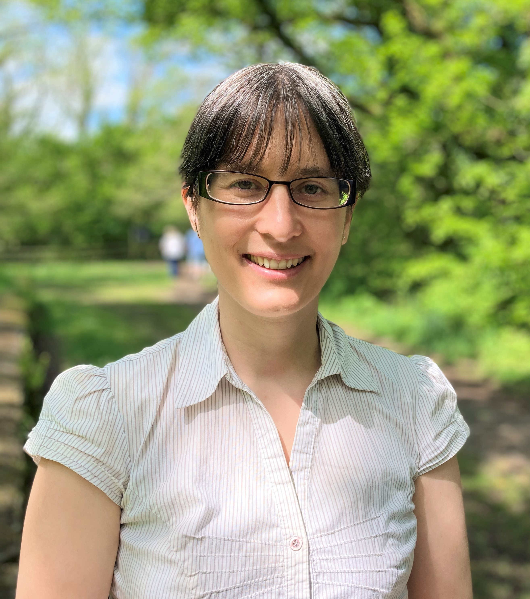
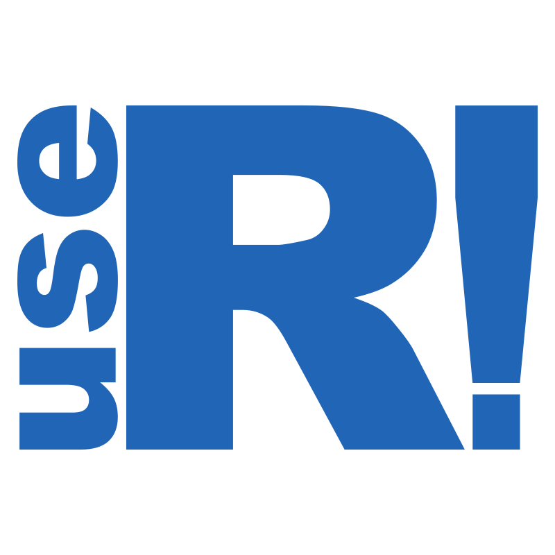

layout: true

.footer[`r fontawesome::fa("link")` [heatherturner.net/talks/AsiaRPanel2022](https://www.heatherturner.net/talks/AsiaRPanel2022)  &nbsp; `r fontawesome::fa("twitter")` [@HeathrTurnr](https://twitter.com/heathrturnr)]

---

# About me

.pull-left-64[
* Started using R in 2001 at start of Statistics PhD
* Postdoc 2004-2010
 - Developing R packages
* Period outside academia 2010-2021
 - Pharmaceutical industry, freelance
* Return to academia as Research Software Engineer 

Became more involved in R community at each stage!

]
.pull-right-30[

]

---

# Statistical Computing Conferences

.pull-left-30[

]
.pull-right-64[
- **Attendee**, CSDA 2005 - introduced to wider R community!
- **Program committee**, useR! 2008, 2010, 2012, 2014--2016; ERCIM 2009, 2013; eRum 2018, 2020
- **Program chair**, useR! 2011 (local organiser), 2017, 2019
- **R Foundation Conference Committee**, 2017 -
- **Appointed advisor** to useR! 2017, 2019, 2021
]

---

# R Foundation/Forwards

.pull-left-30[
.center[.img-300[]]
]
.pull-right-64[
- **Ordinary Member**, 2015 - 
- **Board Member**, 2016 - 
- **Chair** of _Forwards_, R Foundation taskforce for women & under-represented groups, 2015 –
]

---

# R-Ladies

.pull-left[
2012: Gabriela de Queiroz founded group in San Francisco

Later: Twin Cities, Taipei, London

2016: 
 - San Francisco & London organizers meet at useR! + me & others
 - R Consortium grant: R-Ladies Global
 
**Co-organizer** R-Ladies Remote, 2018 -

]
.pull-right[

] 

---

# R Foundation Endorsed Conferences

.pull-left[
Latin America:
- R Day, May 2018, Curitiba, Brazil.
- LatinR, September 2018, Buenos Aires, Argentina.
- ConectaR, January, 2019, San José, Costa Rica.

India:
- R@IISA. December, 2019, Mumbai.
]
.pull-right[

]  

---

# Regional Networks

.pull-left[

]
.pull-right[
* [@LatinR_Conf](https://twitter.com/LatinR_Conf) / [LatinR](https://latin-r.com/) 
    * Community grew around conference
* [@AfricaRUsers](https://twitter.com/AfricaRUsers) / [africa-r.org](https://africa-r.org/)
    * Grass roots community
    * Supported via Forwards Community Team
* AsiaR ([Slack](https://bit.ly/join_asiaR_slack))
    * Community started from useR! 2021 incubator
]
