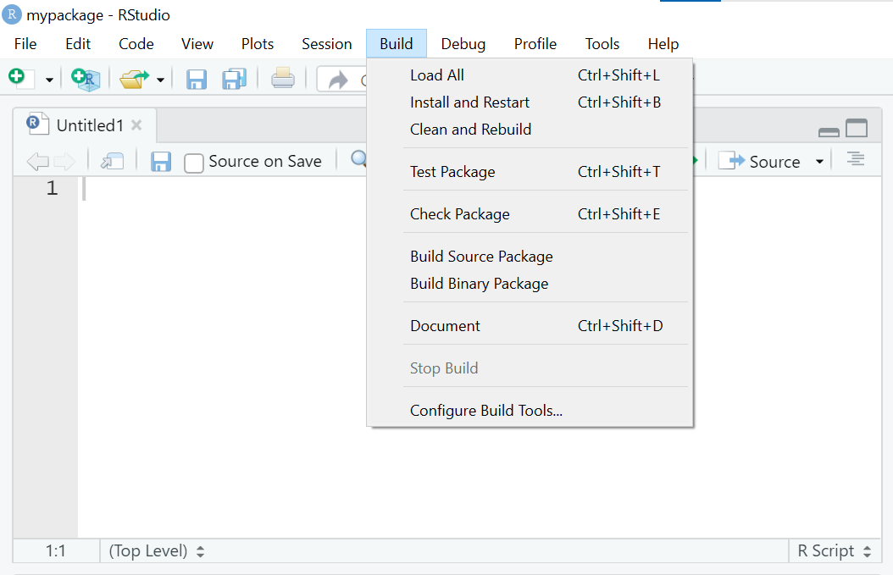
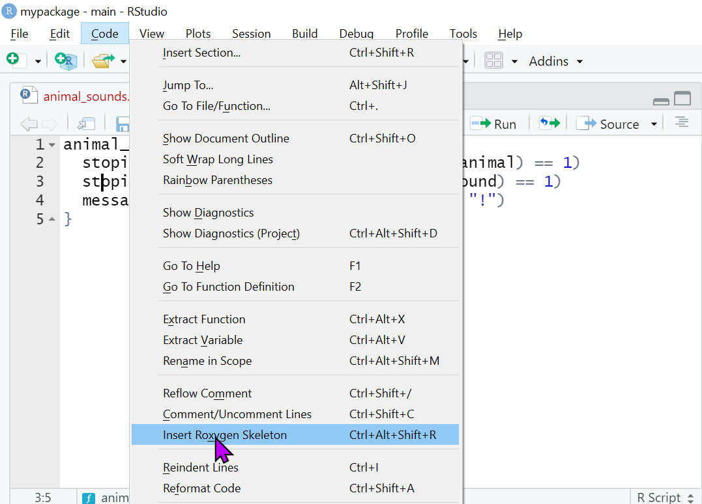
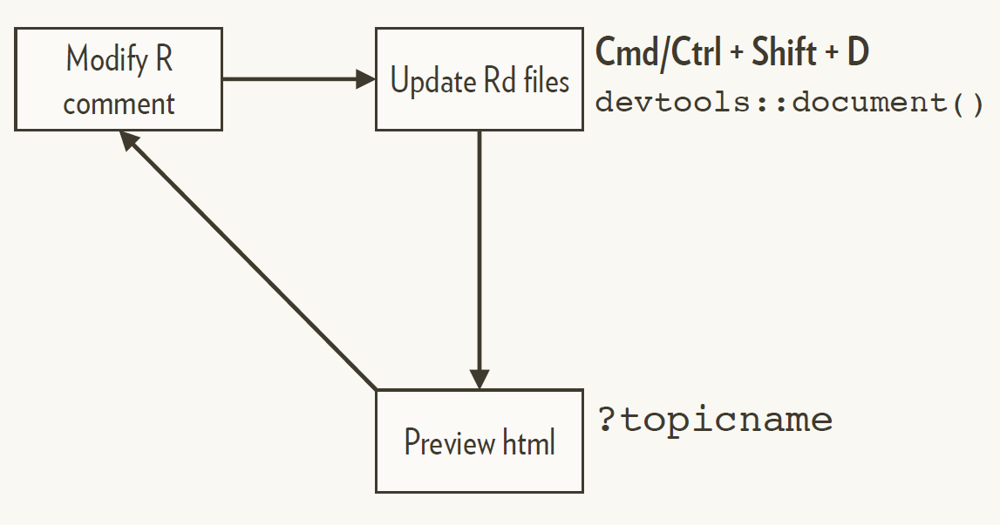

```{r setup, include=FALSE}
options(digits = 4)
options(width = 67)
library(fs)
```

layout: true

.footer[`r fontawesome::fa("link")` [heatherturner.net/talks/Chennai2023](https://www.heatherturner.net/talks/Chennai2023)]

---

class: inverse middle

# Why Create a Package?

---

# Script vs Package

.pull-left[
<center>
<b>R Script</b>
</center>
- Customised
- Reproducible workflow
    - read data
    - analyse
    - summarise
    - report
]
--
.pull-right[
<center>
<b>R Package</b>
</center>
- Optimized
- Reusable
- Sharable  
    ```{r, eval = FALSE}
    library(your_package)
    ```
]

---

# Who to share with and why?

.pull-left[
Internal to company/organization
 - Customized/novel methods
 - Convenience wrappers
 - Analysis templates (`.Rmd` templates)
 - Branding assets (logos, colour palettes)
]
.pull-right[
External to company/organization
 - Share utilities/novel methods
 - Give back to community
 - Raise reputation
 - Gain input from users
 ]
???
https://unconj.ca/blog/copyright-in-closed-source-r-packages-the-right-way.html

---

class: inverse middle

# Creating a package

---

# Package structure

An R package is developed as a directory of source code files.
  
The names of files and directories must follow the specification laid out in 
the [Writing R Extensions](https://cran.r-project.org/doc/manuals/r-release/R-exts.html) 
manual - we'll cover the main components in this talk.

Directory tree for an example RStudio package project:

```{r, structure, echo = FALSE}
# usethis::create_package("mypackage", open = FALSE)
dir_tree("mypackage")
```

---

# Explore

Let's look at the source code for the [usethis](https://github.com/r-lib/usethis) package.

---

# devtools

> "The aim of devtools is to make package development easier by providing R functions that simplify and expedite common tasks."
> [devtools.r-lib.org](https://devtools.r-lib.org/)

.your-turn[
(Install and) load devtools as follows
]

```{r eval = FALSE}
install.packages("devtools")
library(devtools)
```

Installing devtools will also install **usethis**, which helps set up package infrastructure.

---

# usethis::create_package()

`usethis::create_package()` can be used to start an R package project:

* Creates a folder which is a package and an RStudio project
* Restarts R in the new project
* Creates some infrastructure for your package
* Starts the RStudio Build pane

---

## RStudio Build pane/menu

.pull-left[

]
.pull-right[

]


---

# Create a package!

.your-turn[
Check the location and contents of your home directory with:
]
```{r, eval = FALSE}
fs::path_expand("~")
fs::dir_ls("~", type = "directory")
```

.your-turn[
Verify that you can create a package with:
]

```{r, eval = FALSE}
usethis::create_package("~/Desktop/mypackage")
```

You may want to use a different path!


---

## Minimal components

`usethis` will create the minimal components of a package that we have already seen:

-   `DESCRIPTION` provides metadata about your package. 
-   `NAMESPACE` declares the functions your package exports for external use and the external functions your package imports from other packages.
-   The `/R` directory is where we will put `.R` files with function definitions.

---

## Auxiliary files

`usethis` also add some auxiliary files:

-   `mypackage.Rproj` is the file that makes this directory an RStudio Project.
-   `.Rbuildignore` lists files that we need but that should not be included when building the R package from source.
-   `.gitignore` anticipates Git usage and ignores some standard, behind-the-scenes files created by R and RStudio.

---

## Add an R function

Functions will go in an `.R` file.

There's a `usethis` helper for adding `.R` files!

```{r eval = FALSE}
usethis::use_r("file_name")
```

--

`usethis::use_r()` adds the file extension (you don't need to).

---

## `usethis::use_r()`

.your-turn[

Create a new R file in your package called `animal_sounds.R`

]

```{r eval = FALSE}
usethis::use_r("animal_sounds")
```

---

## Add the function

.your-turn[

Put the following code into your script:

]


```{r eval = FALSE}
animal_sounds <- function(animal, sound) {
    stopifnot(is.character(animal) & length(animal) == 1)
    stopifnot(is.character(sound) & length(sound) == 1)
    message("The ", animal, " goes ", sound, "!")
}
```

Don't try to use the function yet!

---

## Development workflow

In a normal script, you might use:

```{r eval = FALSE}
source("R/animal_sounds.R")
``` 

but for building packages, we will use the `devtools` approach.

This will ensure our function has the correct namespace and can find internal functions, functions imported by our package from other packages, etc.

---

## Development workflow

.center[
```{r, out.width = "600px", echo=FALSE, fig.alt = "schematic of the development workflow. there are three boxes with arrow joining them clockwise. The boxes are (clockwise from 3' oclock) 'devtools::load_all() Cmd/Ctrl + Shift +L', 'Explore in console' and 'Modify code'"}
knitr::include_graphics("dev_cycle_before_testing.png")
```
]

--
.center[
You don't even need to save your code!
]

---

## Load your code

.your-turn[

Load with `devtools::load_all()` or <kbd>Ctrl</kbd>/<kbd title = "command">&#8984;</kbd> + <kbd>Shift</kbd> + L
]

```{r load, eval = FALSE}
devtools::load_all()
```


---

## Use your code

.your-turn[
Try using the new function
]

```{r use, eval = FALSE}
animal_sounds("dog", "woof")
```

---

## Modify your code

.your-turn[
Change some tiny thing about your function - maybe the animal “says” instead 
of “goes”?
]

Go through the workflow again
.your-turn[
Load the revised code and try the modified function to see the change.
]

---

## Exporting functions

When a package is loaded, only exported functions can be called directly

.pull-left[
<center><b> Exported Function </b></center> 
```{r}
library(fs)
file_exists
```

]
.pull-right[
<center><b> Internal Function </b></center> 
```{r, error=TRUE}
display_mode_to_symbolic_mode_windows 
fs:::display_mode_to_symbolic_mode_windows 
```
]

<br>
Exported functions should be documented.

---


## Documenting with Roxygen

Put your cursor inside a function, then select Insert Roxygen Skeleton from
the Code menu

.pull-left[
```{r, out.width = "500px", echo=FALSE}

```
]

.pull-right[
```{r, eval = FALSE}
#' Title
#'
#' @param animal
#' @param sound
#'
#' @return
#' @export
#'
#' @examples
animal_sounds <- function(animal, sound) {
  stopifnot(is.character(animal) & length(animal) == 1)
  stopifnot(is.character(sound) & length(sound) == 1)
  message("The ", animal, " goes ", sound, "!")
}
```
]

---

## Regular documentation workflow

.center[
```{r, out.width = "800px", echo=FALSE}

```
]
--
.center[
You must have loaded the package with
`load_all()` at least once.
]

---

## Create a documentation file

.your-turn[
Insert a Roxygen skeleton for `animal_sounds()` using the RStudio helper.
]

Go through the documentaiont workflow:
.your-turn[
1. Edit the Roxygen comments
2. Run `devtools::document()` or <kbd>Ctrl</kbd>/<kbd title = "command">&#8984;</kbd> + <kbd>Shift</kbd> + D.
3. Preview the HTML help with ?animal_sounds.
]

---

class: inverse middle

# Building a package

---

# Development setup

Some additional system tools are required to build R packages with devtools

- Windows
    - Install RTools
 
- macOS
    - Install Xcode
 
- Linux
     - For Debian/Ubuntu, install r-base-dev (see instructions on [CRAN](https://cran.r-project.org/index.html))

---

## macOS

.your-turn[
Install Xcode command line tools.
]

.pull-left[
**Option 1 (minimal install):** 

- [Register as an Apple developer](https://developer.apple.com/programs/register/)
- In the *Terminal*:

```{bash eval = FALSE}
xcode-select --install
```
]
.pull-right[
**Option 2 (more convenient):** 

Install the current release of full [Xcode from the Mac App Store](https://itunes.apple.com/ca/app/xcode/id497799835?mt=12)
]

???

Option 2 is convenient since you can just get it off the App Store, but it includes a great deal that you do not need.

---

# Windows

Install [RTools 4.2](https://cran.r-project.org/bin/windows/Rtools/) using the Rtools42 installer.

 - **For Windows with admin rights:**  run the installer, keeping the default settings.  
 - **For Windows with no admin rights:**  
     - Run the following in R to identify a path where you can install RTools:  
        ```{r RTools, eval = FALSE}
        normalizePath(file.path(Sys.getenv("LOCALAPPDATA"), "Programs", "R", "RTools"), 
              winslash = "/", mustWork = FALSE)
        ```
     - Run the installer: on "Select Destination Location" copy-paste the path into the dialog box; on "Select Additional Tasks" uncheck the options offered, then install.
 - Restart RStudio after installing RTools.
 
---

# Build and install the package

To use the package in the normal way we must build and install it.

We can use

```{r, eval = FALSE}
devtools::install()
```

However "Build > Install package" or <kbd>Ctrl</kbd>/<kbd title = "command">&#8984;</kbd> + <kbd>Shift</kbd> + B in RStudio will install the package and start a new session, so we can use the package straight away.

.your-turn[
Run "Build > Install package". Try calling the `animal_sounds()` function.
]

---

class: inverse middle

# Check your package

---

# `devtools::check()`

`R CMD check` is the gold standard for checking that an R package is in full working order.

It is a programme that is executed in the shell. 

However, `devtools` has the `check()` function to allow you to run this without leaving your R session.

---

## `devtools::check()`

.your-turn[
Check your package
]

```{r eval = FALSE}
devtools::check()
```

???
In case of error on network drives on Windows:
https://forwards.github.io/workshops/package-dev-modules/slides/03-your-first-package/your-first-package.html#40

---

class: inverse middle

# Sharing a package

---

# Open source licenses

1. CC0: “public domain”, best for data packages.
    ```{r, eval = FALSE}
    usethis::use_cc0_license()
    ```
2. MIT: Free for anyone to do anything with (including bundling in closed source product).
    ```{r, eval = FALSE}
    usethis::use_mit_license()
    ```
3. GPL: Changes and bundles must also be GPL
    ```{r, eval = FALSE}
    usethis::use_gpl_license()
    ```
 - If you are including someone else's GPL code directly, you must use GPL.
 
---

# Proprietary packages

You can use `usethis::use_proprietary()` to make it clear that your package isn’t open source.

```{r, eval = FALSE}
usethis::use_proprietary(copyright_holder = "ACME Ltd")
```

In DESCRIPTION:
```
License: file LICENSE
```
In LICENSE:
```
Copyright 2022 ACME Ltd. All rights reserved.
```

---

# Sharing Internally

1. Source code bundle
 - Create with `devtools::build()`
 - Install with `remotes::install_local()`
2. Via private GitHub
 - Install with `remotes::install_github()`
3. Set up a local repository, e.g. with [drat](http://dirk.eddelbuettel.com/code/drat.html), [packrat](https://rstudio.github.io/packrat/custom-repos.html) or with commercial support.
 - Install via `install.packages()`

---

# Sharing publicly
 
1. Via GitHub.com
 - Install with `remotes::install_github()`
2. Via GitHub.com + [R Universe](https://ropensci.org/blog/2021/06/22/setup-runiverse/)
 - Install via `install.packages()` 
3. Via CRAN/Bioconductor
 - Install via `install.packages()` 
 
CRAN/Bioconductor have advantages of enforced standards + discoverability.

---

# References

Wickham, H and Bryan, J, _R Packages_ (2nd edn), https://r-pkgs.org/

R Core Team, _Writing R Extensions_, https://cran.r-project.org/doc/manuals/r-release/R-exts.html

Forwards package development workshops (1hr modules)
 - [Packages in a Nutshell](http://bit.ly/pkg-dev-1)
 - [Setting up your System](http://bit.ly/pkg-dev-2)
 - [Your First Package](http://bit.ly/pkg-dev-3)
 - [Package Documentation](http://bit.ly/pkg-dev-4)

---

## License

<a rel="license" href="http://creativecommons.org/licenses/by-nc-sa/4.0/"></a><br /><span xmlns:dct="http://purl.org/dc/terms/" property="dct:title">Creating an R Package: Why and How?</span> by <a href="https://github.com/hturner">Heather Turner</a> is licensed under <a rel="license" href="http://creativecommons.org/licenses/by-nc-sa/4.0/">CC BY-NC-SA 4.0</a>. Derivative of <a href="https://github.com/forwards/workshops">Package Development Workshop</a> by <a href="https://forwards.github.io/about/">Forwards</a>, used under <a rel="license" href="http://creativecommons.org/licenses/by-nc-sa/4.0/">CC BY-NC-SA 4.0</a>. 

???
https://github.com/hturner/package-development
https://hturner.github.io/package-development/01_Package_foundations.html
https://hturner.github.io/package-development/02_function_documentation.html
https://hturner.github.io/package-development/03_testing.html
https://hturner.github.io/package-development/04_Package_check_and_documentation.html
https://hturner.github.io/package-development/06_Publication_and_maintenance.html
