class: middle

.pull-left-55[
<h1>EDI in the R Community</h1>
  
Heather Turner  

Research Software Engineering Fellow University of Warwick

`r fontawesome::fa("twitter")` [@HeathrTurnr](https://twitter.com/heathrturnr)
  
4 May 2022
 

`r fontawesome::fa("link")` [heatherturner.net/talks/DiveRSE2022](https://www.heatherturner.net/talks/DiveRSE2022)
]
.pull-right-45[
 
 

<small> Artwork from <a href="https://twitter.com/juliesquid">@juliesquid</a> for <a href="https://twitter.com/openscapes">@openscapes</a> (illustrated by <a href="https://twitter.com/allison_horst">@allison_horst</a>).</small>]

---

layout: true

.footer[`r fontawesome::fa("link")` [heatherturner.net/talks/DiveRSE2022](https://www.heatherturner.net/talks/DiveRSE2022)  &nbsp; `r fontawesome::fa("twitter")` [@HeathrTurnr](https://twitter.com/heathrturnr)]

---

class: middle, inverse

# Background

---

# Potted History of R

.pull-left[
1992: Robert Gentleman and Ross Ihaka develop an early version of R for teaching.

1995: R released under a GNU public license

1997: CRAN and R Core team established

2000: R 1.0.0 released

April 2022: R 11th in TIOBE rankings

]
.pull-right[
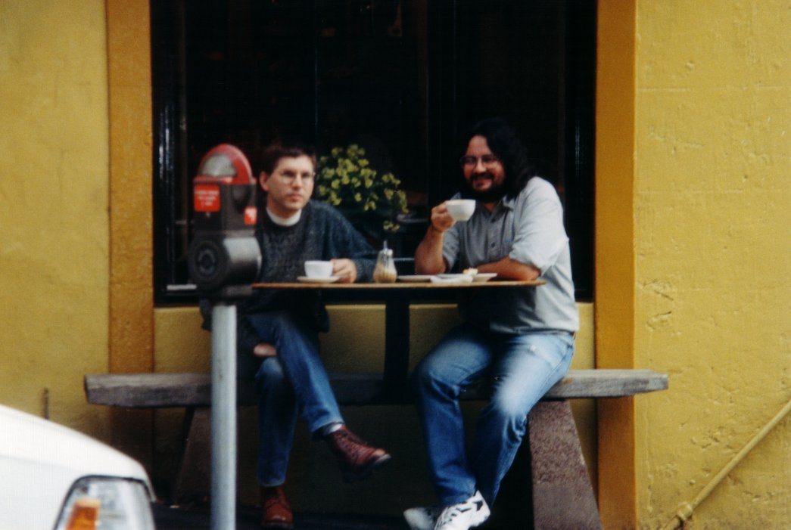
At the  Black Crow Cafe, Auckland, NZ 
<small>(source: [R. Ihaka](https://www.stat.auckland.ac.nz/~ihaka/downloads/the-r-project.pdf))</small>]

???

1993 - shared vias Statlib, others start to use
CRAN - 12 packages originally
---

# Gender Diversity

.pull-left[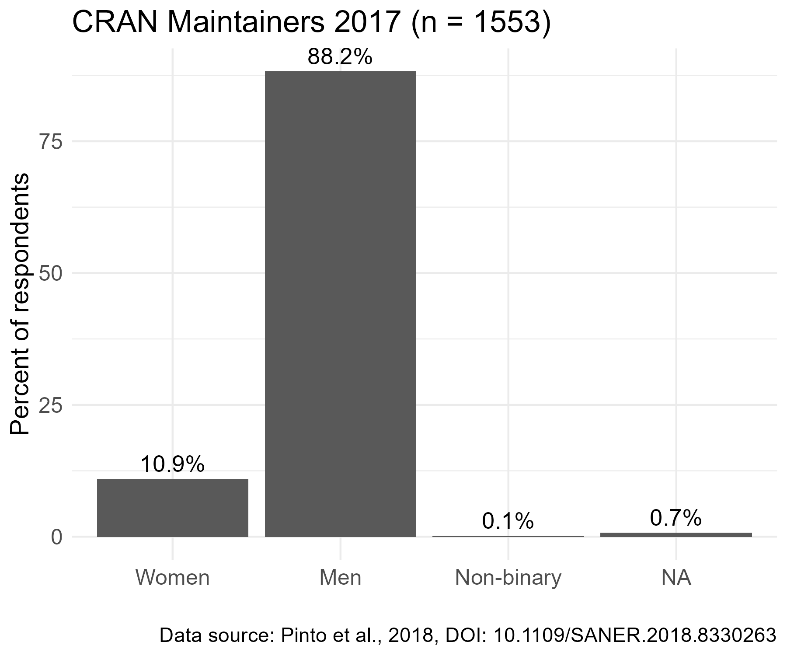
]
.pull-right[
Only ~11% women/non-binary package maintainers.

Similar over-representation of men in general user community

* [R Consortium Survey, 2017](https://blog.revolutionanalytics.com/downloads/Voice%20of%20R%20Community.pdf)  \> 80%
* [RStudio R Community Survey 2020](R Community Survey) ~80%

]

---

# Geographical Diversity

.center-64[
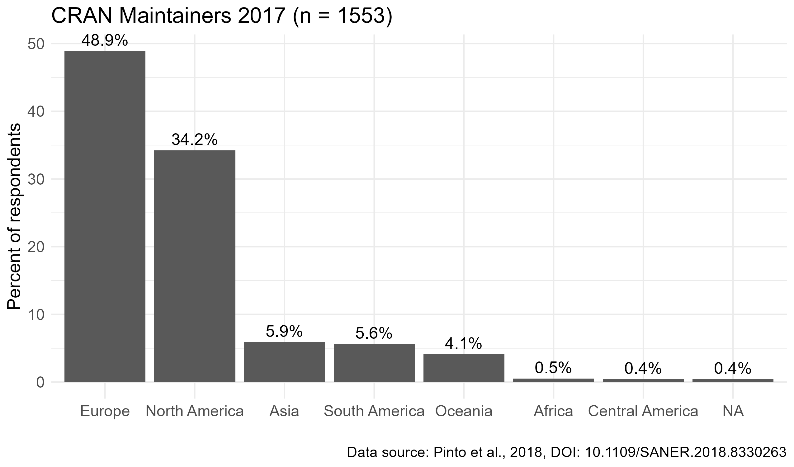
]

---

class: middle, inverse

# EDI Initiatives

---

# Women in R

.pull-left[
"heR" panel at useR! 2014 raised awareness of gender disparity

In 2015:
  - Myself and Bettina Grün elected to R Foundation
  - Women in R taskforce set up in December 2015
]

.pull-right[
  
  ]

???

R Foundation founded 2003

---

# useR! 2016 survey

.pull-left-64[
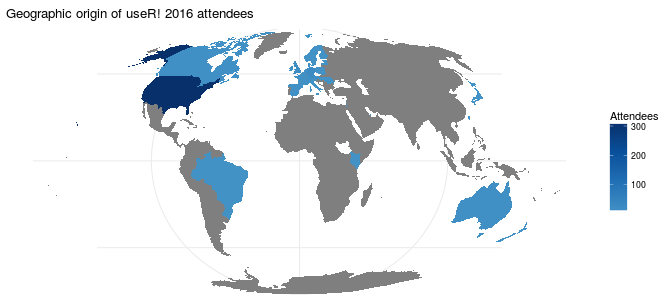
<small>(source: [ https://forwards.github.io/blog/2017/01/13/mapping-users/](https://forwards.github.io/blog/2017/01/13/mapping-users/))</small>

]

.pull-right-30[
 
- 74% White; 16 % Asian
- 5% LGBT
- 33% women
]

???
Note already had some diversity scholarships and made some recommendations

---

# Forwards

.pull-left-30[
 
.center[.img-300[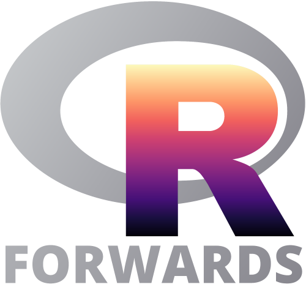]]
] 
.pull-right-64[Widening participation in R Foundation activities:  *useR!*, *R Journal*, CRAN, R project
- Accessibility
- Community
- Conferences
- On-ramps
- Surveys
- Teaching

[@R_Forwards](https://twitter.com/R_Forwards) / [forwards.github.io](https://forwards.github.io/)
]

---

# Forwards Team

.center[
.img-100[]
.img-100[]
.img-100[]
.img-100[]
.img-100[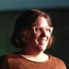]
.img-100[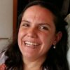] 
.img-100[]
.img-100[]
.img-100[]
.img-100[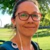]
.img-100[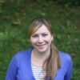]
.img-100[] 
<small>Core Team: Heather Turner, gwynn sturdevant, Jonathan Godfrey, Kevin O'Brien,   Noa Tamir, Yanina Bellini Saibene,
Saranjeet Kaur, Michael Lawrence, Anna Vasylytsya,   Andrea Sánchez-Tapia, Mine Çetinkaya-Rundel, Emma Rand </small>

Plus >20 sub-team members!
]

---

# R Consortium 

.pull-left[
Non-profit business association set up as Linux Foundation project

- Funded projects
    - Forwards package development workshops
- Working groups 
    - 2018: R-Community IDEA
- RUG and conference support
]
.pull-right[
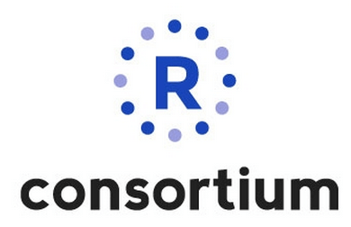
]  

???
Inclusion, diversity equity and accessibility
---

# R-Ladies

.pull-left[
2012: Gabriela de Queiroz founded group in San Francisco

Later: Twin Cities, Taipei, London

2016: 
 - San Francisco & London organizer meet at useR!
 - R Consortium grant to create R-Ladies Global

]
.pull-right[

] 
---

# R-Ladies Growth

Currently 216 Chapters (source: [R Community Explorer](https://benubah.github.io/r-community-explorer))
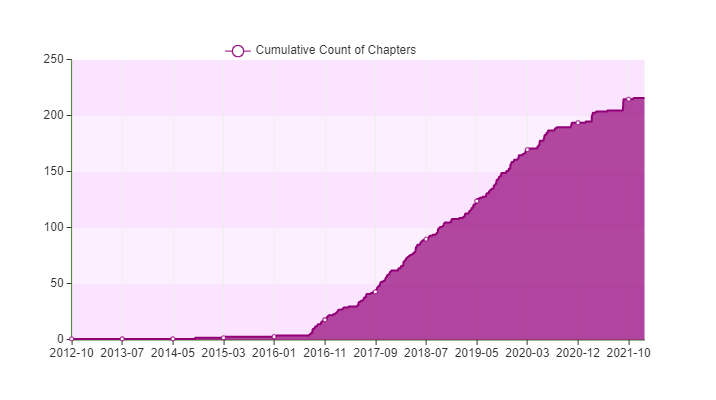

---

# R Ladies Global Team

.center[
.img-100[]
.img-100[]
.img-100[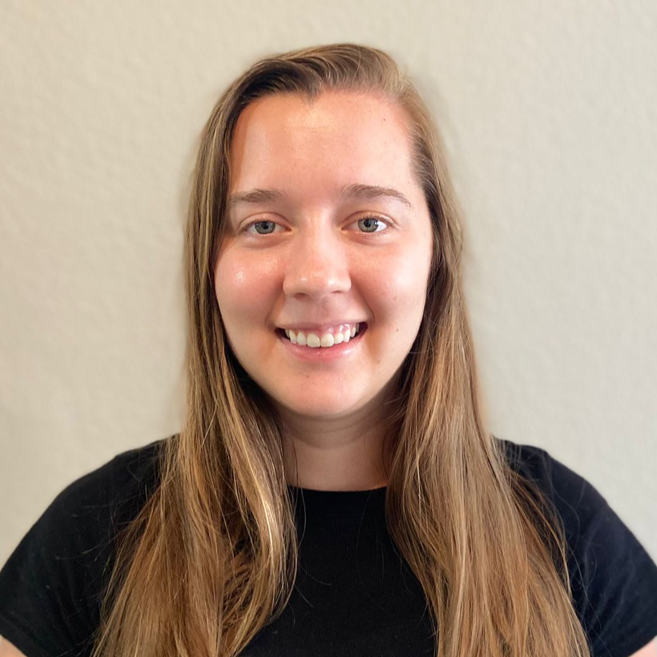]
.img-100[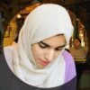]
.img-100[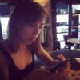]
.img-100[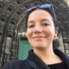]
.img-100[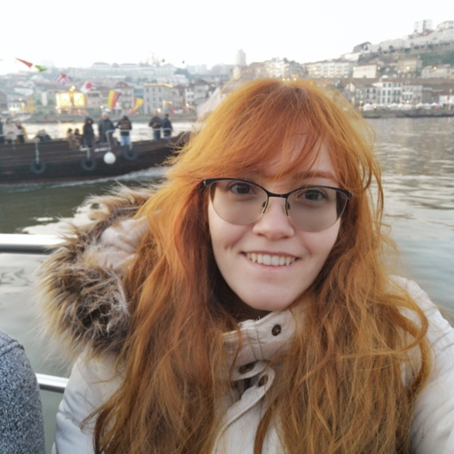]
.img-100[]

.img-100[]
.img-100[]
.img-100[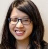]
.img-100[]
.img-100[]
.img-100[]
.img-100[]
.img-100[]

.img-100[]
.img-100[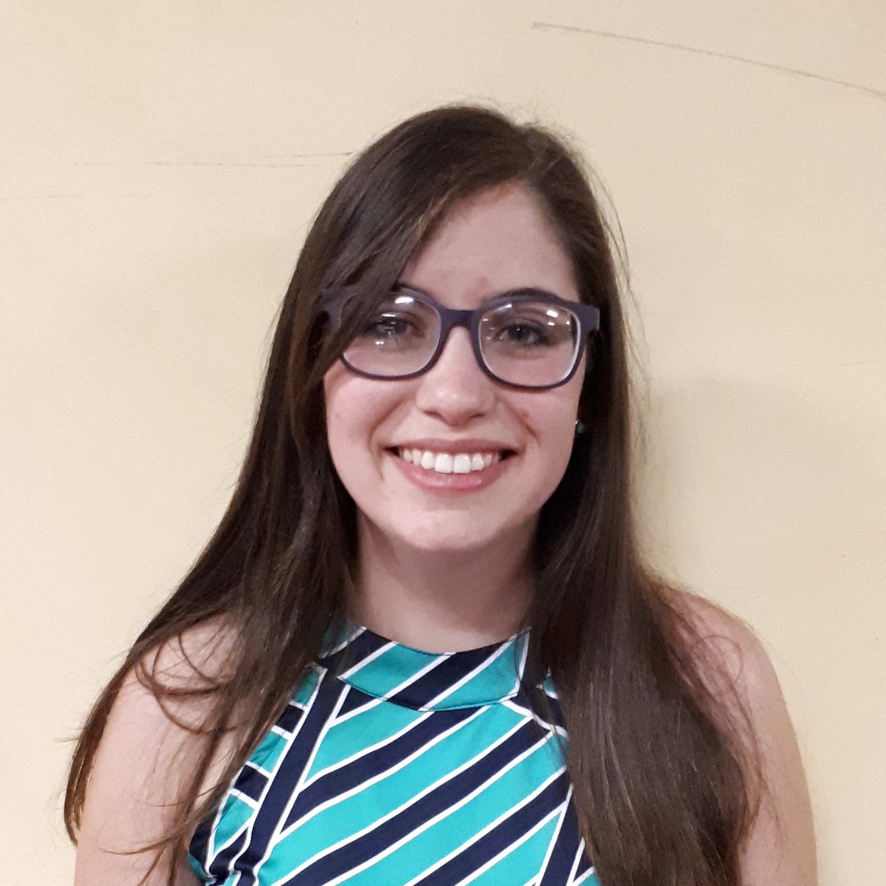]
.img-100[]
.img-100[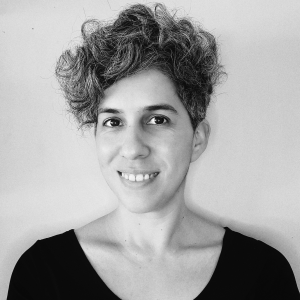]
.img-100[]
.img-100[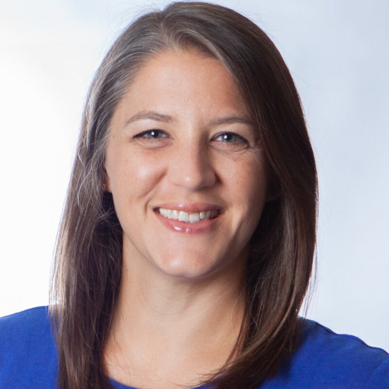]
.img-100[]
.img-100[]

https://rladies.org/about-us/team/
]

---

# R-Ladies vs RUGS

* 858 RUGS on Meetup.com (earliest 2008)
* R-Ladies relatively stronger in Latin America

.pull-left[
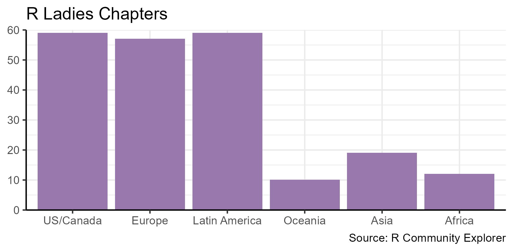
]
.pull-right[
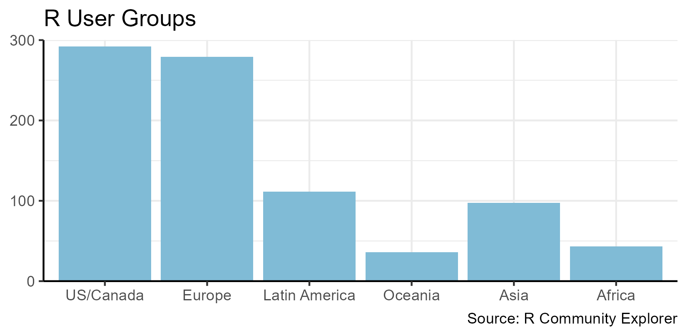
]

---

# satRdays

.pull-left[
2016: R Consortium grant to start
- Locally organized
- Strong commitment to diversity
    - Ticket price < 8hr min wage

\> 20 conferences
- 6 in Africa
- 1 in S. America, Asia, Oceania

[https://satRdays.org/](https://satRdays.org/)
]
.pull-right[

] 

???

free/low-cost
locally organized

---

# useR! 2017

.pull-left[
Forwards recommendations implemented
- Wider diversity scholarships
- Subsidised childcare 
- Improved code of conduct

Rainbow R established
- [@R_LGBTQ](https://twitter.com/r_lgbtq) 
]
.pull-right[
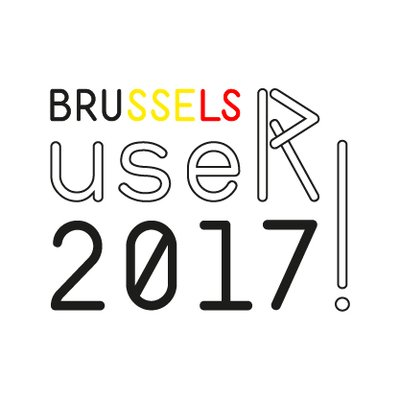
] 

---

# R Foundation Endorsed Conferences

.pull-left[
Latin America:
- R Day, May 2018, Curitiba, Brazil.
- LatinR, September 2018, Buenos Aires, Argentina.
- ConectaR, January, 2019, San José, Costa Rica.

India:
- R@IIRSA. December, 2019, Mumbai.
]
.pull-right[
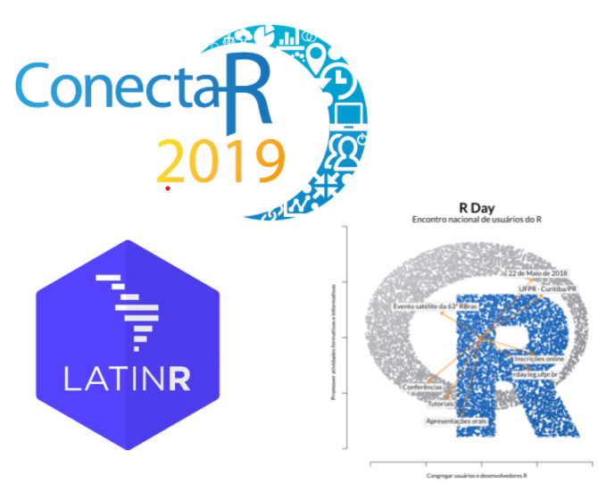
]  

---

# Regional Networks

.pull-left[

]
.pull-right[

* Provide community
* Support user groups
* Organize regional events

[@LatinR_Conf](https://twitter.com/LatinR_Conf) / [latin-r.com](https://latin-r.com/)  
[ArabR](https://arabr.github.io/ArabR-Website/)  
[@AfricaRUsers](https://twitter.com/AfricaRUsers) / [africa-r.org](https://africa-r.org/)  
[@AsiaR_comm](https://twitter.com/AsiaR_comm) / [AsiaR-community](https://github.com/AsiaR-community)  
]

---

# Regional Leaders

.center[
LatinR chairs: 
.img-100[]
.img-100[]
.img-100[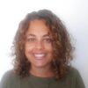]
.img-100[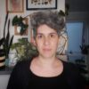]
.img-100[] 
AfricaR leaders: 
.img-100[]
.img-100[]
.img-100[]
.img-100[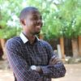]
.img-100[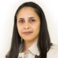]
.img-100[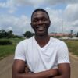]
.img-100[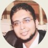] 
AsiaR founders:
.img-100[]
.img-100[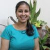] 
ArabR team: .img-100[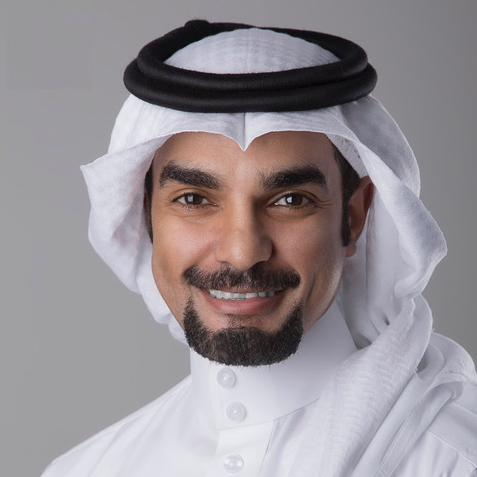]
.img-100[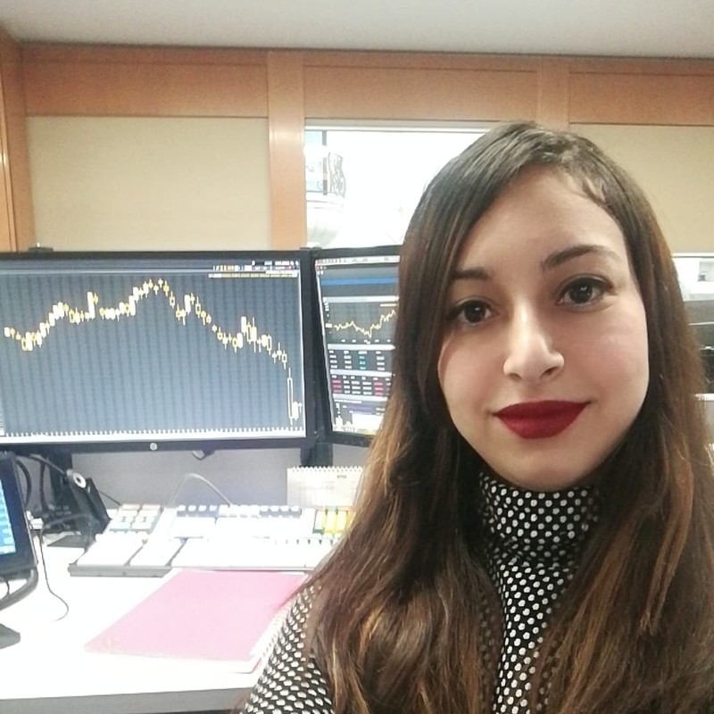] 
.img-100[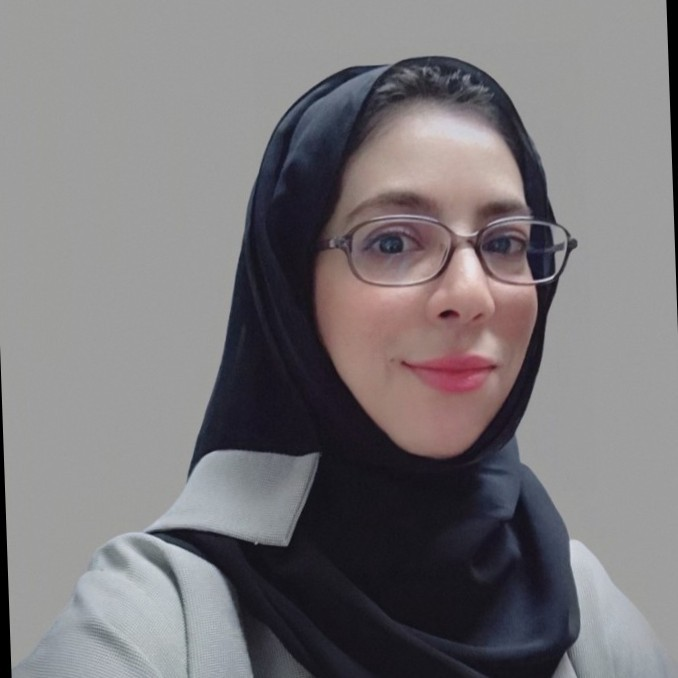] 
.img-100[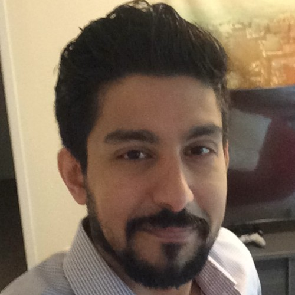] 
.img-100[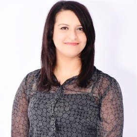] 
.img-100[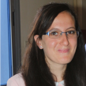] 
.img-100[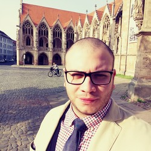] 
.img-100[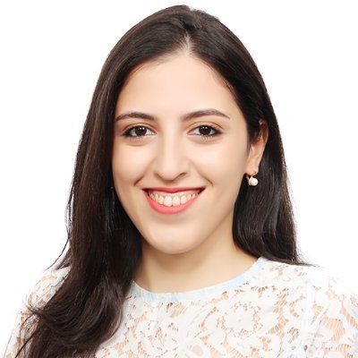] 
]
    
---

# Minorities in R

> MiR Community aims to support historically underrepresented R users around the world.
.pull-left[
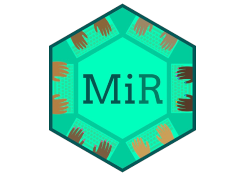
]
.pull-right[
- MiR community Slack
- Blog
- Webinars and tutorials
- Support RStudio instructor certification

[@miR_community](https://twitter.com/miR_community) / [mircommunity.com](https://mircommunity.com/)
]

---

# MiR Team

.center[
.img-100[]
.img-100[] 
Co-founders: Danielle Smalls-Perkins, Dorris Scott  
.img-100[]
.img-100[]
.img-100[]
.img-100[]
.img-100[]
.img-100[]
.img-100[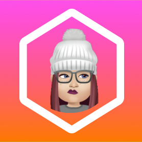]
 
Silvia Canelón, Liz Hare, Audris Campbell,  Andy Murtha, Meenakshi Kushwaha, Ola Giwa, Zane Dax
]

---

# Developer Community Events

.pull-left[
rOpenSci unconfs (2014-2019)
- mostly invited
- strong commitment to diversity

Tidyverse Developer Days (2019,2020)
 - open events
 - first-timers encouraged
]
.pull-right[

<small>(source: [B. Milz](https://beatrizmilz.com/blog/2019-08-12-tidydevday/))</small>
] 

---

# R Contribution Working Group

.pull-left-55[
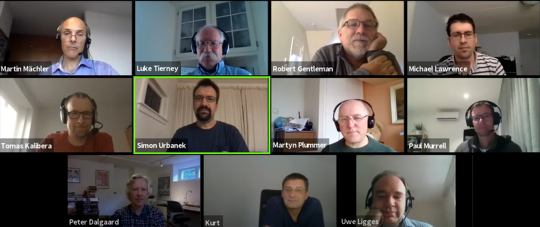
]
.pull-right-45[
* Motivated by R Core panel at useR! 2020
* Collaboration between R Core, Forwards and community groups
* Aim to foster larger, more diverse community of contributors to the R project.
] 

---

# RCWG Initiatives

First year (2020-2021):

 - Created the R Contribution Site: [contributor.r-project.org/](https://contributor.r-project.org/)
 - Set up the [R-Devel Slack](https://forwards.github.io/rcontribution/slack)
 - Developed a draft version of the [R Development Guide](https://forwards.github.io/rdevguide)
 - Organized, prepared and delived two contributor-focused tutorials at *useR! 2021*
     - [Contributing to R](https://youtu.be/CZmldTOdlRM?list=PL4IzsxWztPdnCC_kMCYKrd_t6cViMhBrD)
     - [Translating R to your language](https://forwards.github.io/rcontribution/tutorials#translating-r-to-your-language)

---

# Collaboration Campfires

.pull-left[
Novice-friendly topics
 - Bug handling
 - Contributing translations
Designed to be inclusive
 - Community champions
 - Targeted promotion
]
.pull-right[
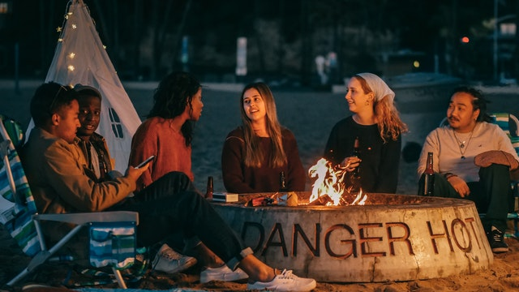
] 

---

# Ongoing RCWG Initiatives

* Google Season of Docs: 
_Expanding and reorganizing the R Development Guide_
 - new chapter on contributing translations
 - using a git workflow to test bug patches
* Google Summer of Code: _Track R Translation Status_
 - dashboard to monitor status of translated messages in R
* Bug BBQ
 - online, 24-hour event after useR! 2022 to tackle bugs
 - aiming to be novice-friendly!
 

---

# RCWG participants

.pull-left[
.img-100-float[] 
Saranjeet Kaur  *R Development Guide Collaboration Campfires*   
.img-100-float[] 
Lluís Revilla Sancho  *R Bugzilla analysis*  
.img-100-float[] 
.img-100-float-next[] 
Michael Chirico 
Michael Lawrence *Translations tutorial*
]
.pull-right[
.img-100-float[] 
Kara Woo  *R-Ladies link, RWeekly Slack moderator*  
.img-100-float[] 
gwynn sturdevant  *MiR link*  
.img-100-float[] 
.img-100-float-next[] 
Gabriel Becker 
Martin Mächler *Contributing tutorial*
]

 
Plus several others joining meetings, contributing via [github.com/r-devel/rcontribution](https://github.com/forwards/rcontribution)

---

class: middle, inverse

# Impact

---

# Overview

- User community: 
    - Grass-roots communities have had a big impact on building welcoming community
    - R Foundation/R Consortium played role by stimulating change/providing support
- CRAN: need updated data, but would need large changes to make an impact
- R core/contributors: still early days!
- useR! 
    - gender balance improved in recent years (women and gender minorities 2017-2021: 27%, 30%, 34%, 42%)
    - COVID (moving online) + greater representation in committees had biggest impact on diversity

---

# useR! Global 2021

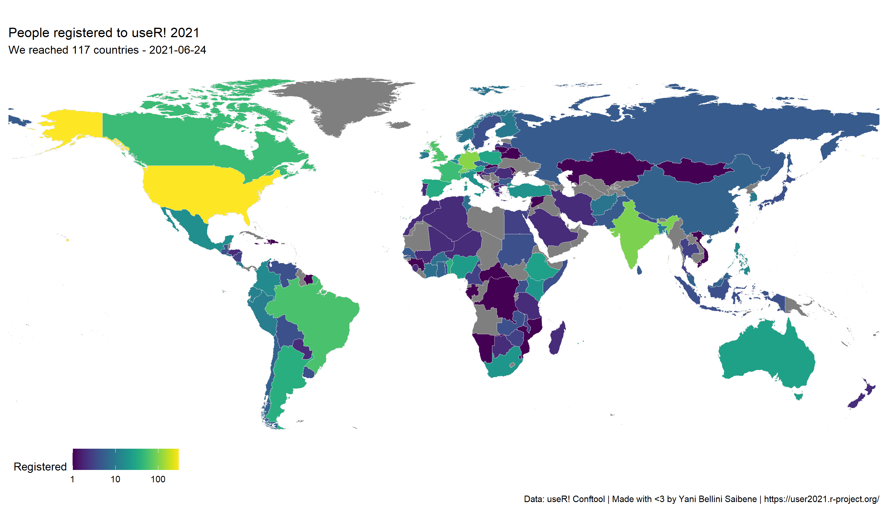

