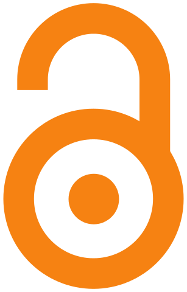
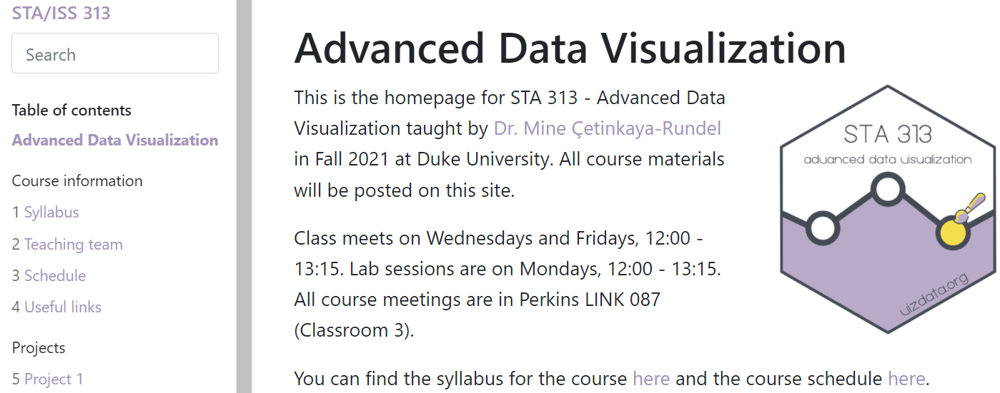
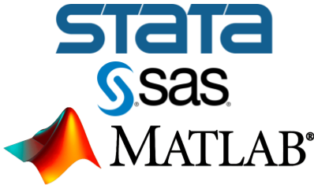
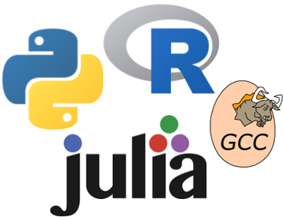

# Open Access

.pull-left-66[
New UKRI policy for research articles from **1 April 2022**.

Two routes to open access:
 - **Gold**: final version on publishers website. 
 - **Green**: accepted version in a repository.

Both routes require:
 - CC BY license.
 - Statement about the access of the underlying data.
]

.pull-right-33[

 

]

---

# Open Practices

.pull-left[
Recognised as integral to healthy research culture

Working openly means that our work is 

 - Accessible, for free
 - Open to scrutiny (verifiable)
 - Reproducible
]

.pull-right[

<small>(source: [analogicus from Pexels](https://www.pexels.com/photo/wooden-welcome-signage-on-green-wooden-door-5395777/))</small>
]

---

# Open Teaching

 
<small> Example of CC BY-SA course materials, <a href = https://www.vizdata.org/index.html>vizdata.org</a> </small>

Range of licenses e.g. CC BY, CC BY-SA, CC BY-NC, CC BY NC-ND, No license. 

???
https://stat545.stat.ubc.ca/ CC BY
https://online.stat.psu.edu/stat501/ CC BY-NC
https://avehtari.github.io/BDA_course_Aalto/ CC BY-NC
https://www.andrew.cmu.edu/user/achoulde/94842/ CC BY-NC-SA
https://econsp21.classes.andrewheiss.com/ CC BY-NC-ND

---

# Code and Software

.pull-left[

<b>Script</b>

 
Analysis/simulation script

- Customised
- Reproducible workflow
    - read data
    - analyse
    - summarise
    - report
]
.pull-right[

<b>Software</b>

 
Package, tool, dashboard

- Optimized
- Reusable
- Sharable
]

???
command line tool

---

# Why Share Code and Software?

Beyond general benefits of open practices

- Increased impact and reputation
- Faster translation into practice
- Additional, citable, outputs

Benefits of coding in the open

- Encourages good practices
- Facilitates collaboration
- Can give access to software engineering tools

---

# Proprietary vs. Open Source

.pull-left[

<b>Proprietary </b>
  

- Code can not be reviewed
- No control over when bugs fixed
- Costly: not accessible to all
]
.pull-right[

<b>Open Source</b>
  

- Code open to scrutiny
- Can contribute bug fix/fork code
- Free to use
]

---

# Sharing code on your website

## Pros

 - Simple
 - Low maintenance

## Cons

 - Not persistent
 - Not discoverable
 - Not citable
 - Versioning is painful, update history not transparent
 
---

# Sharing code as supplementary material

## Pros

 - Simple
 - Low maintenance
 - Persistent 

## Cons

 - Need to publish paper!
 - Not separately discoverable/citable from paper
 - No option to update
 
---

# Sharing code in an open research archive

.pull-left-66[

## Pros

- Persistent DOI
- Version support (including DOI for "all versions")
- Range of licensing options
- Link to ORCID and UKRI grant
- Extensible to "research compendium"

## Cons

- Version snapshots ("releases")
]
.pull-right-33[

<a href = https://zenodo.org/>
   

  
[zenodo.org](https://zenodo.org/)

</a>
]

???
concept DOI
Zenod: built by researchers for researchers
https://www.agu.org/-/media/Files/Publications/Generalist-Data-Repository-Grid.pdf
https://the-turing-way.netlify.app/communication/citable.html
https://www.nature.com/articles/s41597-022-01143-6
https://www.researchequals.com/faq
Other benefits: free, support for peer review during embargo, immediate publication (no peer review)

---

# Sharing code in an online repository

.pull-left-66[
## Pros

- Version control (commit history + releases)
- README.md for quick documentation
- Facilitates contribution (bug reports, patches)
- Can use CITATION.cff file for clear citation [GitHub]
- Links to Zenodo for publishing releases

## Cons

- Learning curve to take full advantage
]
.pull-right-33[
 

 
<a href = https://github.com/>
  
</a>

]

???
Citation File Format (CFF)

---

# Further benefits of GitHub

## Research compendia

Potential to use Binder to so that people can run your code in the browser
 - For short analysis (<10 min) on small data (< 10MB)
 - [Zero to Binder](https://the-turing-way.netlify.app/communication/binder/zero-to-binder.html) tutorial [Julia, Python, R]
 
### Software packages

- Users can install Julia/Python/R packages from GitHub
- Can deploy package websites using GitHub pages
- Can benefit from GitHub Actions, e.g. automatically running tests

???
R-universe

---

# Preparing to Share

.pull-left-66[
1. Choose a license
 - No license = no permission to use, modify or share!
 - [Open source license](https://opensource.org/licenses) for scholarly work 
 - LGPL or BSD license for script in proprietary language.
 - Industrial partnership: check first
2. Make it public
 - Do not version control secrets (passwords, private keys...)!
]
.pull-right-33[

]

???
without explicit permission from the copyright holder(s), i.e. original author(s)
https://choosealicense.com/no-permission/
https://opensource.stackexchange.com/questions/1720/what-can-i-assume-if-a-publicly-published-project-has-no-license
https://opensource.stackexchange.com/a/4888

OSI picture

---

# Good (Enough) Software Practices

* Version control
* Documentation
 - **Basic** Comments, README
 - **Advanced** Codebook, function documentation
* Tests
 - **Basic** Validation examples with expected output
 - **Advanced** Unit tests that check expected vs actual
* Defining the computational environment
 - **Basic** Document dependencies, versions
 - **Advanced** Package management systems, containers
 
???
writing piece of code that working on for more than a day

---

# Release the Software

* GitHub
    - Create a versioned release on GitHub
    - Link to Zenodo to record version with DOI
* Package repository (CRAN, PyPI, Julia General Registry)
    - Quality standards: interoperability
    - Discoverable
    - Easier to install
    
???
Code is ready to be used (not a beta version)
Basic standards: documented code, running examples, etc
Works with current version of R and other packages
Commitment of maintainer

Julia General registry: minimal standards, package must be loadable
Similar for PyPI?

 (but see R-universe)

---

# Prepare for release

* When (incremental) features are usable
* Good time to do additional checks
    - Check spelling
    - URL/article citations up-to-date
    - Testing on different platforms
    - Check repository policies, run their checks
    - Start/update NEWS or ChangeLog

---

# Code review

* External (at time of major release)
    - **Software only** Bioconductor, rOpenSci
    - **With accompanying article** R Journal, JSS, JOSS
* Internal (throughout)
    - Code exchange/peer review within Statistics? c.f. [Oxford Code Review Network](https://www.rse.ox.ac.uk/oxford-code-review-network/)
    - RSE: embedded RSEs (R), grant funded general RSE support via SCRTP (?)
    
---

# Promoting your package

* Some promotion automatic on official repositories
    - E.g. CRANberries, R Views (Top New Packages), custom search engines
* Social media
    - Website, blog 
    - Twitter (#RStats, #Python, #JuliaLang, #OpenSource)
* Suggest for Task View if relevant
    - [CRAN Task Views](https://cran.r-project.org/web/views/)
    - [Python Task Views](https://www.pythondatascience.org/) ??
    
???
CRANberries: RSS feed/Twitter
    
---

# Talks

* Meetups: Warwick RUG, Coventry R-Ladies
* Conferences 
    - General computing: useR!, PyCon, JuliaCon, COMPSTAT
    - Specific: R/Finance, BioC, Psychoco

* Don't forget to share your slides! (Conference/personal website, LinkedIn, RPubs, Slideshare)

???
Conferences provide greater exposure, particular to people working in
relevant field(s).

- General domain: JSM, ESA, ...

---

# Paper

 - Traditional journals:
    - Open Source Software: The R Journal, Journal of Statistical Software
Computational and Graphical Statistics, SoftwareX
    - Science: Bioinformatics, PLOS ONE, Method in Ecology and Evolution
 - Alternative journals:
    - F1000research Bioconductor/R package gateway: publish, then open review
    - Journal Open Source Software: open code review, short descriptive paper

???
A paper not only promotes your package but benefits from peer review
 - Paper can also overlap with vignette
 
---

# Interacting with users

* Bug reports/help requests
  - Can show where documentation/tests need improving
  - Help you find out who's using your package and what for   
  - Can give ideas for new features
  - Can lead to collaborations
* GitHub issues: better than email!
   - Users can see if bug already reported and what action has been taken
  
---

# Interacting with developers

* Add a code of conduct, e.g. Contributor Covenant
* Add a CONTRIBUTING.md to your GitHub repository
    - Do you have a style guide?
    - Reminders to run check/tests/add NEWS item to pull requests
* Use tags to highlight issues: the following are promoted by GitHub
    - `help wanted`
    - `good first issue`
* Take advantage of events e.g. [Hacktoberfest](https://hacktoberfest.digitalocean.com/), [Closember](https://closember.org/)  

---

# Resources

* GitHub: 
  - Intro with me: March 31, 9:00 - 10:30, MS0.07
  - SCRTP materials: https://warwick.ac.uk/research/rtp/sc/rse/training/introgit
* [Computational Toolkit Seminar Series](https://warwick.ac.uk/fac/sci/hetsys/outreach/toolkit/) (HetSys CDT) Tuesdays, 16:00, YouTube (live/recorded).
* Open practices: 
  - Research: [The Turing Way](https://the-turing-way.netlify.app/) - coding, communication, collaboration, ethics 
  - Coding/software: [Software Sustainability Institute](https://www.software.ac.uk/) - guides, events, mentoring 

???
HetSys PhD students/guests
---

# Summary

* Working openly encourages good practices
* Your code/software is an asset!
* We can make steps to improve our own practice
* Consider including time for general/specific RSE support on grants

