layout: true

.footer[`r fontawesome::fa("link")` [heatherturner.net/talks/NHS-R2021](https://www.heatherturner.net/talks/NHS-R2021)  &nbsp; `r fontawesome::fa("twitter")` [@HeathrTurnr](https://twitter.com/heathrturnr)]

---

# Gender Diversity

.pull-left[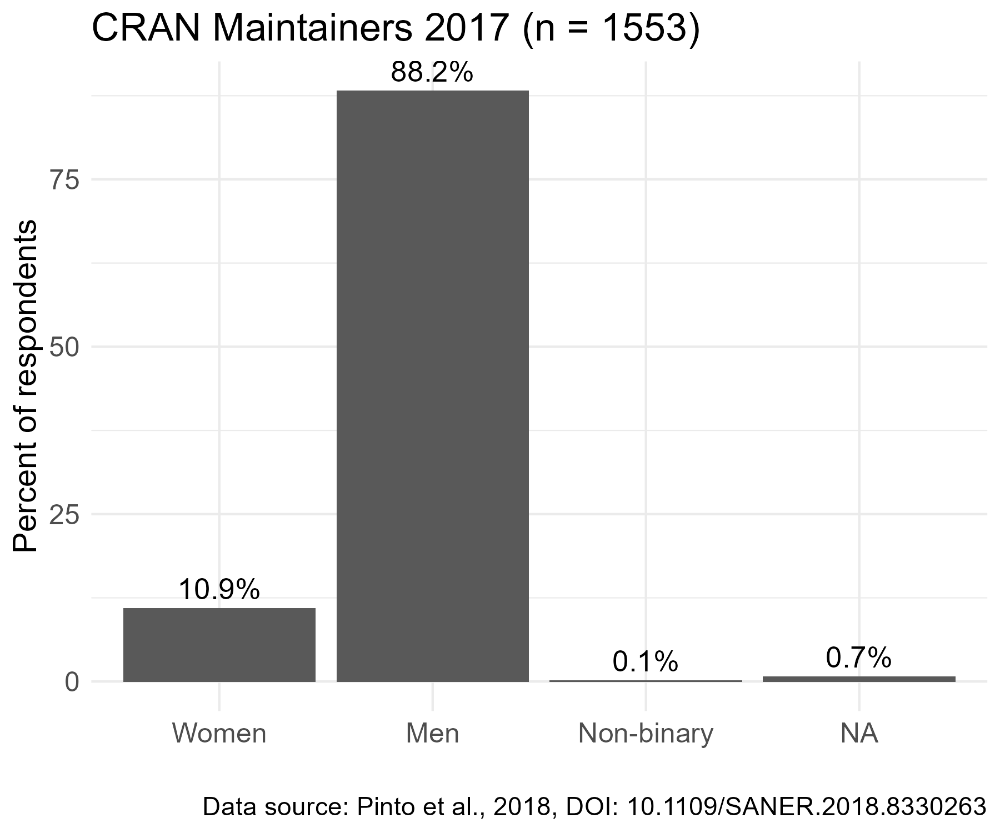
]
.pull-right[
Similar over-representation of men in general user community

* [R Consortium Survey, 2017](https://blog.revolutionanalytics.com/downloads/Voice%20of%20R%20Community.pdf)  \> 80%
* [RStudio R Community Survey 2020](R Community Survey) ~80%

]

---

# Geographical Diversity

.center-64[
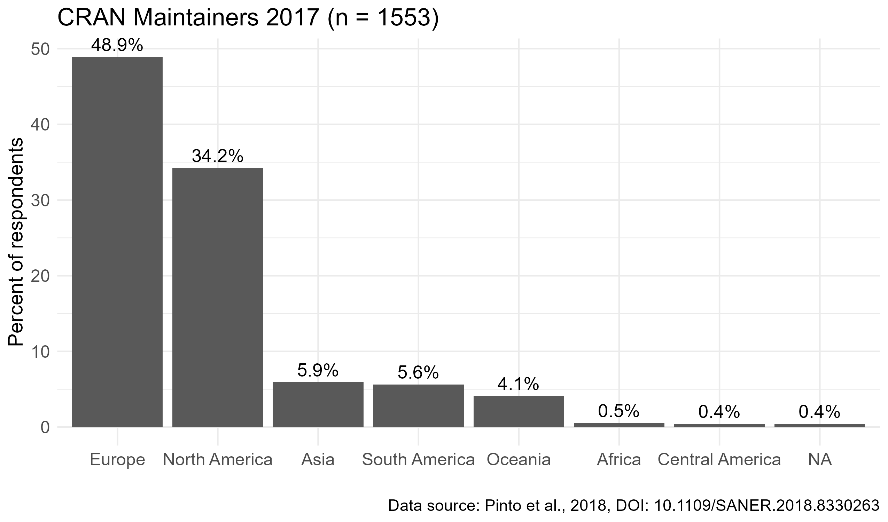
]

---

# R-Ladies

> R-Ladies is a worldwide organization whose mission is to promote gender
diversity in the R community.

.pull-left-30[

]
.pull-right-64[
* Local chapters
* R-Ladies Remote ([@RLadiesRemote](https://twitter.com/rladiesremote))
* R-Ladies directory
* Community slack
* [Abstract review for conferences](https://docs.google.com/forms/d/e/1FAIpQLSck8FBjNWjziI8pPIoCBlf5J4oQ_6pzeUdbQ1HjYfJ2bNDwDw/viewform)
* [@RLadiesGlobal](https://twitter.com/RLadiesGlobal), [@WeAreRLadies](https://twitter.com/WeAreRLadies)
* [rladies.org](https://rladies.org/)
]

---

# R-Ladies Growth

Currently 216 Chapters (source: [R Community Explorer](https://benubah.github.io/r-community-explorer))
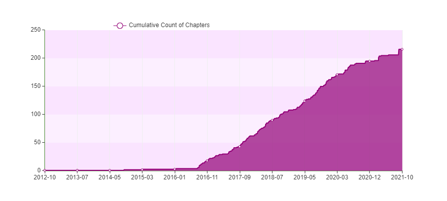

---

# R Ladies Global Team

.center[
.img-100[]
.img-100[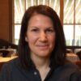]
.img-100[] 
.img-100[]
.img-100[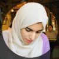]
.img-100[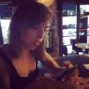]
.img-100[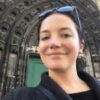]
.img-100[]
.img-100[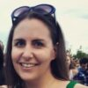]
.img-100[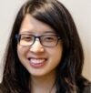]
.img-100[] 
.img-100[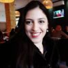]
.img-100[]
.img-100[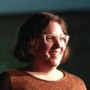]
.img-100[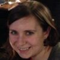]
.img-100[]
.img-100[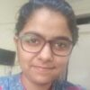]
.img-100[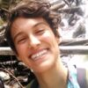]
.img-100[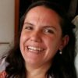]
<small>
 Claudia Vitolo, Erin LeDell, Hannah Frick  
Athanasia Monika Mowinckel, Batool Almarzouq, Bea Hernández, Christin Zasada, Florencia D’Andrea, Jennifer Thompson, Katherine Simeon, Maëlle Salmon, Mouna Belaid, Nadeja Sero, Noa Tamir, Page Piccinini, Patricia A. Loto, Saranjeet Kaur Bhogal, Sheila Saia, Yanina Bellini Saibene</small>
]

---

# R-Ladies vs RUGS

* 858 RUGS on Meetup.com (earliest 2008)
* R-Ladies relatively stronger in Latin America

.pull-left[
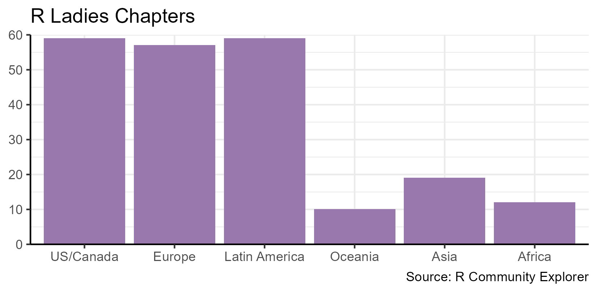
]
.pull-right[
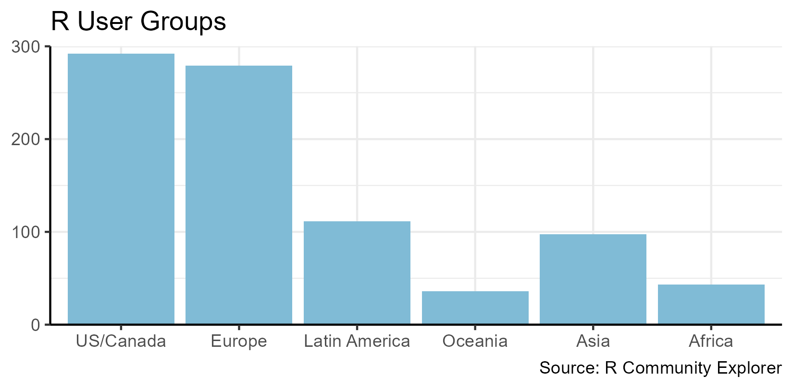
]

---

# R Girls School

> A worldwide network to promote the use of R in secondary schools for girls

.pull-left[
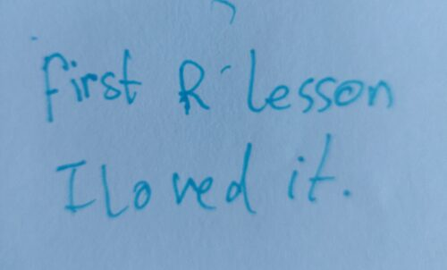
]

.pull-right[
* Led by Green Oak Academy, Birmingham, UK
* R markdown based lessons
* Ages 11-16
* [@R_Girls_School](https://twitter.com/R_Girls_School)
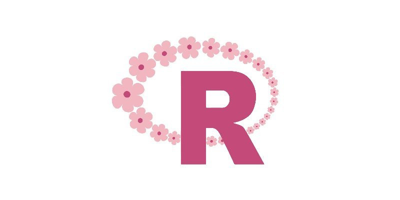
]

---

# Regional Networks

.pull-left[

]
.pull-right[
* [@LatinR_Conf](https://twitter.com/LatinR_Conf) / [LatinR](https://latin-r.com/) 
    * Conference and Slack
* [@AfricaRUsers](https://twitter.com/AfricaRUsers) / [africa-r.org](https://africa-r.org/)
    * Support new user groups
    * satRday conferences
* AsiaR
    * Support new user groups
    * Promote local conferences, e.g. JapanR, Korea R conference
    * Plan for AsiaR 2023/24
]

---

# Regional Leaders

.center[
.img-100[]
.img-100[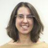]
.img-100[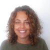]
.img-100[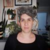]
.img-100[] 
<small> LatinR chairs: Florencia D'Andrea, Laura Ación, Natalia da Silva, Riva Quiroga, Yanina Bellini Saibene 
.img-100[]
.img-100[]
.img-100[]
.img-100[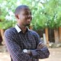]
.img-100[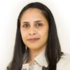]
.img-100[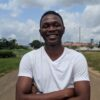]
.img-100[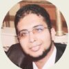] 
AfricaR leaders: Shelmith Kariuki, Ahmadou Dicko, Nelda Limilimi, Anicet Ebou,  Vebashini Naidoo, Dennis Irorere, Mohammed Ibrahim Ali  
.img-100[]
.img-100[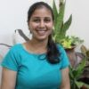] 
AsiaR founders: Janani Ravi, Adithi Upadhya
]
    
---

# Minorities in R

> MiR Community aims to support historically underrepresented R users around the world.
.pull-left[
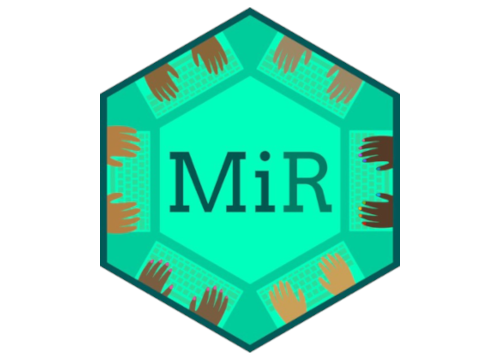
]
.pull-right[
- MiR community Slack
- Blog
- Webinars and tutorials
- Support RStudio instructor certification

[@miR_community](https://twitter.com/miR_community) / [mircommunity.com](https://mircommunity.com/)
]

---

# MiR Team

.center[
.img-100[]
.img-100[] 
Co-founders: Danielle Smalls-Perkins, Dorris Scott  
.img-100[]
.img-100[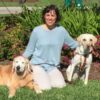]
.img-100[]
.img-100[]
.img-100[]
.img-100[] 
Silvia Canelón, Liz Hare, Audris Campbell,  Andy Murtha, Meenakshi Kushwaha, Ola Giwa
]

---

# Forwards

.pull-left-30[
 
.center[.img-300[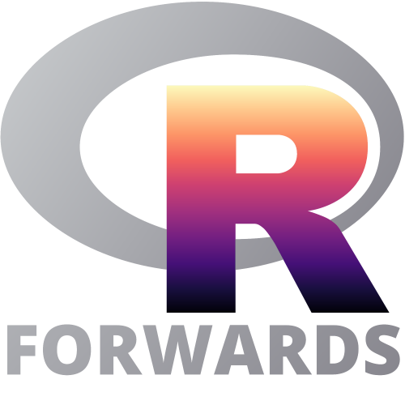]]
] 
.pull-right-64[Widening participation in R Foundation activities:  *useR!*, *R Journal*, CRAN, R project
- Accessibility
- Community
- Conferences
- On-ramps
- Surveys
- Teaching

[@R_Forwards](https://twitter.com/R_Forwards) / [forwards.github.io](https://forwards.github.io/)
]

---

# Forwards Team

.center[
.img-100[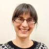]
.img-100[]
.img-100[]
.img-100[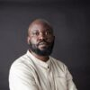]
.img-100[]
.img-100[]
.img-100[] 
.img-100[]
.img-100[]
.img-100[]
.img-100[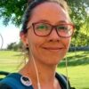]
.img-100[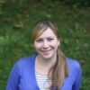]
.img-100[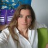] 
<small>Core Team: Heather Turner, gwynn sturdevant, Jonathan Godfrey, Richard Ngamita, Kevin O'Brien,   Noa Tamir, Yanina Bellini Saibene,
Saranjeet Kaur, Michael Lawrence, Anna Vasylytsya,   Andrea Sánchez-Tapia, Mine Çetinkaya-Rundel, Emma Rand </small>

Plus >20 sub-team members!
]

---

# R Contribution Working Group

Aim to foster larger, more diverse community of contributors to the R project.

Range of ways to contribute to R development:
.pull-left-30[
- Report a bug
- Confirm a bug
]
.pull-left-30[
- Contribute a message translation
- Contribute a minor fix
- Test a pre-release version of R
]
.pull-left-30[
- Contribute a substantial fix 
- Implement a new feature
]

---

# RCWG Initiatives

So far:

 - Created the R Contribution Site: [forwards.github.io/rcontribution/](https://forwards.github.io/rcontribution/)
 - Set up the [R-Devel Slack](https://forwards.github.io/rcontribution/slack)
 - Developed a draft version of the [R Development Guide](https://forwards.github.io/rdevguide)
 - Organized, prepared and delived two contributor-focused tutorials at *useR! 2021*
     - [Contributing to R](https://youtu.be/CZmldTOdlRM?list=PL4IzsxWztPdnCC_kMCYKrd_t6cViMhBrD)
     - [Translating R to your language](https://forwards.github.io/rcontribution/tutorials#translating-r-to-your-language)
     
Next: more events to support novice contributors.

---

# RCWG participants

.pull-left[
.img-100-float[] 
Saranjeet Kaur  *R Development Guide*   
.img-100-float[] 
Lluís Revilla Sancho  *R Bugzilla analysis*  
.img-100-float[] 
.img-100-float-next[] 
Michael Chirico 
Michael Lawrence *Translations tutorial*
]
.pull-right[
.img-100-float[] 
Kara Woo  *R-Ladies link, RWeekly Slack moderator*  
.img-100-float[] 
gwynn sturdevant  *MiR link*  
.img-100-float[] 
.img-100-float-next[] 
Gabriel Becker 
Martin Mächler *Contributing tutorial*
]

 
Plus several others joining meetings, contributing via [github.com/forwards/rcontribution](https://github.com/forwards/rcontribution)

---

# Get Involved

- Stay informed, share opportunities
    - Twitter ([@RLadiesGlobal](https://twitter.com/RLadiesGlobal), [@miR_community](https://twitter.com/miR_community),[@R_Forwards](https://twitter.com/R_Forwards), ...)
    - Blogs ([blog.rladies.org](https://blog.rladies.org/), [mircommunity.com/blog](https://mircommunity.com/blog), [forwards.github.io/blog](https://forwards.github.io/blog))
- Visit community/working group websites to join in
  - Slack groups, meetups/webinars, initiatives
- Offer to speak (reuse NHS-R talk?)
- Make sure colleagues/friends know what groups are out there

---

.center[
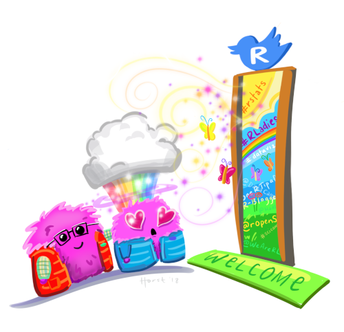 
<small>Artwork by [@allison_horst](https://twitter.com/allison_horst) </small>
]

