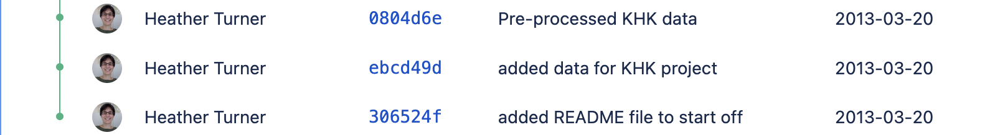

layout: true

.footer[`r fontawesome::fa("link")` [heatherturner.net/talks/NHS-R2022](https://www.heatherturner.net/talks/NHS-R2022)  &nbsp; `r fontawesome::fa("twitter")` [@HeathrTurnr](https://twitter.com/heathrturnr)]

???

Background: experience in research and industry, both writing my own scripts and reviewing other peoples - what am I looking for?

---

# Goals

In theory, writing scripts for data analysis makes our work

- Transparent
- Reproducible/reusable
- Maintainable

In practice, need to adopt good coding and software engineering practices!

???

Note other ways of defining "good", e.g. efficiency - not covered here!

Useful whether work on own or part of a team

---

class: inverse middle

# Transparency

???

Organize code as you would like to find it!

---

## Project Organization

.pull-left[

Organize your project as you would like to find it!

* Organize files by type (data, code, etc) to make it easy to navigate.
* Name files to reflect the content/function.
]
.pull-right[
```
example_project
│
└─── data
│   │   patient_outcomes.csv
│
└─── outputs
│   │   summarized_outcomes.csv
│   
└─── reports
│   │   study_report.Rmd
│   │   study_report.docx
│
└─── scripts
│   │   functions.R
│   │   analysis.R
```
]

???

---

## Documentation

* Put a README at the top level of your project folder
* Comment your code to describe its purpose
```{r, eval = FALSE}
# Patient exposure and event rate
patient_summary <- patient_outcomes |>
    group_by(STUDYID, COUNTRY, CENTRE, PT) |>
    summarise(d_exposure = max(d_exposure, na.rm = TRUE),
              exposure = (d_exposure/30.4), # calculate exposure per month
              event_count = sum(!is.na(EVENT)),
              event_rate = event_count/exposure)
```

--

* In RStudio, use <kbd>Ctrl</kbd>/<kbd title = "command">&#8984;</kbd> + <kbd>Shift</kbd> + R to insert a section
```{r, eval = FALSE}
# Pre-processing ----------------------------------------------------------
```


???

What would you tell a colleague if you were passing on the project and sat next to them?

Commenting, README

- could add slide on sectioning with picture of RStudio outline, if time/space
- could add comments on .Rmd vs .R (chunk names.main text can replace some comments; markdown sectioning replaces comment sectioning)

---

## Readable code

* Use meaningful names
* Keep line length <80 characters and use white space around operators
* Use one chunk of code per objective
* Prefer readability over maximum efficiency

--

.pull-left-53[
Efficient but complex

```r
df$lag_value <- c(NA, df$value[-nrow(df)])
df$lag_value[which(!duplicated(df$group))] <- NA
```
]
.pull-right-43[
More readable, slightly less efficienct
```r
df %>%
  group_by(group) %>%
  mutate(lag_value = dplyr::lag(value))
```
]

???

Naming, code style, one chunk of code per objective
Readable vs max efficiency


Favour readability over maximum efficiency. 

Ideal should be understandable without a comment

---

## Going further on transparency

- Style guides
    - Naming conventions, e.g. `snake_case` vs `CamelCase`
    - Indentation
    - See e.g. [The Tidyverse Style Guide](https://style.tidyverse.org/)
- Code review
- Pair programming
- Function documentation using the **docstring** package

???

docstring: Create help files from special roxygen2 comments.

---

class: inverse middle

# Reproducibility/Reusability

---

## Project-oriented workflow

In addition to organizing files within a project directory...
 1. Set the working directory to the project root
   - Use RStudio Projects
   - Use `here::set_here()` to tag the project root with a `.here` file
 2. Use file paths relative to the project root, to make your project portable
   - The here package makes this easy, e.g. 
   ```r
   ggsave(here("figs", "mpg_hp.png"))
   ```
   - If you need to use paths from outside the project, set these once at the start

???

General issue of hard-coding

Can use askpass:::askpass()

---

## Parameterized R Markdown/Quarto

```{r, echo = FALSE, eval = TRUE}
# function to put ``` when compiling Rmd
ticks <- function() "```"
```

.pull-left[
```{yaml}
---
title: "`r params$data` Dataset"
output: html_document
params:
  data: sleep
---
```
```{markdown}
Summary of the `r params$data` dataset:
```
````r
`r ticks()`{r summary-data, echo = FALSE}
report_data <- get(params$data)
summary(report_data)
`r ticks()`
````
]

.pull-right[
```{yaml}
---
title: "`r params$data` Dataset"
format: html
params:
  data: sleep
---
```
```{markdown}
Summary of the `r params$data` dataset:
```
````r
`r ticks()`{r}
#| label: summary-data
#| echo: false
report_data <- get(params$data)
summary(report_data)
`r ticks()`
````
]

???
Data analyst's reusable component

---

### Render with custom parameters

.pull-left[
```r
rmarkdown::render("rmarkdown.Rmd", 
  params = list(data = "sleep"))
  
```
<iframe src="rmarkdown.html" title="Output of rendering R markdown template" width = 400 height = 300></iframe>
]

.pull-right[
```r
quarto::quarto_render("quarto.qmd", 
  execute_params = list(data = "women"))
  
```
<iframe src="quarto.html" title="Output of rendering Quarto template" width = 400 height = 300></iframe>
]

---

## Defensive programming

Validate inputs, e.g.

```r
# check a Excel file exists at given path
xlsx <- normalizePath(xlsx, winslash = "/", mustWork = TRUE)
# check a threshold is valid
stopifnot(is.numeric(threshold) && threshold >= 0)
```

The **assertthat** and **validate** packages can be useful here.

--

Check results of filters and joins
```r
tab1 <- patient_outcomes %>%
    filter_(~ as.Date(DATE) == report_date & PT == patient)
if (!nrow(tab1))
    warning("No records for ", patient, " on ", report_date)
```


???

**assertthat** extension of stopifnot with more helpful error messages
**validate** for validating input data


---

## Package management

Most basic:
1. Add a `requirements.txt` at the root of the project.
2. Put `library()` calls at the top of `.R` and `.Rmd` files.

More advanced tools to specify and restore working environment:
1. _One-off analysis_: use **groundhog** to specify R, packages & dependencies by a **date**. 
2. _Repeated analysis_: use **automagic** to install package versions specified in **deps.yaml**.
3. _Production code_: use **renv** to specify version R, packages & dependencies.

???

one-off report: groundhog
reusable scripts: automagic
production code: renv

---

class: inverse middle

# Maintainability

---

## Choose dependencies carefully

Using a (non-base) package is always a trade-off:

| For (e.g.) | Against |
|-----|---------|
| Better readability | Package update can break code |
| Faster implementation | Dependent on maintainer to fix bugs |
| Better error handling | More setup to reproduce analysis |

--

* How much of the functionality are you using?
* How mature/well-maintained is the package?
* Are you using it across multiple projects?

???

Not minimize (conflicts with transparency)
Select often-changing packages with care
Avoid trivial dependencies

---

## Don't Repeat Yourself

Copy-pasting is error-prone and leads to over-complex code.

Use custom functions instead, e.g.
```r
# convert counts to percentages in 2-way table with row/column totals
make_perc_tab <- function(tab){
    nr <- nrow(tab)
    nc <- ncol(tab)
    tab/tab[nr, nc] * 100
}
```

--

Makes it easier to re-use or iterate, e.g.
```r
tab_list <- list(tab1, tab2, tab3)
out <- lapply(tab_list, make_perc_tab)
```

???

https://stackoverflow.com/questions/45101045/why-use-purrrmap-instead-of-lapply

make_perc_tab <- function(tab){
    tab/sum(tab) * 100
}

---

## Version control

Version control systems (e.g. git) allow us to record changes made to files in a directory.



--

* Avoid saving multiple variants or commenting out old code
* Commits can be restored temporarily or permanently
* Syncing with a remote repository (e.g. on GitHub) provides a backup

???

Acts like a log, with comments on changes made
Facilitates merging work from collaborators

---

## Testing

Tests can be used to custom functions act as expected, e.g.

```{r}
log_2 <- function(x) log(x, 2)
```

```{r, error = TRUE}
library(testthat)
test_that("log_2 returns log to base 2", {
  expect_equal(log_2(2^3), 3)
})
```

--

Can create a test suite and run as `test_file("tests.R")`.

Helps to detect issues introduced by changes to the code.

???

Pipelines/package development

Can also check Rmd output, e.g. by comparing hashes (MD5 checksums) of HTML files, possibly also testthat::expect_snapshot (untested!)

---

## Going further on maintainability

- Package development
    - Functions, documentation and tests in a shareable format
    - Easier to use across projects
- Using a repository host, e.g. GitHub
    - Use issues: note and discuss changes to make
    - Teamwork: work asynchronously and merge changes
    - Publish your code
    - Encourage external contribution

---

# Resources

[Good enough practices in scientific computing](https://doi.org/10.1371/journal.pcbi.1005510), Wilson et al, PLOS Computat. Biol., 2017.  
[The Turing Way : A Handbook for Reproducible Data Science](http://doi.org/10.5281/zenodo.3233986), Arnold et al, 2022.       
[What They Forgot to Teach You About R](https://rstats.wtf/project-oriented-workflow.html), Bryan and Hester, 2021.  
[Why should I use the here package when I'm already using projects?](https://malco.io/2018/11/05/why-should-i-use-the-here-package-when-i-m-already-using-projects/), Barrett, 2018.  
[How to use Quarto for Parameterized Reporting](https://www.mm218.dev/posts/2022-08-04-how-to-use-quarto-for-parameterized-reporting/), Mahoney, 2022.  
[Managing R script dependencies: automagic and renv](https://warwickrug.github.io/wrug_website/posts/2022-07-14-dependencies/), Cámara-Menoyo, 2022.  
[How to Use Git/GitHub with R](https://rfortherestofus.com/2021/02/how-to-use-git-github-with-r/), Keyes, 2021.  
[Happy Git and GitHub for the useR](http://happygitwithr.com/) Bryan et al, 2022.


???
https://mgimond.github.io/rug_2019_12/Index.html
