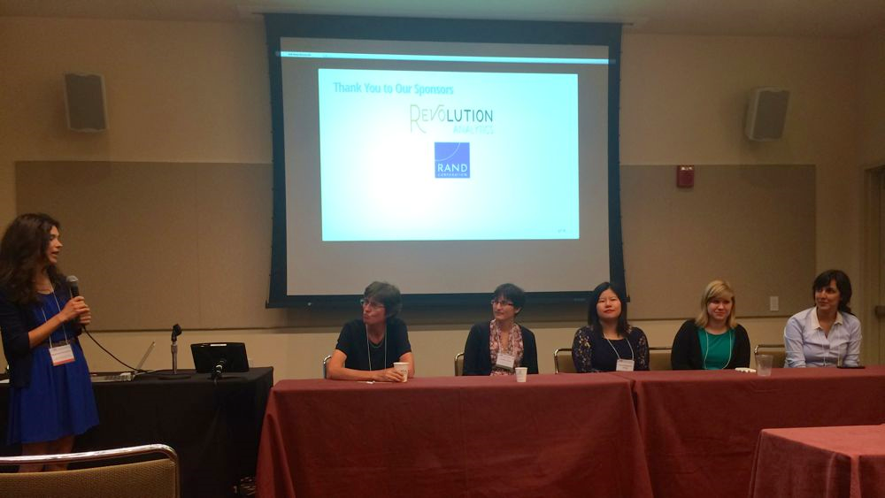
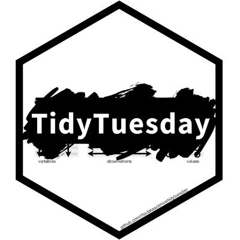
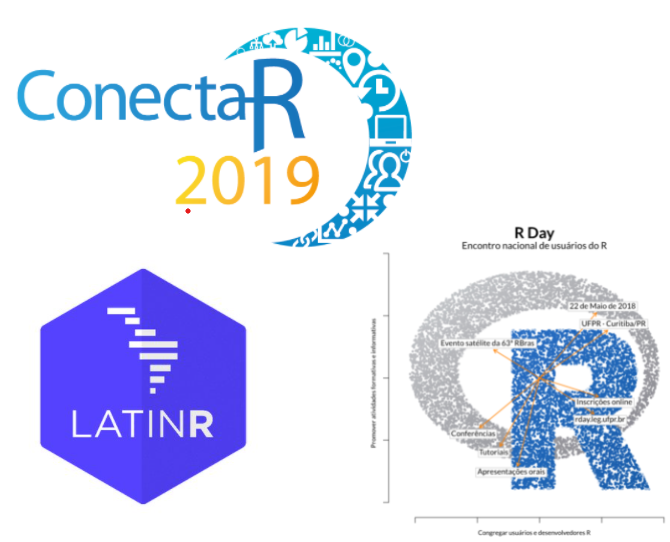

layout: true

.footer[`r fontawesome::fa("link")` [heatherturner.net/talks/RDayBrazil2021](https://www.heatherturner.net/talks/RDayBrazil2021)  &nbsp; `r fontawesome::fa("twitter")` [@HeathrTurnr](https://twitter.com/heathrturnr)]

---

# About me

.pull-left-64[
* Started using R in 2001 at start of Statistics PhD
 - Self-taught - mostly S-Plus resources!
* Postdoc 2004-2010
 - Developing R packages
* Period outside academia 2010-2021
 - Phamarceutical industry, freelance
* Return to academia as Research Software Engineer 

Become more involved in R community at each stage!

]
.pull-right-30[

]

---

class: inverse middle

# Development of the R Community

---

# In the beginning

.pull-left[
 
 
 
 
1992: Robert Gentleman and Ross Ihaka develop an early version of R for teaching.
]
.pull-right[

At the  Black Crow Cafe, Auckland, NZ 
<small>(source: [R. Ihaka](https://www.stat.auckland.ac.nz/~ihaka/downloads/the-r-project.pdf))</small>]

---

# The birth of a community

.pull-left-64[
1993: Robert Gentleman and Ross Ihaka 

 - share binary copies of R via Statlib
 - make announcement on the s-news mailing list
 
Others start to use R and give feedback.

1995: Martin Mächler (ETH Zurich) persuades Robert and Ross to release R under a GNU public license.
]
.pull-right-30[

<small>(source: [M. Maechler](https://stat.ethz.ch/~maechler/index-2004.html))</small>]

???

StatLib, a system for distributing statistical software, datasets, and information by electronic mail, FTP and WWW

---

# Development of the mailing lists

Early days: 
 - Robert, Ross & Martin handle bug reports and releases by email.
 - Robert & Ross maintain small mailing list
 
Martin establishes automated mailing lists
 - 1996: *r-testers*
 - 1997: *r-announce*, *r-help*, *r-devel*
 
This supports the community and accelerates development of R and R "extensions".

---

# Comprehensive R Archive Network

.pull-left-64[
1997: CRAN formed by Kurt Hornik (TU Wien) 

- Official R source distribution provided by R&R
- Extension packages: acepack, bootstrap, ctest, date, e1071, fracdiff, gee, jpn, oz,
snns, splines, survival4
- Documentation and Debian binaries of packages

Mirrors in USA and Switzerland.

R developers could submit package to CRAN via FTP.

]
.pull-right-30[

<small>(source: [Museum Unseres Computer Hinterhofs](https://much.isds.tugraz.at/people/by_name/h/hornik_kurt/index.htm/))</small>]

---

# CRAN growth

 
1997 - 2017 (source: <a href="https://www.r-bloggers.com/2017/03/scraping-cran-with-rvest">J.Silge</a>)

---

# R Core 

.pull-left[Over time, people given commit rights:
  - Luke Tierney (USA)
  - Heiner Schwarte (Switzerland)
  - Paul Murrell (Ross' PhD student)
  
1997: founded R "core team", adding
  - Kurt Hornik (Austria)
  - Peter Dalgaard (Denmark)
  - Thomas Lumley (USA at the time)
]

.pull-right[

<blockquote class="twitter-tweet tw-align-right">
It was twenty years ago today, Ross Ihaka got the band to play.... <a href="https://twitter.com/hashtag/rstats?src=hash&amp;ref_src=twsrc%5Etfw">#rstats</a> <a href="https://t.co/msSpPz2kyA">pic.twitter.com/msSpPz2kyA</a>
&mdash; Peter Dalgaard (@pdalgd) <a href="https://twitter.com/pdalgd/status/897735023427801088?ref_src=twsrc%5Etfw">August 16, 2017</a></blockquote> 

]

???

CVS: Concurrent Versioning System

---

# R-project.org

.pull-left-30[1999: website launched  

 - CRAN mirrors in Denmark, UK
 - JitterBug bug tracker
 - FAQ
 - Contributed documentation in EN, FR, ES
 
<small> 
(snapshot in June 2000, source: [Wayback Machine](https://web.archive.org/web/20000620195631/http://www.r-project.org/))</small>]
.pull-right-64-raise[
]

---

# Directions in Statistical Computing

.pull-left[
1999: First meeting of R Core team

New members present: 
 - Douglas Bates (USA), 
 - Friedrich Leisch (Austria), 
 - Brian Ripley (UK), 
 - Duncan Temple Lang (USA)

Also John Chambers, R Core from 2000

]
.pull-right[

<small> 
(credit Doug Bates, source: [DSC 1999](http://www.ci.tuwien.ac.at/Conferences/DSC-1999/doug-photos/20.html))</small>]

???

John Chambers creator of the S language
28 people at DSC altogether
Not just about R!
biennial conference series from 1999 to 2009

---

# R 1.0.0

.pull-left[
Released 29 February 2000

Base distribution tested and stable.

Now ~50 packages, e.g.
 - boot
 - cluster
 - foreign
 - nlme
]
.pull-right[

<small> 
(source: [R Foundation](https://twitter.com/_R_Foundation/status/1233671896144793600))</small>]

---

# R News

.pull-left[
2-5 issues a year, 2001-2008

 - Changes in R
 - Changes on CRAN
 - R package introductions/reviews
 - Programmer's Niche
 - Hints for newcomers
 - Applications
]
.pull-right[

<small> 
(Screenshot from first issue, source: [R News](https://cran.r-project.org/doc/Rnews/Rnews_2001-1.pdf))</small>]

---

# R Foundation

2003: Founded by R Core

 - Provide support for the R project
 - Provide a reference point
 - Hold copyright of R
 
Further members added by majority vote, currently 
  - 18 R Core members
  - 19 other

---

# useR!

.pull-left[
2004: Inaugural conference

~ 200 participants

- Keynotes from R Core
- User contributed talks & posters
    - Biostatistics, Ecology, Finance, etc
    - Statistical methods
    - R programming and interfaces
]
.pull-right[

<small> 
(Poster session, source: [R Conferences](http://www.ci.tuwien.ac.at/Conferences/useR-2004/Photos/36.html))</small>]

---

# "The useR! world"

Home cities of useR! 2004 participants, redrawn map [original by Roger Bivand](http://www.ci.tuwien.ac.at/Conferences/useR-2004/Photos/27.html)

---

# Internationalization of R

.pull-left[
2005: Support for localization in R 2.1.0

 - messages, error and warning messages
 - menu labels in the GUIs

Initially: *Brazilian Portuguese*, Chinese, English (as opposed to American), French, German, Italian, Korean, Russian and Spanish.

Reliant on volunteer [translation teams](https://developer.r-project.org/TranslationTeams.html).

]
.pull-right[

<small> 
(French R GUI, source: [B. Ripley](https://www.r-project.org/conferences/useR-2006//Slides/Ripley.pdf))</small>]

---

# CSDA 2005

.pull-left[
*International Association for Statistical Computing 3rd world conference on Computational Statistics & Data Analysis*

My first computational statistics conference `r emojifont::emoji("tada")`

More academic than useR!, but given friendly welcome by R folk, especially Achim Zeileis and Martin Mächler.

]
.pull-right[

<small> 
(Achim with Thomas Petzoldt, source: [useR! 2006](https://www.r-project.org/conferences/useR-2006/Photos/Dinner/10.html))</small>]

---

# R Journal

.pull-left-30[2009: inaugural issue  

Peer-reviewed articles 
 - Separate from news.
 - Individual PDFs

Conference reports.

2 issues a year.
 
]
.pull-right-64[

<small> 
(snapshot in May 2009, source: [Wayback Machine](https://web.archive.org/web/20090530125136/https://journal.r-project.org/))</small>]

---

# \#RStats Twitter

.pull-left[
2006: Twitter founded  
2009: #RStats adopted as "official" hashtag

Easy way to "join" the R community
 - @_R_Foundation joins 2016

It is so useful there is a book about it! [t4rstats.com](www.t4rstats.com). 
]

.pull-right[

<blockquote class="twitter-tweet tw-align-right">
I declare <a href="https://twitter.com/hashtag/rstats?src=hash&amp;ref_src=twsrc%5Etfw">#rstats</a> the official R statistical prog lang hashtag, pass it on to friends, family and Stata users
&mdash; Drew Conway (@drewconway) <a href="https://twitter.com/drewconway/status/1448027809?ref_src=twsrc%5Etfw">April 3, 2009</a></blockquote> 

]

---

# R User Groups

.pull-left-30[

Panel at useR! 2010 with

- San Francisco Bay Area (2008)
- Ottawa Gatineau (2008?)
- Los Angeles (2009)
- New York (2009)

LondonR founded 2009

]

.pull-right-64[

<small> 
(snapshot in Feb 2009, source: [Wayback Machine](https://web.archive.org/web/20090218051838/http://www.meetup.com/R-Users/))</small>]

---

# R-Bloggers

.pull-left[
Aggregator of R blogs

- RSS feed
- Follow via email/Facebook

English only in 2009.

Expanded to other langauges in 2010: Indonesian, Italian, Dutch and Korean.

]

.pull-right-raise[

<small> 
(snapshot in Dec 2009, source: [Wayback Machine](https://web.archive.org/web/20091223103951/http://www.r-bloggers.com/)</small>]

---

# rOpenSci

.pull-left[
2011: Non-profit founded to foster open and reproducible research

Initially: R packages to work with literature and databases

Later:
 - package peer review
 - guidance
 - community
 - unconfs (2014-2019)
]
.pull-right[

<small> (rOpenSci's logo at the time, later updated) </small>
]  

---

# Women in R

.pull-left[
heR panel at useR! 2014 raised awareness of gender disparity

In 2015:
  - Myself and Bettina Grün elected to R Foundation
  - Women in R taskforce set up in December 2015
]

.pull-right[
  
  ]

---

# useR! 2016 survey

.pull-left-64[

<small>(source: [Forwards](https://forwards.github.io/blog/2017/01/13/mapping-users/))</small>

]

.pull-right-30[
 
- 74% White; 16 % Asian
- 5% LGBT
- 33% women
]

---

# Forwards

.pull-left[
2017: Taskforce to widen participation

 - Social media
   - Twitter: @R_Forwards
   - https://forwards.github.io/
 - Community
 - Conferences
 - On-ramps
 - Surveys
 - Teaching

]
.pull-right[

] 

---

# R Consortium 

.pull-left[
2015: Non-profit business association set up as Linux Foundation project

Founders: R Foundation and 9 business including Microsoft and RStudio
- Funded projects
- Working groups
- RUG and conference support
]
.pull-right[

]  

---

# R-Ladies

.pull-left[
2012: Gabriela de Queiroz founded group in San Francisco

Later: Twin Cities, Taipei, London

2016: 
 - San Francisco & London organizer meet at useR!
 - R Consortium grant to create R-Ladies Global

]
.pull-right[

] 

---

# R Community Explorer

https://benubah.github.io/r-community-explorer

.pull-left[

RUGS: > 100 in Latin America
]
.pull-right[
 

R-Ladies: ~55 in  Latin America
] 

---

# satRdays

.pull-left[
2016: R Consortium grant to start 

- Budapest, 2016
- Cape Town, 2017

\> 20 conferences
- 6 in Africa
- 1 in S. America, Asia, Oceania

[https://satRdays.org/](https://satRdays.org/)
]
.pull-right[

] 

???

free/low-cost
locally organized

---

# R Weekly

.pull-left[
2016: Issue 0 published in May

 - News & Blog posts
 - New packages & tools
 - R Project updates
 - Calls for participation
 - Upcoming events
 
[rweekly.org/](https://rweekly.org/)

]
.pull-right[

] 

---

# Bookdown

.pull-left[
2016: bookdown 0.1 on CRAN

Enables R books to published on GitHub or
https://bookdown.org/

Top-quality continually updated R books available for free
 - R for Data Science (R4DS)
 - Text Mining with R
 - Efficient R programming
]
.pull-right[

] 

---

# R4DS Community

.pull-left[
2017: Founded by Jesse Mostipak

Online learning community 
 - bring together learners & mentors
 - work through R4DS on Slack
 
Slack now has ~10,000 members

Scope of group now expanded

[rfordatasci.com](https://www.rfordatasci.com/)

]
.pull-right[

]  

---

# RStudio Community

.pull-left[
2017: Discussion/help forum

Focused initially on
 - The Tidyverse
 - Shiny
 - RStudio IDE
 
Now expanded to include R in production, teaching, package development 

[community.rstudio.com](https://community.rstudio.com/)

]
.pull-right-raise[
 
 
 

<small>(screenshot Sep 2021, [community.rstudio.com/](https://community.rstudio.com/))</small>]  

---

# Tidy Tuesday

.pull-left[
2018: Social data project

Born out of R4DS community
 - Release data on Monday
 - Participants tidy data and create a plot
 - Share on Twitter
]
.pull-right[

]  

---

# R Foundation Endorsed Conferences

.pull-left[
Latin America:
- R Day, May 2018, Curitiba, Brazil.
- LatinR, September 2018, Buenos Aires, Argentina.
- ConectaR, January, 2019, San José, Costa Rica.

India:
- R@IIRSA. December, 2019, Mumbai.
]
.pull-right[

]  

---

# AfricaR

.pull-left-30[

]

.pull-right-64[
Established 2019

Expanded leadership team 2020 (9 countries)

- Connect R Users from different regions
- Established several R User Groups
- Organized 6 satRday conferences

[@AfricaRUsers](https://twitter.com/AfricaRUsers) / [africa-r.org](https://africa-r.org/)
]

---

# Tidyverse Developer Days

.pull-left[
2019: 1st TDD held after rstudio::conf(2019)

Work day on tidyverse issues - from first-time to experienced contributors

Repeated useR! 2019, rstudio::conf(2020)
]
.pull-right[

<small>(source: [B. Milz](https://beatrizmilz.com/blog/2019-08-12-tidydevday/))</small>
]  

---

# Minorities in R (MiR)

.pull-left-54[
2020: Founded by Danielle Smalls-Perkins and Dorris Scott

- Conference support
- Mi-useR Slack
- Social media and blog posts
- Mi-useR directory
- MiR dev days

[@miR_community](https://twitter.com/miR_community) / [mircommunity.com](https://mircommunity.com/)
]
]

.pull-right-40[

<blockquote class="twitter-tweet tw-align-right">
Dear Danielle,  Remember these incredibly brilliant, talented, and kind women data scientists whenever you feel like “the only one,” on a team or in a space. Thanks to <a href="https://twitter.com/hashtag/rstudioconf2020?src=hash&amp;ref_src=twsrc%5Etfw">#rstudioconf2020</a> for bringing us together! <a href="https://twitter.com/hashtag/rladies?src=hash&amp;ref_src=twsrc%5Etfw">#rladies</a> <a href="https://t.co/sA312EibH5">pic.twitter.com/sA312EibH5</a>
&mdash; Danielle Smalls-Perkins (@smallperks) <a href="https://twitter.com/smallperks/status/1222380156347547649?ref_src=twsrc%5Etfw">January 29, 2020</a></blockquote> 

]

---

# R Contribution Working Group

Formed after useR! 2020 as collaboration between R Core and community groups.

So far:
 - Created the R Contribution Site [forwards.github.io/rcontribution/](https://forwards.github.io/rcontribution/)
 - Set up the [R-Devel Slack](https://forwards.github.io/rcontribution/slack)
 - Developed a draft version of the [R Developer Guide](https://forwards.github.io/rdevguide)
 - Organized, prepared and delived two Contributor-focused tutorials at useR! 2021
     - [Contributing to R](https://youtu.be/CZmldTOdlRM?list=PL4IzsxWztPdnCC_kMCYKrd_t6cViMhBrD)
     - [Translating R to your language](https://youtu.be/S3Qhqf9u6ao?list=PL4IzsxWztPdnCC_kMCYKrd_t6cViMhBrD)
     
[Ideas incubator](https://forwards.github.io/rcontribution/) ongoing in preparation for open meeting September 24 

---

# Forwards Package Dev Workshops

Originally in-person workshops for women under R Consortium grant (2017-2020)

Now being modularized into 1-hour, online workshops:
 - Packages in a nutshell
 - Setting up your system
 - Your first package
 - Package documentation
 - Git and GitHub (planned)
 
Upcoming events: 21-24 September, 10am Brasilia Standard Time
https://www.eventbrite.co.uk/o/r-forwards-32010430405

---

# useR! Global 2021

---

# useR! Social Interaction

.pull-left[
- Slack
- Social events
   - My first useR! sessions
   - MiR, R-Ladies
   - yoga classes, cartoon art tutorials, Coded Bias screening
   - mixR, trivia
- Tutorials (breakout sessions), panels, incubators 
]
.pull-right[
Were you able to interact with other people during the conference?

] 

---

# useR! 2021 Incubators

- Five principles to grow up your R community
- The role of the R community in the RSE movement 
    - Outputs: [blog post](https://user2021.r-project.org/blog/2021/09/04/role-of-r-in-research-software-engineering/), [SeptemBRSE talk](https://youtu.be/YRsak7sIJ1w?t=3229)
    - Tying in with Heidi Seibold's keynote [Research Software Engineers (& Academia)](https://youtu.be/Xhwh80aTF0k)
- Strategies to build a strong AsiaR Community
- Expanding the R community in the Middle East and North Africa
- Stop reinventing the wheel: R package(s) for conference and abstract management

---

# useR! 2022 and Beyond

- In 2020 were piloting "regional hubs"
- Pandemic forced us to go virtual
- 2022 will be hybrid Nashville/virtual
    - How to keep best of useR! Global?
    - How to make virtual participation engaging?

---

# Much More!

- Regional/business-focused conferences: EARL, eRum, China-R, CascadiaConf, ...
- Specialized communities: Blind R User Group, NHS Community, HumanitaRian useR group, R Epidemics Consortium, ...
- R learning resources: tutorials, podcasts
- General resources: Stackoverflow, GitHub, ...
- Other organizations: Why R? Foundation, Bioconductor

Some covered: [heatherturner.net/talks/r-community](https://www.heatherturner.net/talks/r-community/#1)

---

<small>Artwork by @allison_horst </small>

---

# References

Ihaka, R. (1998). [R: Past and future history](https://cran.r-project.org/doc/html/interface98-paper/paper_2.html). Interface ’98.  
Smith, D. (2020). [The History of R (updated for 2020)](https://blog.revolutionanalytics.com/2020/07/the-history-of-r-updated-for-2020.html). Revolutions blog.

