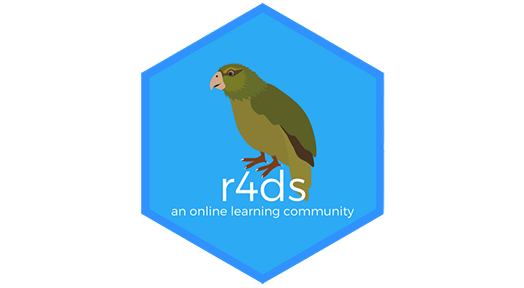
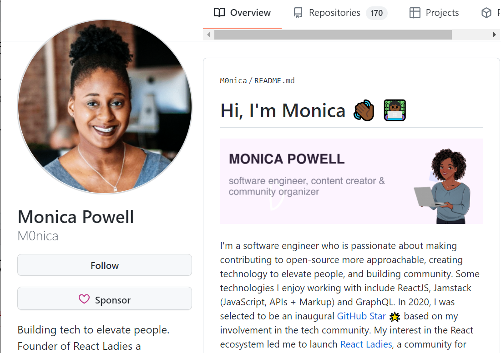
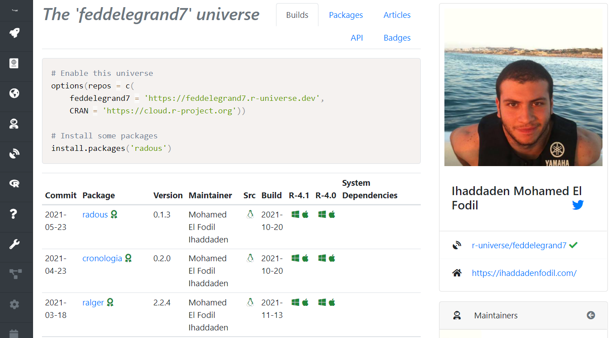

layout: true

.footer[`r fontawesome::fa("link")` [heatherturner.net/talks/RLadiesNairobi](https://www.heatherturner.net/talks/RLadiesNairobi)  &nbsp; `r fontawesome::fa("twitter")` [@HeathrTurnr](https://twitter.com/heathrturnr)]

---

class: inverse middle

# Learning

---

# R-Ladies Resources

- Meetups!
 - Many great virtual events worldwide: https://r-community.github.io/event-explorer/rcalendar.html
 - Watch recordings on the [R-Ladies YouTube](https://www.youtube.com/channel/UCDgj5-mFohWZ5irWSFMFcng)
- R-Ladies meetup materials
 - Search via this great shiny app: https://yabellini.shinyapps.io/RLadiesLesson/
- [R-Ladies Community Slack](https://rladies-community-slack.herokuapp.com/)
 - Get help when you are stuck: \#r-help channel
 - Follow R-Ladies blogs \#rladies_blogs
 
---

# Online Books

[bookdown.org](https://bookdown.org/): top-quality continually updated R books available for free, e.g.
 - R for Data Science (R4DS)
 - Text Mining with R
 - Efficient R programming
 
Sometimes PDF download button available, else clone GitHub source and build locally:
 - Install packages under Depends and Imports in DESCRIPTION
 - RStudio Build Tab > Build book
    
[bigbookofr](https://www.bigbookofr.com/): book of online R books, many free, organized by topic 

---

# R4DS Community

.pull-left[
Online learning community 
 - Slack has ~10,000 members
 - Brings together learners & mentors
 - Originally to work through R4DS
 - Now more books, general learning

[rfordatasci.com](https://www.rfordatasci.com/)

]
.pull-right[

] 

---

# Tutorials

- [R Studio education page](https://education.rstudio.com/learn/) resources for beginners/intermediate/advanced
    - [primers](https://education.rstudio.com/learn/): learning on RStudio cloud, dplyr, tidyr, ggplot2, purrr, R markdown, Shiny
- [Coding Club](https://ourcodingclub.github.io/) (a group at the University of Edinburgh) developed many tutorials, e.g. data handling, visualisation, modelling and spatial data.
- [Compilation of interactive tutorials](https://github.com/flor14/tutorials), including the R Bootcamp, Supervised Machine Learning Case Studies in R.
- [Data Science Guide](https://github.com/Chris-Engelhardt/data_sci_guide), tutorials organized by topic, often free if don't want certificate.
    
---

# Courses

- [Chromebook Data Science course](https://jhudatascience.org/chromebookdatascience) covering the fundamentals of data science, materials on leanpub from free.
- [Data Science in a Box](https://datasciencebox.org/): learn/teach basic data science skills
- [eR-Biostat R/statistics courses](https://er-biostat.github.io/Courses/): exploratory data analysis, inference, modelling
- [PsyTeachR courses](https://psyteachr.github.io/): R/statistical skills for psychology undergraduate/postgraduates
- [Courses by Andrew Heiss](https://www.andrewheiss.com/): data visualization, economics, science communication
    
---

# More Resources!

- Blogs
   - [R-bloggers](https://www.r-bloggers.com/): use RSS reader like feedly, inoreader
   - [RWeekly](https://rweekly.org/): can get RSS feed/follow on Twitter
- Podcasts
  - [Sina Rüeger's recommendations](https://sinarueeger.github.io/post/podcasts/)
- General lists
    - [learnr4free](https://www.learnr4free.com/): searchable table of books, videos, tutorials, articles
    - [awesome-r-learning-resources](https://github.com/iamericfletcher/awesome-r-learning-resources): blogs, books, communities of practice, podcasts, YouTube videos, tutorials

---

class: inverse middle

# Sharing

---

# Paying it forward

Help others to learn as you learnt!

- Meetups
    - Share your talk/workshop materials
- Slacks
- Blogs
- ...

---

# Conferences

- Share your knowledge/work 
- Gain feedback and recognition
- Upcoming:
  - [Why R? 2021 Conference, December 10](https://2021.whyr.pl/) - call for abstracts ends November 19!
  - [R Conferences and Meetings](https://jumpingrivers.github.io/meetingsR) - listing of in-person and virtual events
- [R-Ladies abstract review service](https://docs.google.com/forms/d/e/1FAIpQLSck8FBjNWjziI8pPIoCBlf5J4oQ_6pzeUdbQ1HjYfJ2bNDwDw/viewform)
   - Get feedback on your draft before submitting - allow 3 weeks!

---

# Code

.pull-left-30[
[GitHub](https://github.com/) is a great place to share code  - with benefit of version control!

 - Get started: [Version control with RStudio and GitHub](https://aberdeenstudygroup.github.io/studyGroup/lessons/SG-T1-GitHubVersionControl/VersionControl/)
 - [Build a stunning README for your GitHub profile](https://towardsdatascience.com/build-a-stunning-readme-for-your-github-profile-9b80434fe5d7)
]
.pull-right-64[

]
 
---

# R packages

.pull-left-30[
Learn from [Shelmith Kariuki](https://youtu.be/GfvICRb4TN0)!

[Make a personal package repository on R-universe](https://ropensci.org/blog/2021/06/22/setup-runiverse/)

[Release a package to CRAN](https://r-pkgs.org/release.html)

Consider [peer review](https://github.com/ropensci/software-review)
and [more get your package seen and used](https://www.heatherturner.net/talks/publishing-and-promoting-r-packages)

]
.pull-right-64[

]

---

# Collaborative coding

GitHub makes it easier to contribute to other people's packages
 - Check the URL in the package DESCRIPTION file to see if it has a GitHub
 - Use issues to report a bug/suggest a feature
 - Look at issues for opportunities to contribute
    - Check if project has guidelines in a CONTRIBUTING file
    - Ask if maintainer would accept a PR (pull request)
 
[Learn how to create a PR](https://www.earthdatascience.org/courses/intro-to-earth-data-science/git-github/github-collaboration/)

[Practice with Forwards' first-contributions repo](https://github.com/forwards/first-contributions)

---

# Contributing to the R project

 - R is maintained with SVN (Subversion), but there is a [GitHub mirror](https://github.com/r-devel/r-svn)
 - Help manage bugs on [R's Bugzilla](https://bugs.r-project.org/)
  - Report a bug
  - Confirm a bug
  - Propose a patch
 - Contribute to R's translations of messages
  - [Translating R to Your Language](https://forwards.github.io/rcontribution/tutorials) tutorial
  

See [R Development Guide](https://forwards.github.io/rdevguide/) for more help and join [R-Devel Slack](https://forwards.github.io/rcontribution/slack) to get involved.

---

.center[
  
 
<small>[Image by Clipart.info](https://clipart.info/congratulationsimagesclipart) is licensed under [CC BY 4.0](https://creativecommons.org/licenses/by/4.0/)</small>
]
