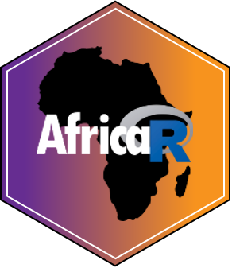

layout: true

.footer[`r fontawesome::fa("link")` [heatherturner.net/talks/RUsersNamibia2022](https://www.heatherturner.net/talks/RUsersNamibia2022)  &nbsp; `r fontawesome::fa("twitter")` [@HeathrTurnr](https://twitter.com/heathrturnr)]

---

class: inverse middle

# What can R do?

---

# Data Management

.pull-left[.center[
Data import

]]
.pull-right[.center[
Tidying, transforming

]]

???
https://epirhandbook.com/en/index.html

---

# Data Analysis

.pull-left-33[.center[
Exploratory data analysis

]]
.pull-left-33[.center[
Statistical modelling

]]
.pull-left-33[.center[
Specialised analysis

]]

???
https://programminghistorian.org/en/lessons/temporal-network-analysis-with-r

---

# Reporting

.pull-left-raise-25[.center[
Dashboards/web apps

]]
.pull-right-raise-90[.center[
Literate programming

]]

---

class: inverse middle

# The R Community

---

# R User Community

.pull-left-33[
Research Institutions
* CGIAR
* European Environment Agency
* Indian Statistical Institute
* University of Oxford
* National Institute of Standards and Technology
]
.pull-left-33[
Companies
* Deloitte
* Ebay
* Google
* Mozilla
* Oracle
* Pfizer
* Roche
* Twitter
]
.pull-left-33[
Government, NGO, journalists...
* BBC
* National Health Service England & Wales
* New York Times
* UK Government
* World Bank
* United Nations
]

???
Consultative Group on International Agricultural Research

---

# R Developer Community

.pull-left-64[.center[
R Core Team + R Contributors

[r-project.org/contributors.html](https://www.r-project.org/contributors.html)
]]
.pull-left-33[.center[
Package Authors

CRAN  <a href="https://cran.r-project.org">cran.r-project.org</a>

 <a href="https://www.bioconductor.org">bioconductor.org</a>

GitHub  <a href="https://github.com">github.com</a>
]]

???

https://github.com/llrs/bugzilla_viz

---

# The R Foundation

A not-for-profit organization that supports the R project

* Publisher of The R Journal
* Organizes/endorses conferences

.pull-left-30[.raise-25[.center[
 
June 20-23

[user2022.r-project.org](https://user2022.r-project.org/)

]]]
.pull-right-64[.raise-25[
 
Fees for Namibia:
* Conference: USD 14-29
* 2 tutorials: USE 12-22 

Needs-based waivers on a case-by-case basis.
]]

---

# Forwards

The R Foundation taskforce for under-represented groups

* Initiatives to increase participation

.pull-left[.raise-25[

]]
.pull-right[
Forwards Southern Africa Project 2020
* South Africa: R-Ladies, satRdays
* Eswatini: R User Group 
* Botswana: WiMLDS Gaborone and PyData Botswana
] 

---

# R User Groups

.pull-left[According to https://benubah.github.io/r-community-explorer
29 RUG/R-Ladies Groups (+1 for Namibia!)

]
.pull-right[.center[

]]

---

# R Consortium 

.pull-left[
Non-profit business association set up to support R.

R Foundation + 17 business including Microsoft and RStudio
- Funded projects
- Working groups
- [RUG and conference support](https://www.r-consortium.org/all-projects/r-user-group-support-program)
]
.pull-right[

]  

---

# AfricaR

.pull-left-30[.center[

]]

.pull-right-64[
Established 2019

- Connect R users from different regions
- Established several R User Groups
- Organized 6 satRday conferences

[@AfricaRUsers](https://twitter.com/AfricaRUsers) / [africa-r.org](https://africa-r.org/)
]

---

# R-Ladies

> R-Ladies is a worldwide organization whose mission is to promote gender diversity in the R community.

.pull-left[
- R-Ladies Remote ([@RLadiesRemote](https://twitter.com/rladiesremote))
    - reading group (~1/month)
    - Slack/Zoom chats (~1/month)
- [Abstract review for conferences](https://docs.google.com/forms/d/e/1FAIpQLSck8FBjNWjziI8pPIoCBlf5J4oQ_6pzeUdbQ1HjYfJ2bNDwDw/viewform)
- R-Ladies community slack [sign up](https://rladies-community-slack.herokuapp.com/)
 - many channels: #events, #r-help

]
.pull-right[.center[

] ]

---

# Minorities in R (MiR)

> Slack-based community to support the professional development and well-being of historically underrepresented minorities that use R

.pull-left[
- Sharing information
- Webinars
- RStudio Instructor Training
- Social media and blog posts

[@miR_community](https://twitter.com/miR_community) / [mircommunity.com](https://mircommunity.com/)
]
.pull-right[.center[

] ]

---

# Online Community Spaces

.pull-left[
 
- [R4DS Online Learning Community](https://www.rfordatasci.com/)
- [RStudio Community](https://community.rstudio.com/)
- [discoRd](https://www.r-discord.com/)
- [Twitter for R programmers](https://www.t4rstats.com/index.html) #RStats 
- LinkedIn
]
.pull-right[

]

---

# Research Software Engineering

> Supporting the use of software in research

.pull-left[.center[

]]
.pull-right[
Research Software and Systems Engineers of Africa

- Raise awareness of RSE
- Organize events
- Forum for sharing skills & opportunities

https://rsse.africa/
]

---

class:middle

.center[
Thanks and all the best on the launch of R Users Namibia!

]
