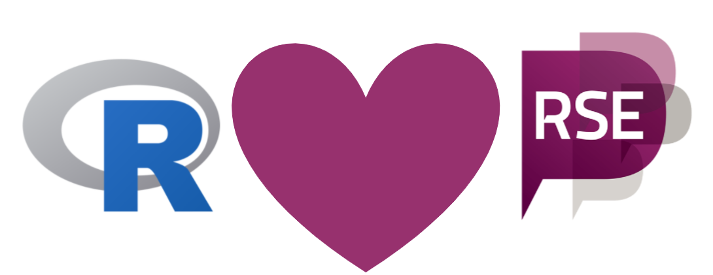
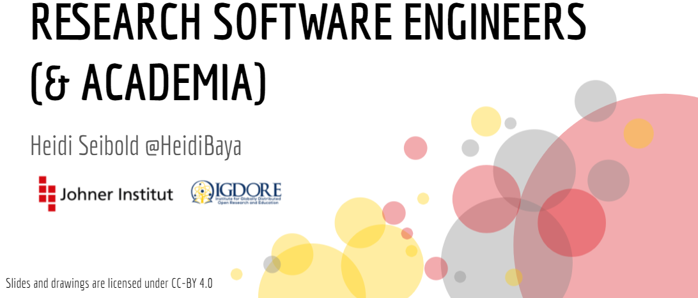
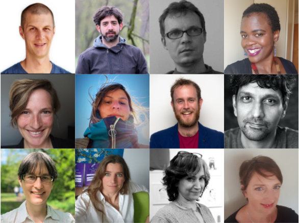
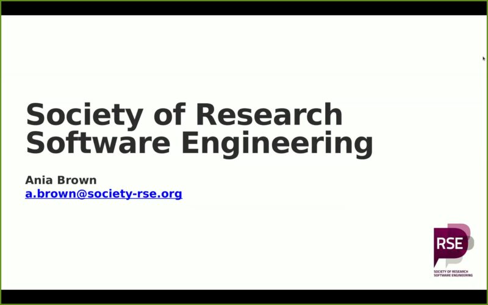
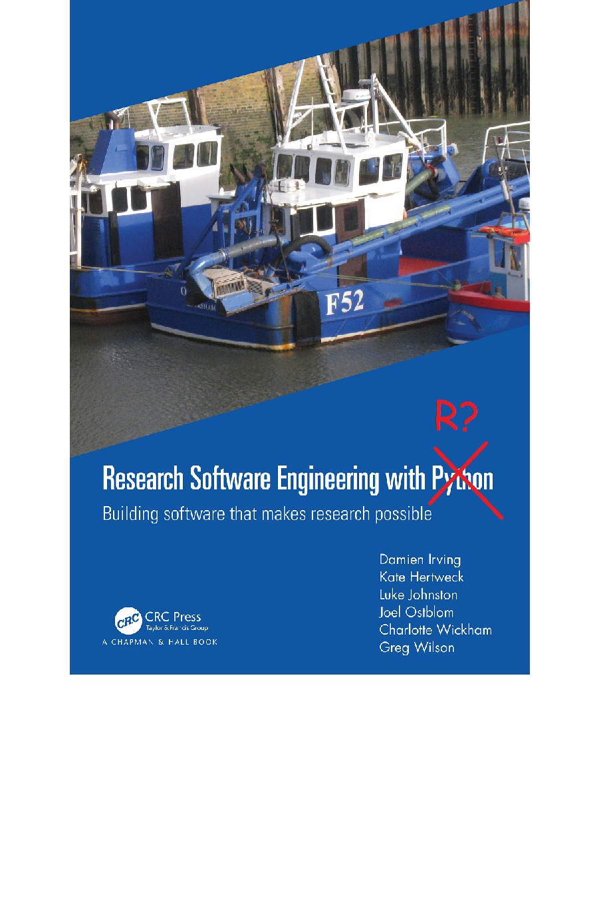

layout: true

.footer[`r fontawesome::fa("link")` [heatherturner.net/talks/SeptembRSE2021](https://www.heatherturner.net/talks/SeptembRSE2021)  &nbsp; `r fontawesome::fa("twitter")` [@HeathrTurnr](https://twitter.com/heathrturnr)]

---

# R & RSE Communities

.pull-left[

R is widely used software for data science.

RSE community mainly people from computer science and physical sciences.

A lot of scope to bring communities closer together!

]
.pull-right[ <small>Image credit: @HeidiBaya</small>]

---

# Incubator Session at useR!

.pull-left[

*useR!* is the main R user conference

Introduced "incubators" for 2021

> Incubators give the opportunity to people working in similar fields to connect and work on a common goal or question.

Heidi Seibold proposed an incubator to accompany her keynote
]

.pull-right[
  
<a href="https://youtu.be/Xhwh80aTF0k">Heidi Seibold's keynote on YouTube.</a>
]

---

class: inverse middle

# Plan

---

# Planning the Incubator

.pull-left[
* Gathered team of R users in RSE-related roles
* Planned format for session
   - 1 hr with  ~45 min for discussion
   - Team propose topics in advance
   - Participants have free choice
   - Team facilitate breakout groups
   - Each group writes summary
]

.pull-right[
]

---

# Special Guests

.pull-left[
*  Ania Brown (RSE at the University of Southampton, UK and Trustee at the Society of Research Software Engineering) 
* Mario Antonioletti (RSE at Software Sustainability Institute, UK).
]

.pull-right[
<a href="https://www.youtube.com/watch?v=Xhwh80aTF0k">Ania Brown's introductory talk on YouTube.</a>
]

---

class: inverse middle

# Outputs

---

# 1A:  What does a RSE who uses R do? 

Experiences were shared by the group:
 - Nick Tierney and Anna Krystalli became RSEs having started out in research 
 - Others not officially RSEs, but doing RSE work
 
Common tasks:
 - Data cleaning
 - Automating repetitive tasks (analysis templates)
 - Building tools/R packages for analysis
 - Developing documentation
 - Supporting new users
 
 
---

# 1B: How to get started as an RSE?

You can get started with 
 - Research experience
 - Interest in software
 - Desire to improve the research experience
 
Get started by
- Teaching software in your research group
- Automating repetitive tasks/ simplify annoying tasks

---

# 2A: How can we promote RSE career paths? 

**Bottom up:** Build grass-roots communities.   
**Top down:** Institutions, funders, and journals have the power to make change.

- Allow for less stiff career paths in science
- Offer permanent/prestigious positions and group leader positions.
- Make term RSE more widely known.

---

# 2B: How can we make software a first class citizen in science? 

RSE careers depend on academia valuing software

 - Teach / learn about research software and its importance.
 - Count software as a valuable research output.
 - Value maintenance of software

---

# 3A: How can we identify and highlight funders of research software? 

Many funders provide seed capital, but maintenance harder

- Build networks to become aware of opportunities and how to exploit them
  - Get involved in the RSE community!
- Develop focused functionality through student projects
  - Masters/PhD
  - Google Summer of Code
- Use a donation button (but no continuity)
- Consider a dual licensing scheme for commercial/academic use.

---

# 3B: Potential funders (international)

 - Chan Zuckerberg Initiative (CZI)
 - Code for Science and Society
 - Gordon and Betty Moore Foundation
 - Wellcome Trust
 - Society of RSE
 
---

# 4A: How can we increase visibility of RSEs in the R community? 

Many people do not know what an RSE is or identify as an RSE when they could! 

Start by promoting RSE as a discipline/career
 - Share relevant talks on social media
 - Invite RSE speakers (especially R users) to R events.
 - Share RSE event announcements/listings.
 - Participate in mentoring ([RSE Society Mentorship Scheme @ SeptembRSE](https://septembrse.github.io/#/event/T1026))
 - Share RSE jobs ([RSE Society vacancies page](https://society-rse.org/careers/vacancies/))
 - Apply for funding to support RSE work/outreach
 
---

# 4B: Identifying as an RSE/building community

 - Join your local [RSE Association](https://researchsoftware.org/assoc.html) and/or the [RSE Slack](https://society-rse.org/join-us/#slack) 
 - Create RSE channels on R Slacks, e.g. R-Ladies community Slack.
 - Use the #RSEng hashtag on Twitter (with #RStats, #RStatsES etc).
 - Write RSE-related posts on R blogs.
 - Create newsletter for R + RSE community.
 - Start/contribute to podcast 
 
---

# 5A: Could we develop a podcast on ‘meet the R-engineers’? 

Thoughts on idea in general:

- What to cover?
    - RSE stories vs technical topics
    - Research vs software 
- Podcast vs YouTube
    - Longer, less technical vs short technical topics with visual support
    - Better reach with YouTube
- How to differentiate from existing efforts in R community?

---

# 5B: Existing outlets

Collaborating with existing outlets may be most practical
 - [Bioconductor Developer's Forum](https://www.youtube.com/playlist?list=PLdl4u5ZRDMQQLMupAtEzm2y4gUIUm_1n6) (Monthly teleconference with RSE content)
 - [Why R? Webinars]( https://www.youtube.com/watch?v=3RkBEva4xRk&list=PLKMUlj_pGn_ldSI9_xIae6tOozrMNYa96)
 - [RSE Stories podcast](https://us-rse.org/rse-stories/posts/)
 
RSE Stories is most in line with the original idea.

---

# 6A: What should a book “Research Software Engineering with R” contain? 

.pull-left-64[
Fundamentals to allow R users to become software engineers (similar to [Research Software Engineering with Python](https://merely-useful.tech/py-rse/))
  - Unix, shell, git
  - Pipeline toolkits (including R-specific ones)
  - Package development, testing and deployment
  - Thinking like a RSE, how to be a good contributor
]

.pull-right-30[

]
---

# 6B: Further themes

Could be in separate books/sections
 - Benefits of R-focused RSE
   - Could contribute R-specific perspectives to the Turing Way
 - Advanced topics
   - Managing memory
    - Big data
    - Cloud and parallel computing
    - Database connectivity
    - Data products such as Shiny dashboards

---

# 7: How do we develop an RSE for R users community?

Ideas overlap with other groups, but set out a coherent plan:

- Find interested people and set up a core team
- Make the RSE concept explainable to interested people, e.g. by writing a manifest.
- Identify crosscutting topics in the RSE and R communities (e.g. Open Science/Data).
- Invite R users to RSE events and vice versa.
- Start with user stories as in the RSE Stories podcast.

---

# Actions

A few actions since the incubator:
- Created \#r-users groups on RSE Slack
- Published post about incubator on useR! blog [https://user2021.r-project.org/blog/](user2021.r-project.org/blog)
- Presented this talk!

---

# Summary   

Incubators

- Require pre-planning and post-processing by the organizers
- Can be a productive way to get a community working together on a theme.

The useR! RSE incubator helped to
   - Raise awareness of the RSE movement
   - Promote individual actions
   - Connect collaborators
   - Provide space to build on ideas

