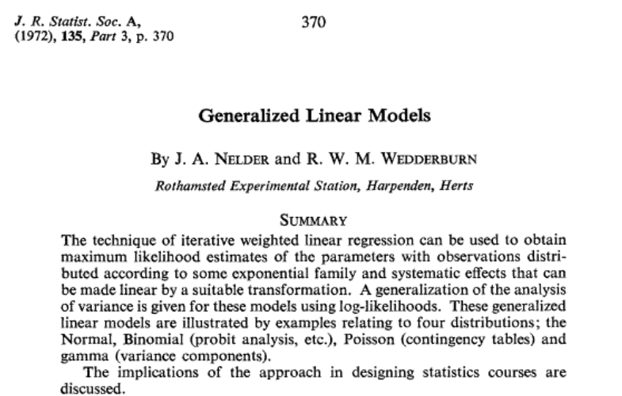

```{r setup, include = FALSE}
options(digits = 4)
options(width = 80)
library(dplyr)
library(ggplot2)
library(gnm)
library(splines)
library(vcd)
library(kableExtra)
library(knitr)
opts_chunk$set(echo = TRUE, dev = "png", dpi = 300,
               comment = "")
# trim white space top and right of plot
knit_hooks$set(small.mar = function(before, options, envir) {
    if (before) par(mar = c(4, 8, .1, 4))
})
# trim white space when par won't work
library(magick)
knit_hooks$set(crop = function(before, options, envir) {
    if (before || isTRUE((fig.num <- options$fig.num) == 0L))
        return()
    paths = fig_path(options$fig.ext, options, fig.num)
    for (f in paths) image_write(image_trim(image_read(f)), f)
})
set.seed(1)
```

# 50 Years Ago...

```{r glm_paper, echo = FALSE, fig.align = "center", out.width = "80%"}

```

---

# Extending to nonlinear predictors

In a **GLM** we have

$$g(\mu) = \beta_0 + \beta_1 x_{1} + ... + \beta_p x_{p}$$ 

and

$$\text{Var}(Y) = \phi V(\mu)$$ 

A **generalized nonlinear model (GNM)** is the same as a GLM except that we have 

$$g(\mu) = \eta(\boldsymbol{x}; \boldsymbol{\beta})$$ 

where $\eta(\boldsymbol{x}; \boldsymbol{\beta})$ is nonlinear in the
parameters $\boldsymbol{\beta}$.

---

# Motivation

* Parsimony, e.g. 
    - multiplicative interaction
    - weighted main effects

* Interpretability, e.g. 
    - multiplicative scaling
    - mechanistic model
    
Several specific models proposed in the literature: the R package gnm 
(Turner and Firth, 2005) enables fitting in unified framework.
    
---

.pull-left-45[
# Example: Mental Health Status

A study of 1660 children from Manhattan recorded their mental impairment and
parents' socioeconomic status (Agresti, 2002)
]

.pull-right-54-raise[
```{r mentalHealth, fig.width = 4.6, fig.height = 4.6, echo = FALSE}
data("mentalHealth")
mentalHealth$MHS <- C(mentalHealth$MHS, treatment)
mentalHealth$SES <- C(mentalHealth$SES, treatment)
mentalHealth <- xtabs(count ~ SES + MHS, mentalHealth)
mosaic(mentalHealth)
```
]

---

# Independence

A simple analysis of these data might be to test for independence of MHS
and SES using a chi-squared test.

This is equivalent to testing the goodness-of-fit of the independence
model 

$$\log(\mu_{rc}) = \alpha_r + \beta_c$$

Such a test compares the independence model to the saturated model

$$\log(\mu_{rc}) = \alpha_r + \beta_c + \gamma_{rc}$$ 

which may be over-complex.

---

# Row-column Association

One intermediate model is the Row-Column association model:

$$\log(\mu_{rc}) = \alpha_r + \beta_c + \phi_r\psi_c$$ 

(Goodman, 1979), an example of a multiplicative interaction model.

For the Mental Health data:
```{r anovaTable, echo = FALSE}
options(show.signif.stars = FALSE)
indep <- gnm(Freq ~ SES + MHS, family = poisson, data = mentalHealth)
sat <- update(indep, Freq ~ SES*MHS)
RCmodel <- update(indep, Freq ~ SES + MHS + Mult(SES, MHS), verbose = FALSE)
anova(indep, RCmodel, sat, test = "Chisq")
```

---

# Parameterisation

The independence model was defined earlier in an over-parameterised
form: 

$$
\begin{aligned}
  \log(\mu_{rc}) &= \alpha_r + \beta_c \\
    &= (\alpha_r + 1) + (\beta_c - 1) \\
    &= \alpha_r^* + \beta_c^*
\end{aligned}
$$ 
  
Identifiability constraints may be imposed

-   to fix a one-to-one mapping between parameter values and
    distributions
-   to enable interpretation of parameters

---

# Standard Implementation

The standard approach of all major statistical software packages is to
apply the identifiability constraints in the construction of the model

$$g(\boldsymbol{\mu}) = \boldsymbol{X\beta}$$ 

so that $\text{rank}(\boldsymbol{X})$ is equal to the number of parameters $p$.

Then the inverse in the score equations of the IWLS algorithm
$$\boldsymbol{\beta}^{(r + 1)} = \left(\boldsymbol{X}^{T}\boldsymbol{W}^{(r)}\boldsymbol{X}\right)^{-1}\boldsymbol{X}^{T}\boldsymbol{W}^{(r)}\boldsymbol{z}^{(r)}$$
exists.

---

# Alternative Implementation

An alternative is to keep models in their over-parameterised form, so
that $\text{rank}(\boldsymbol{X}) < p$, and use the generalised inverse in
the IWLS updates:
$$\boldsymbol{\beta}^{(r + 1)} = \left(\boldsymbol{X}^{T}\boldsymbol{W}^{(r)}\boldsymbol{X}\right)^{-}\boldsymbol{X}^{T}\boldsymbol{W}^{(r)}\boldsymbol{z}^{(r)}$$

This approach is more useful for GNMs, since in this case it is much
harder to define standard rules for specifying identifiability
constraints.

Rather, identifiability constraints can be applied post-fitting for
inference and interpretation.

---

# Parameterisation of RC Model

The RC model is invariant to changes in scale or location of the
interaction parameters: 

$$
\begin{aligned}
  \log(\mu_{rc}) &= \alpha_r + \beta_c + \phi_r\psi_c \\
    &= \alpha_r + \beta_c + (2\phi_r)(0.5\psi_c) \\
    &= \alpha_r + (\beta_c - \psi_c) + (\phi_r + 1)(\psi_c)
\end{aligned}
$$ 

One way to constrain these parameters is as follows

$$
\phi_r^* = \frac{\phi_r - \frac{\sum_r w_r \phi_r}{\sum_r w_r}}{
\sqrt{\sum_r w_r \left(
\phi_r - \frac{\sum_r w_r \phi_r}{\sum_r w_r}
\right)^2
}}
$$ 

where $w_r$ is the row probability, say, so that $\sum_r w_r \phi_r^* = 0$ and $\sum_r w_r (\phi_r^*)^2 = 1$.
    
---

#  Row and Column Scores

The row and columns scores for the RC model are
```{r scores, echo  = FALSE}
rowProbs <- margin.table(mentalHealth, 1)/sum(mentalHealth)
colProbs <- margin.table(mentalHealth, 2)/sum(mentalHealth)
mu <- getContrasts(RCmodel, pickCoef(RCmodel, "[.]SES"),
                   ref = rowProbs, scaleRef = rowProbs,
                   scaleWeights = rowProbs)
nu <- getContrasts(RCmodel, pickCoef(RCmodel, "[.]MHS"),
                   ref = colProbs, scaleRef = colProbs,
                   scaleWeights = colProbs)
round(mu$qv, 2)
round(nu$qv, 2)

```

As one might expect, the scores are ordered for both factors, suggesting
the model for the dependence structure might be simplified further.

---

# Stereotype Model

The stereotype model (Anderson, 1984) is suitable for ordered categorical data.
It is a special case of the multinomial logistic model:
$$pr(y_i = c | \boldsymbol{x}_i) = \frac{\exp(\beta_{0c} + \boldsymbol{\beta}_c^T \boldsymbol{x}_i)}
    {\sum_r\exp(\beta_{0r} + \boldsymbol{\beta}_r^T \boldsymbol{x}_i)}$$
in which only the *scale* of the relationship with the covariates
changes between categories:
$$pr(y_i = c | \boldsymbol{x}_i) = \frac{\exp(\beta_{0c} + \gamma_c \boldsymbol{\beta}^T \boldsymbol{x}_i)}
    {\sum_r\exp(\beta_{0r} + \gamma_r \boldsymbol{\beta}^T \boldsymbol{x}_i)}$$

---

# Poisson Trick

The stereotype model can be fitted as a GNM by re-expressing the
categorical data as category counts $Y_i = (Y_{i1}, \ldots, Y_{ik})$.

Assuming a Poisson distribution for $Y_{ic}$, the joint distribution of
$Y_i$ is $\text{Multinomial}(N_i, p_{i1}, \ldots, p_{ik})$ conditional on the
total count $N_i$.

The expected counts are then $\mu_{ic} = N_ip_{ic}$ and the parameters can be estimated via
$$
\begin{aligned}
    \log \mu_{ic} &= \log(N_i) + \log(p_{ic}) \\
        &= \alpha_i + \beta_{0c} + \gamma_c\sum_r \beta_{r}x_{ir}
\end{aligned}
$$ 
where the "nuisance" parameters $\alpha_i$ ensure
that the multinomial denominators are reproduced exactly, as required.

---

# Augmented Least Squares

The number of nuisance parameters can be large, making computation slow. The algorithm can be adapted using *augmented least squares*. 

For an ordinary least squares model, 
$$
\begin{aligned}
    \left[(\boldsymbol{y}|\boldsymbol{X})^T(\boldsymbol{y}|\boldsymbol{X})\right]^{-1} &=
        \begin{pmatrix}
            \boldsymbol{y}^T\boldsymbol{y} & \boldsymbol{y}^T\boldsymbol{X} \\
            \boldsymbol{X}^T\boldsymbol{y} & \boldsymbol{X}^T\boldsymbol{X} \\
        \end{pmatrix}^{-1} =
        \begin{pmatrix}
            \boldsymbol{A}_{11} & \boldsymbol{A}_{12} \\
            \boldsymbol{A}_{21} & \boldsymbol{A}_{22} \\
        \end{pmatrix}
\end{aligned}
$$ 
where $\boldsymbol{A}_{11}, \boldsymbol{A}_{12}$ and
$\boldsymbol{A}_{22}$ are functions of $\boldsymbol{y}^T\boldsymbol{y}$,
$\boldsymbol{X}^T\boldsymbol{y}$ and $\boldsymbol{X}^T\boldsymbol{X}$. It can be shown that 
$$
\begin{aligned}
  \hat{\boldsymbol{\beta}} &= (\boldsymbol{X}^T\boldsymbol{X})^{-1}\boldsymbol{X}^T\boldsymbol{y}
        = - \frac{\boldsymbol{A}_{21}}{\boldsymbol{A}_{11}}
\end{aligned}
$$ 
requiring only the first row (column) of the inverse
to be found.


---

# Application to Nuisance Parameters I

The same approach can be applied to the IWLS algorithm, letting
$$\tilde{\boldsymbol{X}} = \boldsymbol{W}^{\frac{1}{2}}(\boldsymbol{z}|\boldsymbol{X})$$

Now let $$\tilde{\boldsymbol{X}} = (\boldsymbol{U} | \boldsymbol{V})$$
where $\boldsymbol{V}$ is the part of the design matrix corresponding to
the nuisance factor.

$\boldsymbol{U}$ is an $nk \times p$ matrix where $n$ is the number of
nuisance parameters and $k$ is the number of categories and $p$ is the
number of model parameters, typically with $n >> p$.

$\boldsymbol{V}$ is an $nk \times n$ matrix of dummy variables
identifying each individual.

---

# Application to Nuisance Parameters II

Then 
$$
\begin{aligned}
        (\tilde{\boldsymbol{X}}^T\tilde{\boldsymbol{X}})^{-} &=
        \begin{pmatrix}
            \boldsymbol{U}^T\boldsymbol{U} & \boldsymbol{U}^T\boldsymbol{V} \\
            \boldsymbol{V}^T\boldsymbol{U} & \boldsymbol{V}^T\boldsymbol{V} \\
        \end{pmatrix}^{-}
        = \begin{pmatrix}
            \boldsymbol{B}_{11} & \boldsymbol{B}_{12} \\
            \boldsymbol{B}_{21} & \boldsymbol{B}_{22} \\
        \end{pmatrix}
\end{aligned}
$$

Again, only the first row (column) of this generalised inverse is
required to estimate $\hat{\boldsymbol{\beta}}$, so we are only
interested in $\boldsymbol{B}_{11}$ and $\boldsymbol{B}_{12}$.
$$
\begin{aligned}
        \boldsymbol{B}_{11} &= (\boldsymbol{U}^T\boldsymbol{U} -
        \boldsymbol{U}^T\boldsymbol{V}(\boldsymbol{V}^T\boldsymbol{V})^{-1}\boldsymbol{V}^T\boldsymbol{U})^{-} \\
        \boldsymbol{B}_{12} &= - (\boldsymbol{V}^T\boldsymbol{V})^{-1}\boldsymbol{V}^T\boldsymbol{U}\boldsymbol{B}_{11}
\end{aligned}
$$

---

# Elimination of the Nuisance Factor

$\boldsymbol{U}^T\boldsymbol{U}$ is $p \times p$, therefore not
expensive to compute.

$\boldsymbol{V}^T\boldsymbol{V}$ and $\boldsymbol{V}^T\boldsymbol{U}$
can be computed without constructing the large $nk \times n$ matrix
$\boldsymbol{V}$, due to the stucture of $\boldsymbol{V}$

-   $\boldsymbol{V}^T\boldsymbol{V}$ is diagonal and the non-zero
    elements can be computed directly

-   $\boldsymbol{V}^T\boldsymbol{U}$ is equivalent to aggregating the
    rows of $\boldsymbol{U}$ by levels of the nuisance factor

Thus we only need to construct the $\boldsymbol{U}$ matrix, saving
memory and reducing the computational burden

---

# Example: Back Pain Data

For 101 patients, 3 prognostic variables were recorded at baseline, then
after 3 weeks the level of back pain was recorded (Anderson, 1984)

These data were converted to counts, for example for the first record:

```{r backPain, echo = FALSE}
data(backPain)
backPainLong <- expandCategorical(backPain, "pain", group = FALSE)
head(backPainLong)
```

---

# Back Pain Model

In this example, the expanded data is not that long (606 records) and
the total number of parameters is only 115 (9 nonlinear), so the model
does not take long to fit (<1s!).

However, eliminating the linear parameters reduces the computation time
by almost two-thirds, showing the potential of this technique.

Compare the stereotype model to the multinomial logistic model:

```{r stereotype, echo = FALSE}
stereotype <- gnm(count ~ pain + Mult(pain, x1 + x2 + x3),
                  eliminate = id, family = poisson, data = backPainLong,
                  verbose = FALSE)
logistic <- gnm(count ~ pain + pain:(x1 + x2 + x3),
                eliminate = id, family = poisson, data = backPainLong,
                verbose = FALSE)
anova(stereotype, logistic, test = "Chisq")
```

---

# Identifiability Constraints

In order to make the category-specific multipliers identifiable, we must
constrain both the location and scale.

A simple way to do this is to set the first multiplier to zero and fix
the coefficient of the first covariate to one.
```{r constrain, echo = FALSE}
stereotype <- update(stereotype, constrain = "[.]x1", constrainTo = 1)
## obtain identifiable contrasts & id possibly indistinguishable slopes
tmp <- getContrasts(stereotype, pickCoef(stereotype, "[.]pain"))
rownames(tmp$qv) <- gsub("Mult(., x1 + x2 + x3).pain", "", rownames(tmp$qv),
                         fixed = TRUE)
tmp$qv[,1:2]
```
---

# Summary

Moving from GLMs to GNMs present some technical difficulties, but
provides a framework that covers several useful models.

Further examples can be found in the help files and manual accompanying
the **gnm** package which is available on CRAN:
[https://cran.r-project.org/package=gnm](https://cran.r-project.org/package=gnm)

---

# References

Agresti, A. 2002. _Categorical Data Analysis_. 2nd ed. New York: Wiley.

Anderson, J.A. 1984. _J. R. Statist. Soc. B_ [https://doi.org/10.2307/2336390](https://doi.org/10.2307/2336390).

Goodman, L A. 1979. _J. Amer. Statist. Assoc._ [10.1080/01621459.1979.10481650](https://doi.org/10.1080/01621459.1979.10481650).

Turner, H. and D. Firth 2005. _gnm: Generalized Nonlinear Models_. [https://CRAN.R-project.org/package=gnm](https://CRAN.R-project.org/package=gnm).
