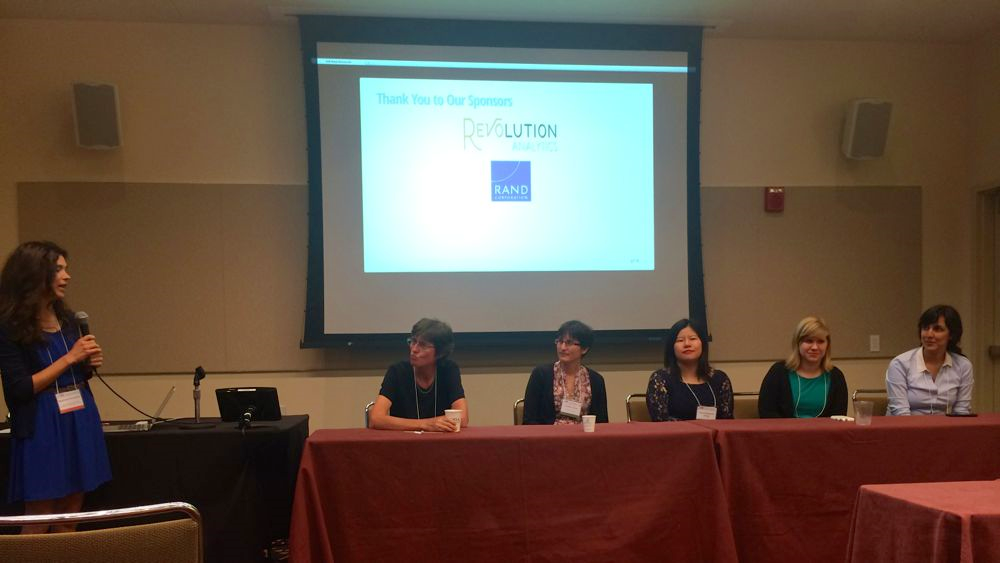
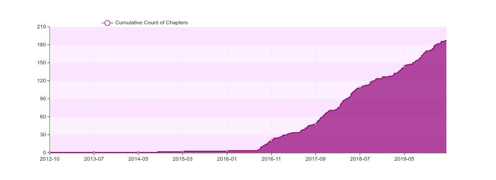
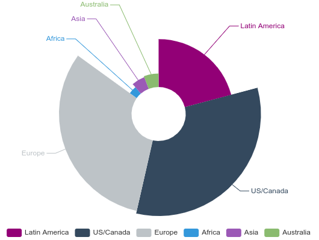

# Background

Action from the community initially focused on women

.pull-left[
- heR panel at useR! 2014 raised awareness of gender disparity
- Forwards taskforce set up in December 2015
- R-Ladies global set up in August 2016
]

.pull-right[

]

---

# Forwards

R Foundation taskforce to widen participation of underepresented groups

 - Social media
   - Twitter: @RWomenTaskforce
   - Blog: https://forwards.github.io/blog/
 - Community
 - Conferences
 - On-ramps
 - Surveys
 - Teaching

---

# useR! conference

   - Code of conduct since 2015
   - Diversity scholarships & Parent's room since 2016
   - Childcare; R-Ladies and newbie events since 2017
   - Better balance in committees, chairs, keynotes, tutors
   
[couple of outcome stats]

???

Show some outcome stats?

---

# Package development workshops

---

# Other initiatives - Wider Community

- Conferences
 - Women in Statistics and Data Science (est 2016), Women in Analytics (est 2016), Women in Data Science (est 2015), Pycon (diversity outreach chair est 2014)

- The Carpentries (est 2018)
 - Merger of Software Carpentry and Data Carpentry (both scaled up in 2014)
 - Equity, Inclusion, and Accessibility Roadmap 2019
 
- NUMFocus Diversity & Inclusion in Scientific Computing (DISC) (est 2017)
 
---

# Other initiatives - R Community

- rOpenSci 
 - unconf (est 2014)
 - Community Manager (since 2016)
 
- Tidyverse developer day (est 2019)

- R Consortium Diversity & Inclusion working groups (est 2018)

---

# R-Ladies

Currently 188 chapters in 52 countries

.pull-left-64[

]

.pull-right-30[

]

---

# Current Challenges

User Community

- outreach beyond white women

Developer community

- widening participation from underrepresent groups

---

# Outreach to minority groups

Two principles in tension

> Nothing about us without us
>
> &mdash; <cite>common saying esp. among disability activists</cite>

 

> The function, the very serious function of racism is distraction
>
> &mdash; <cite>Toni Morrison</cite>

---

# Moving Forward: Being Allies

We have to work on being allies to minority groups

- Let minority groups set the agenda
- Work to lessen the burdens
- Create space for them
- Promote their activities
- Amplify their voices

---

class: middle

Minority Ethic/Racial Groups

---

# Diversity Scholarships

<blockquote class="twitter-tweet">
Dear Danielle,  Remember these incredibly brilliant, talented, and kind women data scientists whenever you feel like “the only one,” on a team or in a space. Thanks to <a href="https://twitter.com/hashtag/rstudioconf2020?src=hash&amp;ref_src=twsrc%5Etfw">#rstudioconf2020</a> for bringing us together! <a href="https://twitter.com/hashtag/rladies?src=hash&amp;ref_src=twsrc%5Etfw">#rladies</a> <a href="https://t.co/sA312EibH5">pic.twitter.com/sA312EibH5</a>
&mdash; Danielle Smalls-Perkins (@smallperks) <a href="https://twitter.com/smallperks/status/1222380156347547649?ref_src=twsrc%5Etfw">January 29, 2020</a></blockquote> 

---

# MiR Community

<blockquote class="twitter-tweet">
🧵! Do you identify as an underrepresented minority users of R or want to help support minority useRs? If so, MiR(My-R) is the group for you! You can sign up here: <a href="https://t.co/fR1qP6RlhF">https://t.co/fR1qP6RlhF</a>. (1/n)
&mdash; Dorris Scott (@Dorris_Scott) <a href="https://twitter.com/Dorris_Scott/status/1229206267169775617?ref_src=twsrc%5Etfw">February 17, 2020</a></blockquote> 

---
