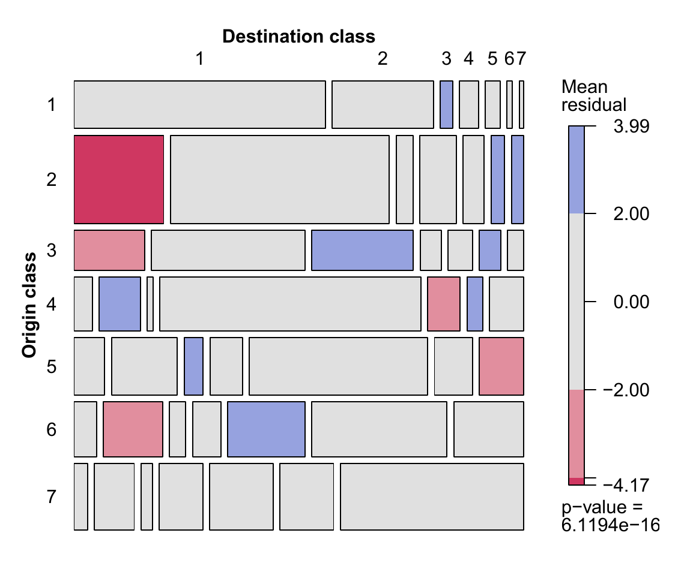
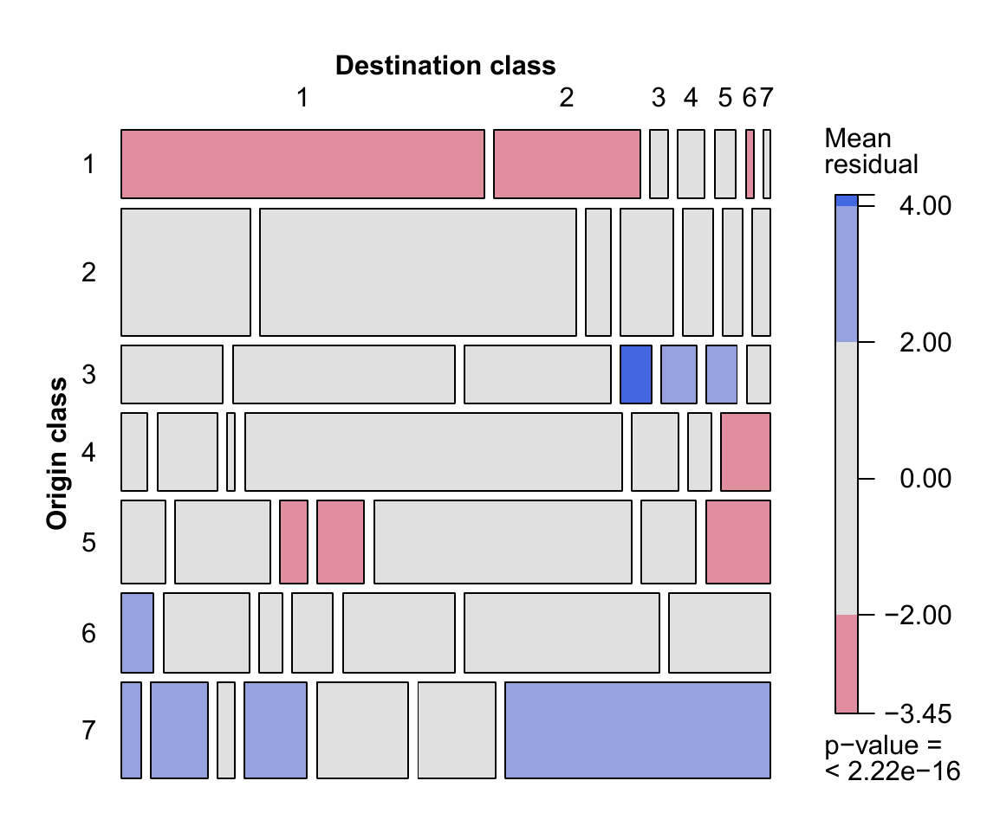

layout: true

.footer[`r fontawesome::fa("link")` [heatherturner.net/talks/uRos2021](https://www.heatherturner.net/talks/uRos2021)  &nbsp; `r fontawesome::fa("twitter")` [@HeathrTurnr](https://twitter.com/heathrturnr)]

```{r setup, include = FALSE}
options(digits = 4)
options(width = 80)
library(dplyr)
library(ggplot2)
library(gnm)
library(splines)
library(vcd)
library(kableExtra)
library(knitr)
opts_chunk$set(echo = TRUE, dev = "png", dpi = 300,
               comment = "")
# trim white space top and right of plot
knit_hooks$set(small.mar = function(before, options, envir) {
    if (before) par(mar = c(4, 8, .1, 4))
})
# trim white space when par won't work
library(magick)
knit_hooks$set(crop = function(before, options, envir) {
    if (before || isTRUE((fig.num <- options$fig.num) == 0L))
        return()
    paths = fig_path(options$fig.ext, options, fig.num)
    for (f in paths) image_write(image_trim(image_read(f)), f)
})
set.seed(1)
```


---

# Overview

* Introduction to Generalized Nonlinear Models and the `gnm` package

* Case study of a structured main effect:
    
    *Modelling the Consequences of Social Mobility with the Diagonal Reference Model*
    
* Case study of a structured interaction:

    *Modelling Mortality Trends with the Lee-Carter Model*
    
---

class: inverse middle

# Introduction to GNMs and the <tt>gnm</tt> package
    
---

# Linear models?

So no what linear vs nonlinear means

---

# Generalized linear models

Problems with linear models in many applications:

* range of $y$ is restricted (e.g., $y$ is a count, or is binary, or is a
duration)
* effects are not additive
* variance depends on mean (e.g., large mean $\Rightarrow$ large variance)

*Generalized* linear models specify a non-linear *link function* and *variance
function* to allow for such things, while maintaining the simple
interpretation of linear models.

---

# GLM structure

A GLM is made up of a *linear predictor*

$$\eta = \beta_0 + \beta_1 x_{1} + ... + \beta_p x_{p}$$

a *link function* that describes how $E(Y) = \mu$ depends on $\eta$

$$g(\mu) = \eta$$

a *variance function* that describes how $\text{Var}(Y)$ depends on $\mu$

$$\text{Var}(Y) = \phi a_i V(\mu)$$

where the *dispersion parameter* $\phi$ is a constant and $a_i$ are known values.

---

# Logistic regression $\newcommand{\stext}[1]{{\style{font-family:inherit}{\text{#1}}}}$

Suppose proportions $Y_i/n_i$ with $Y_i \sim \text{Binomial}(n_i, p_i)$. Then 

$$
\begin{align*}
    E(Y_i/n_i) &= p_i & \text{Var}(Y_i/n_i) = \frac{1}{n_i}p_i(1 - p_i)
\end{align*}
$$

The variance function is

$$V(\mu_i) = \mu_i(1 - \mu_i)$$
Using a logit link maps the mean from $(0,1)$ to $(-\infty,\infty)$
$$g(\mu_i) = \text{logit}(\mu_i)=\log\left(\frac{\mu_i}{1 - \mu_i}\right)$$


---


# Log-linear model

Suppose counts $Y_i \sim \text{Poisson}(\lambda_i)$. Then

$$
\begin{align*}
    E(Y_i) &= \lambda_i & \text{Var}(Y_i) = \lambda_i
\end{align*}
$$

The variance function is

$$V(\mu_i) = \mu_i$$
Using a log link maps the mean from $(0,\infty)$ to $(-\infty,\infty)$

$$g(\mu_i) = \log(\mu_i)$$
---

# Generalized Nonlinear Models

A generalized nonlinear model (GNM) is the same as a GLM except that we have

$$g(\mu) = \eta(x; \beta)$$

where $\eta(x; \beta)$ is nonlinear in the parameters $\beta$.

Equivalently an extension of nonlinear least squares model, where the
variance of $Y$ is allowed to depend on the mean.

Using a nonlinear predictor can produce a more parsimonious and
interpretable model.

---
.pull-left-45[
# Example: Mental Health Status

A study of 1660 children from Manhattan recorded their mental impairment and
parents' socioeconomic status [@Agre02]

```{r mosaic, eval = FALSE}
library(vcd)
mosaic(mentalHealth)
```

]

.pull-right-54-raise[
```{r mentalHealth, fig.width = 4.6, fig.height = 4.6, echo = FALSE}
data("mentalHealth")
mentalHealth$MHS <- C(mentalHealth$MHS, treatment)
mentalHealth$SES <- C(mentalHealth$SES, treatment)
mentalHealth <- xtabs(count ~ SES + MHS, mentalHealth)
mosaic(mentalHealth)
```
]

---

# Independence

A simple analysis of these data might be to test for independence of MHS and SES using a chi-squared test.

Equivalent to testing goodness-of-fit of the independence model
$$\log(\mu_{rc}) = \alpha_r + \beta_c$$

Such a test compares the independence model to the saturated model

$$\log(\mu_{rc}) = \alpha_r + \beta_c + \gamma_{rc}$$
which may be over-complex.

---

# Row-column Association
    
One intermediate model is the Row-Column association model:

$$\log(\mu_{rc}) = \alpha_r + \beta_c + \phi_r\psi_c$$
@Good79a, an example of a multiplicative interaction model.

For the mental health data:
```{r RCmodel, echo = FALSE}
options(show.signif.stars = FALSE)
indep <- gnm(Freq ~ SES + MHS, family = poisson, data = mentalHealth)
sat <- update(indep, Freq ~ SES*MHS)
RCmodel <- update(indep, Freq ~ SES + MHS + Mult(SES, MHS), verbose = FALSE)
anova(indep, RCmodel, sat, test = "Chisq")
```

---

# <tt>gnm</tt> R package

* Provides a framework for specifying, fitting and criticizing GNMs in R
* Designed to be `glm`-like
    * common arguments, returned objects, methods, etc
    * equivalent results for linear predictors
* For `family = gaussian` equivalent to `nls` fit.

---

# Model Specification

* Linear terms in the model may be specified in the usual way, e.g.

```r
y ∼ a + b + a:b
```

* Nonlinear terms must be specified using functions of class
`"nonlin"`
 * specify structure of term, possible also labels & starting values
 * provided functions: Exp, Inv, Mult, MultHomog, Dref
 * custom functions
 
---

```{r RCmod}
RCmod <- gnm(Freq ~ SES + MHS + Mult(SES, MHS), family = poisson, 
             data = mentalHealth, verbose = FALSE, ofInterest = "Mult")
coef(RCmod)
```
---

# Parameterisation in (G)LMs

The independence model was defined in an over-parameterised
form:

$$
\begin{align*}
\log(\mu_{rc}) &= \alpha_r + \beta_c \\
               &= (\alpha_r + 1) + (\beta_c - 1) \\
               &= \alpha_r^* + \beta_c^*
\end{align*}
$$

`glm` will impose identifiability constraints, by default $\alpha_1 = \beta_1 = 0$

---

# Parameterisation in (G)NMs

In the Row-Column Association model

$$
\begin{align*}
\alpha_r + \beta_r + \phi_r\psi_c &= \alpha_r + (\beta_r - \psi_c) + (\phi_r + 1)\psi_c\\
&= \alpha_r + \beta_r + (2\phi_r)(\psi_c/2)
\end{align*}
$$

We need to constrain both location and scale for identifiability.

`gnm` works with overparameterised models
 - will return one of infinite parameterisations at random
 - by default, nonlinear parameters are not identifiable: standard error `NA`
 - constrain parameters of interest, as required

---

class: inverse middle

# Case study: Diagonal Reference Model

---

# Background

Data from the ONS Longitudinal Survey, which links census and vital event data 
for 1% of the  population of England and Wales. 

Objective is to study the effect of social mobility on long-term limiting illness (LLTI)

> *a long-standing illness, health problem or handicap that limits a person's
activities or the work they can do*

Data include
 * National Statistics socio-economic classification (7 classes, high man/prof to routine) in 1991 (origin) and 2001 (destination).
 * Age, gender

---

# Bartley & Plewis Models
  
@Bart07 modelled trajectories by combining social mobility effects with origin or destination effects.

For example the origin + mobility model includes the term
$$
\theta_{ij} = 
\begin{cases}
    \alpha_i + \delta_0 & i > j\\
    \alpha_i + \delta_1 & i = j\\
    \alpha_i + \delta_2 & i < j\\
\end{cases}
$$

where $\alpha_i$ is the effect for origin $i$ and $i > j$ denotes moving to a more favourable destination class.

---

# GLM mobility models

The probability of LLTI in 2001 was modelled via
logistic regression.

Age in 1991 was included as a covariate and men and women were
modelled separately.

In R
```{r dest_m, eval = FALSE}
dest_m <- glm(llti ~ age1991 + origin + mobility, 
              family = binomial, data = LS_m)
```

---

# Social Mobility Effects

The exponential of the mobility parameters gives the odds ratios of LLTI, shown here for men

```{r mobility_effects, echo = FALSE}
tab <- data.frame(`Origin + Mobility` = c(1.00, 1.21, 1.45),
                  `Destination + Mobility` = c(1.00, 0.71, 0.52),
                  row.names = c("To more favourable", "Stable", 
                                "To less favourable"),
                  check.names = FALSE)
kable(tab, booktabs = TRUE) 
```

* given origin, odds of LLTI increased by downward mobility
* given destination, odds of LLTI decreased by downward mobility

---

# Weighted Residuals

The working residuals from the GLM fit can be averaged over each
origin-destination combination to provide an indicator of fit for each
trajectory 

These average residuals can be standardized to be approximately N(0, 1) assuming the model is correct.

Passing a GLM fit to the `mosaic` function will produce a plot of the weighted residuals, with the p-value for a $\chi^2$ goodness-of-fit test.

---

.pull-left[
Origin + Mobility

]
.pull-right[
Destination + Mobility

]

Although two sides of the same coin, the two models capture different features of the data.

---

# Diagonal Reference Model

@Sobe1991 proposed the *diagonal reference model*,
which combines origin, destination and social mobility effects
$$
      w_1 \gamma_i + (1 - w_1) \gamma_j
$$
The effect of moving from class $i$ to class $j$ is a weighted sum of the diagonal effects $\gamma_i$, where $\gamma_i$ is the effect for stable individuals in that class.

---

# Dref in <tt>gnm</tt>

A diagonal reference term may be specified via `Dref(fac1, fac2, ...)`

The weights are constrained to be non-negative and to sum to one by defining them as
$$
w_f = \frac{e^{\delta_f}}{\sum_i e^{\delta_i}}
$$
and estimating unconstrained $\delta_f$ parameters.

---

Following the previous analysis we fit the diagonal reference model with age as a covariate and fit models for men and women separately.

```{r dref_m, eval = FALSE}
dref_m <- gnm(llti ~ age1991 + Dref(origin, dest),
              family = binomial, data = LS_m)
coef(summary(classMobility))
```
```{r drefmen_intercept, echo = FALSE}
tab <- read.csv("drefmen_intercept.csv", header = TRUE, row.names = 1, check.names = FALSE)
nm <- rownames(tab)
nm <- gsub("mnssec9", "origin", nm)
nm <- gsub("mnssec0", "dest", nm)
nm <- gsub("age9", "age1991", nm)
rownames(tab) <- nm
a <- c(-3.744438, -0.05275)
tab$Estimate <- c(tab$Estimate[1] - a[1], tab$Estimate[2], 
                  tab$Estimate[3:4] + a[2], tab$Estimate[-(1:4)] + a[1])
tab$`Std. Error` <- c(NA, tab$`Std. Error`[2], rep(NA, 9))
tab$`z value` <- c(NA, tab$`z value`[2], rep(NA, 9))
tab$`Pr(>|z|)` <- c(NA, tab$`Pr(>|z|)`[2], rep(NA, 9))
print(tab, na.print = "NA")
```

---

# Diagonal Effects

The model for the stable individuals is an ordinary logistic regression

$$
\text{logit}(p_{iik}) = \beta_0 + \beta_1\text{age}_k + \gamma_i        
$$
Setting $\gamma_i = 0$, the diagonal effects are log odds ratios of LLTI in class $i$ against the first class for a given age

$$
\begin{align*}
&\log\left(\frac{p_{iik}/(1 - p_{iik})}{p_{11k}/(1 - p_{11k})}\right) \\
=&(\beta_0 + \beta_1 \text{age}_k  + \gamma_i) -  (\beta_0 + \beta_1
\text{age}_k) \\
=& \gamma_i
\end{align*}
$$
---

```{r dref_m_constrain, eval = FALSE}
dref_m <- gnm(llti ~ age1991 + Dref(origin, dest),
              family = binomial, data = LS_m,  constrain = "(high man)")
coef(summary(classMobility))
```
```{r drefmean_intercept_constrain, echo = FALSE}
tab <- read.csv("drefmen_intercept.csv", header = TRUE, row.names = 1, check.names = FALSE)
nm <- rownames(tab)
nm <- gsub("mnssec9", "origin", nm)
nm <- gsub("mnssec0", "dest", nm)
nm <- gsub("age9", "age1991", nm)
rownames(tab) <- nm
a <- c(-0.02115)
tab$Estimate <- c(tab$Estimate[1:2], 
                  tab$Estimate[3:4] + a[2], tab$Estimate[-(1:4)])
tab$`Std. Error` <- c(tab$`Std. Error`[1:2], NA, NA, tab$`Std. Error`[-(1:4)])
tab$`z value` <- c(tab$`z value`[1:2], NA, NA, tab$`z value`[-(1:4)])
tab$`Pr(>|z|)` <- c(tab$`Pr(>|z|)`[1:2], NA, NA, tab$`Pr(>|z|)`[-(1:4)])
print(tab, na.print = "NA")
```
---

# Health Inequality


```{r OR, fig.width = 7, fig.height = 3, echo = FALSE, warning = FALSE}
# exp(tab$Estimate[-(1:4)] + 1.96*tab$`Std. Error`[-(1:4)])
OR <- data.frame(class = rep(c("high prof", "low prof", "intermed", "self empl",
                               "low sup", "semi-routine", "routine"), 2),
                 class2 = c(1:7 - 0.2, 1:7 + 0.2),
                 gender = rep(c("men", "women"), each = 7),
                 odds = c(1, 1.56, 2.72, 2.11, 2.57, 3.57, 4.36,
                          1, 1.53, 1.56, 1.54, 2.72, 2.41, 3.66),
                 lo = c(NA, 1.41, 2.4, 1.9, 2.32, 3.21, 3.95,
                        NA, 1.32, 1.34, 1.29, 2.28, 2.08, 3.15),
                 up = c(NA, 1.74, 3.08, 2.33, 2.86, 3.96, 4.81,
                        NA, 1.78, 1.81, 1.84, 3.25, 2.79, 4.25))
OR$class <- factor(OR$class, levels = unique(OR$class))
ggplot(data = OR, 
       aes(x = class2, y = odds, group = gender, color = gender)) + 
  geom_point() +
  geom_segment(aes(x = class2, xend = class2, y = lo, yend = up)) +
  scale_color_manual(values = c("blue", "orange")) + 
  scale_x_continuous(breaks = 1:7,
                     labels = c("high prof", "low prof", "intermed", 
                                "self empl", "low sup", "semi-routine",
                                "routine")) +
  labs(x = "Socio-economic Position", y = "Odds Ratio", legend = "Gender")
```

---

# <tt>DrefWeights</tt>

Setting $\delta_1 = 0$ is enough to constrain the weights, so that 

$$
\begin{align*}
    w_1 &= \frac{1}{1 + e^{\delta_2}} & w_2 &= \frac{e^{\delta_2}}{1 + e^{\delta_2}}
\end{align*}
$$
`DrefWeights()` computes these weights and their standard errors, e.g.
```{r DrefWeights, eval = FALSE}
 DrefWeights(dref_m)
```
```
$origin
 weight      se
0.61799 0.02649
$dest
 weight       se
0.38201 0.02649
```
---

# Diluting Effect of Social Mobility
    
The ratio of origin weight to destination weight quantifies the diluting effect of social mobility on health inequality

* **1:0** social mobility has no effect on individual
* **0:1** social mobility has no effect on inequality
* otherwise social mobility increases P(LLTI) in the upper classes and decreases P(LLTI) in the lower classes. 

The larger the origin weight, the greater the diluting effect.
     
???

mobile assume probability of stable in destination class

---

# Diagonal Weights

The  diagonal weights for the LLTI models are
```{r weights_tab, echo = FALSE}
tab <- data.frame(Men = c("0.62 (0.03)", "0.38 (0.03)"),
                  Women = c("0.41 (0.03)", "0.59 (0.03)"),
                  row.names = c("Origin", "Destination"))
kable(tab, booktabs = TRUE) 
```

Since their destination class is given more weight, social mobility has a 
greater impact for women.

---

# Model Comparison
    
The models can be compared by the difference in deviance from the null
model: 

```{r mobility_models, echo = FALSE}
tab <- data.frame(dev1 = c(4050, 4026, 4121),
                  df1 = c(9, 9, 8),
                  dev2 = c(3194, 3273, 3312),
                  df2 = c(9, 9, 8),
                  row.names = c("Origin + mobility", "Destination + mobility",
                                "Diagonal reference"))
kable(tab, col.names = c("Deviance", "Df", "Deviance", "DF"), 
      row.names = TRUE, booktabs = TRUE) %>%
  add_header_above(c(" " = 1, "Men" = 2, "Women" = 2))
```

The diagonal reference model reduces the deviance the most despite requiring
fewer degrees of freedom.
    
---

class: inverse middle

# Case study: Lee-Carter Model

---

# Background

Data from the Human Mortality Database, which provides open, international access to population and mortality data from 41 countries. 

Here we consider data on deaths for men aged 20 to 99 in Canada from 1921 to 2003.

The data comprise the variables
* `Year`: year death recorded
* `Age`: age at time of death (0 to 110+)
* `Deaths`: number of deaths
* `Exposure`: number at risk
model
---

# Lee-Carter model

@LeeCart92 proposed a model for age-specific population mortality rates that has  been the basis of many
subsequent analyses.

Suppose that death count $D_{ay}$ for individuals of age $a$ in year $y$ has
mean $\mu_{ay}$ and *quasi-Poisson* variance $\phi\mu_{ay}$.

*Lee-Carter model*

$$
\begin{align*}
&\log(\mu_{ay}/e_{ay}) = \alpha_a + \beta_a\gamma_y\, ,\\
\Rightarrow & \log(\mu_{ay}) = \log(e_{ay}) + \alpha_a + \beta_a\gamma_y
\end{align*}
$$

where $e_{ay}$ is the \emph{exposure} (number of lives at risk).

---

# Lee-Carter in gnm

The Lee-Carter model can be fitted with `gnm` as follows

```{r LC_model, eval  = FALSE}
LCmodel <- gnm(Deaths ~ Mult(Exp(Age), Year),
               eliminate = Age, offset = log(Exposure),
               family = "quasipoisson")
```

* `Exp(Age)` is used to constrain the parameters representing the
    *sensitivity* of age group $a$ to have the same sign,
* `Age` is *eliminated* since it will typically have many levels,
* `offset` is used to add the log exposure with a coefficient of 1
* the `quasipoisson` family is used so that the dispersion parameter $\phi$ is estimated rather than fixed to 1.

???
    
The eliminate argument of gnm is used to specify that the Age
parameters replace the intercept in the model. This has two benefits:
* gnm exploits the structure of these parameters to estimate them
more efficiently
* these nuisance parameters are excluded from summaries of the
model object

---


```{r Canada, include = FALSE}
Canada <- readRDS(url("https://github.com/hturner/gnm-case-studies/raw/main/LeeCarter_artefacts/saved_results/Canada.rds",method = "libcurl"))
saveRDS(Canada, "Canada.rds")
```
<br>
Residuals are more dispersed for ages 25-35 and 50-65, as well as pre-1930

```{r res1, fig.width = 3.6, fig.height = 3.2, echo = FALSE, out.width = "49%"}
Canada <- readRDS("Canada.rds")
ggplot(Canada, aes(x = Age, y = LC_res)) +
  geom_boxplot(fill = "cornflowerblue", outlier.size = 0.5) +
  labs(y = "Pearson residual") + 
  scale_x_discrete(breaks = seq(20, 100, by = 5), 
                   expand = c(0.02,0)) +
  coord_cartesian(ylim = c(-8, 8))  
ggplot(Canada, aes(x = Year, y = LC_res)) +
  geom_boxplot(fill = "cornflowerblue", outlier.size = 0.5) +
  labs(y = "Pearson residual") + 
  scale_x_discrete(breaks = seq(1930, 2000, by = 10), 
                   expand = c(0.02,0)) +
  coord_cartesian(ylim = c(-8, 8))  
```

---

Residuals by birth cohort (calendar year - age) show a clear trend

```{r res2, fig.width = 4.5, fig.height = 3, echo = FALSE, fig.align = "center", out.width = "75%"}
ggplot(Canada, aes(x = Cohort, y = LC_res)) +
  geom_boxplot(fill = "cornflowerblue", outlier.size = 0.5) +
  labs(y = "Pearson residual") + 
  scale_x_discrete(breaks = seq(1825, 1983, by = 25), 
                   expand = c(0.02,0)) +
  coord_cartesian(ylim = c(-8, 8))  
```

---

# Renshaw & Haberman extension

@Rensabe06 considered a cohort-based extension

$$\log(\mu_{ay}/e_{ay}) = \alpha_a + \beta^{(0)}_a \gamma_y + \beta^{(1)}_a \lambda_{y-a}$$

This is easy to specify in `gnm`

```r
Deaths ~ Mult(Exp(Age), Year) + Mult(Exp(Age), Cohort)
```

But not so easy to fit!
 - `Year`, `Age` and `Cohort` are directly related
 - now have 405 multiplicative parameters, data for some cohorts is sparse
 
???

Haberman and Renshaw rejected the model on practical grounds
 
---

# Fitting the Renshaw & Haberman model

Step 1. Initially fit the model with age multipliers fixed to 1

$$\log(\mu_{ay}/e_{ay}) = \alpha_a + \gamma_y + \lambda_{y-a}$$

Step 2. Fit the full model with starting values from step 1, without constraining the age multipliers.
   * Converges in 54 iterations
   * Find the multiplier for age 99 in the first multiplicative term is negative

Step 3. Re-fit using `Exp(Age)` to constrain the age multipliers to be positive, setting 
$$\beta^{(0)}_{99} = \exp(-1000) = 0$$

---

Residuals from Renshaw & Haberman model

```{r res1b, fig.width = 3.6, fig.height = 3.2, echo = FALSE, out.width = "49%"}
Canada <- readRDS("Canada.rds")
ggplot(Canada, aes(x = Age, y = APC_res)) +
  geom_boxplot(fill = "cornflowerblue", outlier.size = 0.5) +
  labs(y = "Pearson residual") + 
  scale_x_discrete(breaks = seq(20, 100, by = 5), 
                   expand = c(0.02,0)) +
  coord_cartesian(ylim = c(-8, 8))  
ggplot(Canada, aes(x = Year, y = APC_res)) +
  geom_boxplot(fill = "cornflowerblue", outlier.size = 0.5) +
  labs(y = "Pearson residual") + 
  scale_x_discrete(breaks = seq(1930, 2000, by = 10), 
                   expand = c(0.02,0)) +
  coord_cartesian(ylim = c(-8, 8))   
```

---
<br>
```{r res2b, fig.width = 4.5, fig.height = 3, echo = FALSE, fig.align = "center", out.width = "75%"}
ggplot(Canada, aes(x = Cohort, y = APC_res)) +
  geom_boxplot(fill = "cornflowerblue", outlier.size = 0.5) +
  labs(y = "Pearson residual") + 
  scale_x_discrete(breaks = seq(1825, 1983, by = 25), 
                   expand = c(0.02,0)) +
  coord_cartesian(ylim = c(-8, 8))  
```

---

# Age multipliers

```{r AgeContrasts, include = FALSE}
AgeContrasts <- readRDS(url("https://github.com/hturner/gnm-case-studies/raw/main/LeeCarter_artefacts/saved_results/AgeContrasts.rds",method = "libcurl"))
saveRDS(AgeContrasts, "AgeContrasts.rds")
```

An advantage of re-parameterising the model such that 
$$
\begin{align*}
   \beta^{(0)}_a &= \exp(\delta^{(0)}_a) & \beta^{(1)}_a &= \exp(\delta^{(1)}_a)
\end{align*}
$$
is that simple contrasts (differences) of $\delta^{(n)}_a$ are identifiable.

We can obtain the contrasts and standard errors with `getContrasts()`
```{r AgeMult2, eval = FALSE}
AgeMult2 <- pickCoef(APCmodel_GNM,  "Mult(Exp(.), Cohort)", fixed = TRUE)
getContrasts(APCmodel_GNM, AgeMult2, check = FALSE)$qvframe[1:3,]
```
```{r AgeContrasts_qv, echo = FALSE}
AgeContrasts <- readRDS("AgeContrasts.rds")[[2]]
AgeContrasts$qvframe[1:3,]
```

???

delta are log-multipliers

the relative approximation errors for the quasi-variances of these contrasts range from −24% to 70.1%, so the quasi-variance approximation performs poorly in this example

---

<br>
```{r AgeMultipliers, fig.align = "center", fig.width = 4.5, fig.height = 3, out.width = "75%", echo = FALSE}
dat <- AgeContrasts$qvframe[c("estimate", "SE")] %>%
  mutate(tops = estimate + (2 * SE),
         tails = estimate - (2 * SE),
         Age = seq(from = 20, length.out = n()))

ggplot(dat, aes(x = Age, y = estimate)) + 
  geom_point() +
  geom_segment(aes(x = Age, xend = Age, y = tops, yend = tails)) +
  labs(y = "Log-multiplier (Cohort)") +
  coord_cartesian(ylim = c(-10, 2))
```

???

Figure shows a clear pattern in the log-multipliers for age in both terms, with the sensitivity
of age initially rising until about 35 years of age, then decreasing with increasing age. However
there is a lot of local variability with the estimates rising and falling in consecutive years and
it is clear that the precision of the estimates decreases with age. The large uncertainty in the
log-multipliers of the cohort effects for ages 85 and above is due to the early cohorts, for which
we only have data at the end of the age range.

---

# Spline model

Define a piecewise linear spline over age:

```{r Age_bs}
Age_num <- as.numeric(as.character(Canada$Age))
Age_bs <- bs(Age_num, knots = c(seq(25, 70, by = 5), 80), 
             degree = 1)
```

Use instead of age in the Renshaw & Haberman model:
```r
Deaths ~ Mult(Exp(Age_bs), Year) + Mult(Exp(Age_bs), Cohort)
```
```{r dev, include = FALSE}
dev <- readRDS(url("https://github.com/hturner/gnm-case-studies/raw/main/LeeCarter_artefacts/saved_results/dev.rds",method = "libcurl"))
saveRDS(dev, "dev.rds")
```

---

# Model comparison

```{r mortality_models, echo = FALSE}
mod_dev <- readRDS("dev.rds")
tab <- data.frame(model = c("Lee-Carter", "Main effects", "Spline", "Renshaw-Haberman"), 
                  dev = mod_dev[c("LC", "APC_GLM", "APC_spline", "APC_GNM")],
                  df = c(6399, 6318, 6293, 6159)) %>%
  mutate(perc = (mod_dev["APC_GLM"] - dev)/(mod_dev["APC_GLM"] - mod_dev["APC_GNM"])*100)
tab$perc[1] <- NA
kable(tab, booktabs = TRUE, 
      col.names = c("Model", "Deviance", "Df", "Percent"), 
      digits = 2, row.names = FALSE) %>%
  pack_rows("Age-Period-Cohort models", 2, 4)
```

The spline model preserves the year and cohort multipliers which could
be modelled using time series methods for forecasting as in [@RensHabe06] - only depends on the *differences* between multipliers.

???

so it is not necessary to impose constraints on these parameters

---

# Wrap-up

other models
case studies, vignette

---

# References
