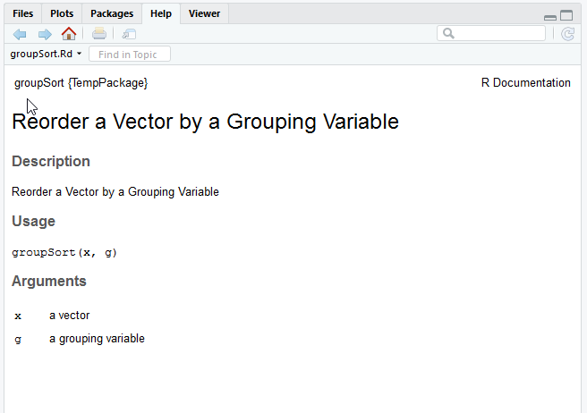
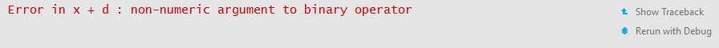
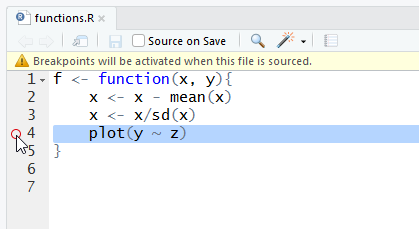
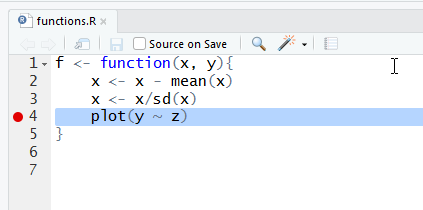
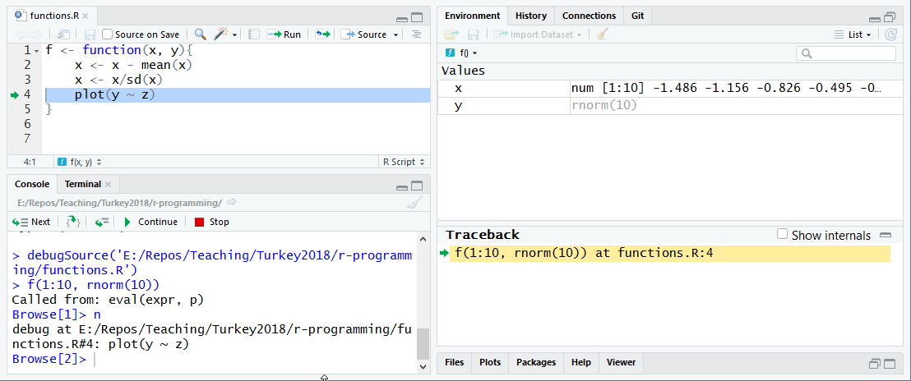
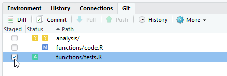
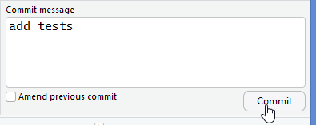
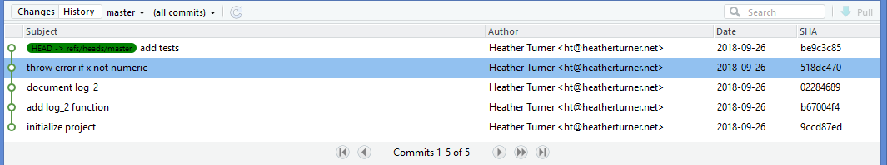
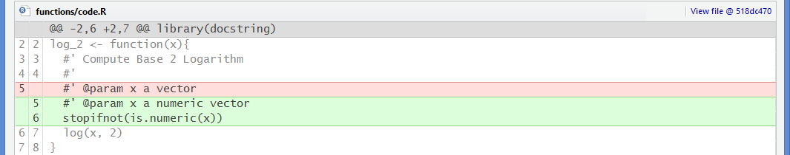

```{r setup, include=FALSE}
options(digits = 4)
options(width = 67)
library(knitr)
library(kableExtra)
opts_chunk$set(echo = TRUE, dev = "png", dpi = 300,
               comment = "#", eval = TRUE, 
               fig.width = 5, fig.height = 5, 
               knitr.table.format = "markdown")
# trim white space top and right of plot
knit_hooks$set(small.mar = function(before, options, envir) {
    if (before) par(mar = c(4, 5, 2, 1))
})
# trim white space when par won't work
library(magick)
knit_hooks$set(crop = function(before, options, envir) {
    if (before || isTRUE((fig.num <- options$fig.num) == 0L))
        return()
    paths = fig_path(options$fig.ext, options, fig.num)
    for (f in paths) image_write(image_trim(image_read(f)), f)
})
# function to put ``` when compiling Rmd
ticks <- function() "```"
set.seed(1)
```

# Intro

Understanding the basics of R programming helps to improve
analysis/reporting scripts and extend what we can do with R.

Good coding practice follows the DRY principle: Don't Repeat Yourself. 
Rather than modifying copy-pasted code chunks, we might
 - write a custom function
 - use loops or iteration functions to perform multiple similar tasks
 
Custom functions can be used to provide convenient wrappers to complex 
code chunks as well as implement novel functionality.

---

# Data Structures Revisited

For basic data analysis, our data is usually imported and we use 
high-level functions (e.g. from **dplyr**) to handle it.

For programming, we need to work with lower-level data structures and be
able to

- create basic objects
- extract components
- coerce one data type to another

---

# Vectors

`numeric()`, `character()` and `logical()` can be used to initialize 
vectors of the corresponding type for a given length

```{r}
x <- numeric(3)
x
```

Elements can be assigned by indexing the positions to be filled, e.g.

```{r}
x[1] <- 4
x[-c(2, 3)] <- 4
```

This is particularly useful when programming an iterative procedure.

`as.logical()`, `as.numeric()` and `as.character()` coerce to the 
corresponding type, producing `NA`s if coercion fails.

???

Miss out factors and arrays

---

# Logical Vectors

Logical vectors are commonly used when indexing. The vector might be 
produced by a logical operator:
```{r}
x <- c(1, 1, 2, 2)
x > 1
x[x > 1]
```
`duplicated()` is also useful here:
```{r}
duplicated(x)
!duplicated(x)
```
Single element logical vectors (scalars) are useful
for flow control, see later.

---

# Numeric Vectors

The are several convenience function for creating
numeric vectors, notably `seq()` and `rep()`.

As they are so useful there are fast shortcuts for
particular cases
```{r}
seq_len(4)
x <- 3:5
seq_along(x)
rep.int(1:2, times = c(2, 3))
```

---

# Character Vectors

Character vectors may be used for creating names
```{r}
names(x) <- paste0(LETTERS[1:3], 1229:1231)
x
names(x)
```
Names can be used as an alternative to numeric or logical vectors when indexing
```{r}
x["B1230"]
```


---

# Matrices

A matrix is in fact also a vector, with an attribute giving the dimensions of the matrix
```{r}
M <- matrix(1:6, 2, 3)
M
str(M)
attributes(M)
```

Useful functions for matrices include `dim()`, `ncol()`, `nrow()`, 
`colnames()` and `rownames()`. `rbind()` and `cbind()` can be used to 
row-bind or column-bind vectors.

Matrices enable computation via matrix algebra as well as row/column-wise operations.

???

Matrices are a special case of arrays, which are n-dimensional data 
objects (n &ge; 1 ). However arrays with n &gt; 2 are rarely used.

Don't name matrix here as makes attributes more complicated.

---

# Lists

Lists collect together items which may be different types or lengths. Like a 
vector, elements may be named.
```{r}
results <- list(matrix = M, vector = x)
results
```

Lists are often used to return the results of a function. 

Elements can be indexed by `[` to return a list or `[[` to return a 
single element. `$` can be used to extract elements by name, e.g. 
`results$matrix`.

---

# Data Frames

Data frames are lists of variables of the same length and hence can often 
be treated as a matrix 
```{r}
dat <- data.frame(x = x, id = letters[1:3])
dat[[1]]
dat[1, 2]
```

The `tibble()` (or `as_data_frame()`) from the **tibble** package (or 
**dplyr**) can be used to produce a tibble instead.

When the data are all numeric, `as.matrix()` can be used to coerce to a 
matrix.

???

Possibly exclude this slide
Could also cover set operations (setdiff etc) probably enough to start with

---

# Your Turn

The `exercises.Rmd` file provides a template for the exercises.

The `lm` function calls the "workhorse" function `lm.fit` to actually 
fit the model. Unlike `lm`, which works from a formula, `lm.fit` works 
from the model matrix and the response vector.

Define a response `y` containing 10 numeric values. Define an 
explanatory variable `z` of the numbers 1 to 10.

Use the function `cbind()` to create a matrix `x` with 1s in the first
column and `z` in the second column.

Fit a model using `fit1 <- lm.fit(x, y)`. Use `str` to explore the structure of
the results. Use `$` to extract the coefficients.

Create a second fit using `lm(y ~ z)`. Use `names` to compare the 
results. Check the coefficients of the second fit are the same. 

---

# Control Structures

Control structures are the commands that make decisions or execute loops.

Conditional execution: `if`/`else`, `switch`

Loops: `for`, `while`, `repeat`

---

# `if`/`else`

An `if` statement can stand alone or be combined with an `else` statement

```{r}
x <- 1:3
if (all(x > 0)) {
    res <- mean(x)
} else {
    res <- mean(abs(x))
}
```

The condition must evaluate to logical vector of length one. The 
functions `all()`, `any()`, `is.na()`, `is.null()` and other `is.`
functions are useful here.

---

# Conditioning on equality

Using `==` may not be appropriate as it compares each element; `identical()` will test the whole object

```{r}
x <- y <- 1:2
x == y
identical(x, y)
```

`all.equal()` will alow for some numerical “fuzz”

```{r}
z <- sqrt(2)
identical(z * z, 2)
all.equal(z * z, 2)
```

---

# `switch`

The `switch()` function provides a more readable alternative to nested 
`if` statements
```{r, eval = FALSE}
if (summary == "IQR") { 
    y <- IQR(x)
} else {
    if (summary == "range"){
        y <- range(x)
    } else y <- mean(x)
}
y <- switch(summary,
            IQR = IQR(x),
            range = range(x),
            mean(x))
```

The final unnamed argument is the default.

---

# `for`

A for loop repeats a chunk of code, iterating along the values of a 
vector or list

```{r}
x <- c("banana", "apple")
for (nm in x) print(nm)
```

Unassigned objects are not automatically printed; hence call to `print()`. 
This also applies to `ggplot` objects, which only display when printed.

```{r}
for (i in seq_along(x)) {
    message("Element ", i, ": ", x[i])
}
```

`seq_along()` is used here rather than `1:length(x)` as `length(x)` may 
be zero. `message` is used to print messages to the console.

---

# `while` and `repeat`

The `while` loop repeats while a condition is `TRUE`
```{r, eval = FALSE}
niter <- 1
while (niter < 3) {
    x <- x * 2
    niter <- niter + 1
}
```

The `repeat` loop repeats until exited by `break`
```{r, eval = FALSE}
repeat {
    x <- x + 1
    if (max(x) > 10) break
}
```

`break` can be used in `for` or `while` loops too. 

`next` can be used to skip to the next iteration.

---

# Growing Objects

Adding to an object in a loop, e.g. via `c()` or `cbind()`

```{r}
res <- NULL
for (i in 1:5000) res <- c(res, 1)
```

forces a copy to be made at each iteration.

It is far better to create an object of the necessary size first

```{r}
res <- numeric(5000)
for (i in seq_along(res)) res[i] <- 1
```

To initialise a list we can use
```{r}
res <- vector(mode = "list", length = 100)
```

---

# Benchmarking

There will usually be many ways to write code for a given task. To compare
alternatives, we can benchmark the expression

```{r}
library(rbenchmark)
benchmark({res <- NULL;
           for (i in 1:5000) res <- c(res, 1)})
benchmark({res <- numeric(5000)
           for (i in seq_along(res)) res[i] <- 1})$elapsed
```

???
could skip this slide

---

# Your Turn

Load the **broom** package, as we will use `glance` in this exercise.

Assign to `y` the variable `mtcars$mpg`. Assign to `n` the number of 
columns of `mtcars` minus 1. Create a vector named `r.squared` with this 
number of elements. 

Write a for loop to iterate through the names of `mtcars` *except* 
`mpg`, that
 - prints a message stating the current variable
 - assigns the current variable to `x`
 - fits a linear model using `lm`, regressing `y` on `x`
 - uses `glance` to obtain the $R^2$ value and stores it in an element of
 `r.squared` corresponding to the current iteraton

Use `which.max()` to find the best predictor for `mpg`
and the corresponding $R^2$ value.

---

# Vectorization

Vectorization is operating on vectors (or vector-like objects) rather than individual elements.

Many operations in R are vectorized, e.g.

```{r}
x <- 1:3
y <- 3:1
x == y
res <- list(a = 1:3, b = 1:6)
lengths(res)
```

We do not need to loop through each element!

---

# Recycling

Vectorized functions will recycle shorter vectors to create vectors of 
the same length
```{r}
1:4 + 0:1 
```
This is particularly useful for single values
```{r}
cbind(1, 3:4)
```
and for generating regular patterns
```{r}
paste0(rep(1:3, each = 2), c("a", "b"))
```

---

# Vectorization and Matrices

Vectorizations applies to matices too, not only through matrix algebra
```{r}
M <- matrix(1:4, nrow = 2, ncol = 2)
M + M
```
but also vectorized functions
```{r}
M <- M + .3
round(M)
```

---

# Matrices and Recycling

Values are recycled down matrix, which is convenient for 
row-wise operations

```{r}
M <- matrix(1:6, nrow = 2, ncol = 3)
M
M - 1:2
```
To do the same for columns we would need to explicitly replicate, 
which is not so efficient.
```{r}
M - rep(1:3, each = 2)
```

---

# Vectorization vs For Loop

Operations that can be vectorized will be more efficient than a loop in R

```{r}
M <- matrix(1:2000, nrow = 100, ncol = 200)
x <- 1:100
benchmark({for (i in 1:100){
             for (j in 1:200){
               M[i, j] <- M[i, j] - x[i]
             }
           }})$elapsed
benchmark({M - x})$elapsed
```

---

# Row/Column-wise Operations

Several functions are available implementing efficient row/column-wise
operations, e.g. `colMeans()`, `rowMeans()`, `colSums()`, `rowSums()`, `sweep()`

```{r}
M <- matrix(1:4, nrow = 2, ncol = 2)
rowMeans(M)
```

These provide an alternative to iterating though rows and columns in R (the 
iteration happens in C, which is faster).

The **matrixStats** provides further "matricised" methods.

---

# Iteration Functions

Iteration functions provide a general alternative to for loops. They are 
not necessarily faster, but can be more compact.

`apply()` applies a function over rows/columns of a matrix.

`lapply()`, `sapply()` and `vapply()` iterate over a list or vector. `vapply()` 
is recommended for programming as it specifies the type of return value
```{r}
vapply(list(a = 1:3, b = 1:6), FUN = mean, FUN.VALUE = numeric(1))
```
`mapply()` iterates over two or more lists/vectors in parallel.

The **purrr** packages provides alternatives to these that have a simpler, 
more consistent interface with fixed type of return value.

---

# Random Sampling

In order to test code, or when running simulations, you may want to 
generate random numbers. The numbers may be a random sample from a pool
```{r}
pool <- 1:10
sample(pool, 7)
sample(pool, 7, replace = TRUE)
```

---

# Statistical Distributions

Alternatively you can sample from a statistical distribution such as the 
standard normal
```{r}
rnorm(7, mean = 0, sd = 1)
```
or the uniform distribution
```{r}
runif(7, min = 1, max = 100)
```
Common distributions are available in the base package, e.g. `rchisq()`, 
`rt()`, others are provided in packages, e.g. `mvrnorm()` is provided by 
**MASS**.

---

# Random Seeds

Sampling relies on generating random numbers. 

We can fix the random seed so that all the code that follows will be 
repeatable

```{r}
set.seed(1746)
sample(1:7)
set.seed(1746)
sample(1:7)
```
To repeatedly run the same code with different seeds, we can use `replicate()`.
```{r, eval = FALSE}
sim <- replicate(100, mean(rexp(10, rate = 10)))
```


---

# Functions

Functions are defined by two components:

 - the arguments of the function
 - the body of the function that computes the result
 
They are created using `function()`

```{r}
t_statistic <- function(n) {
    x <- rnorm(n)
    y <- rnorm(n)
    t.test(x, y)$statistic
}
```

---

# Your Turn

Find the code for the `t_statistic` function in `exercises.Rmd`. Source 
in the function by running the function code. Try calling the function 
with different values of `n` to check it works.

Use `replicate` to simulate 1000 t-statistics comparing two samples of 
size 10 drawn from N(0, 1).

Theoretically the statistics should follow a $t$-distribution with 18 
(= 10 + 10 - 2) degrees of freedom. Use `rt` to simulate 1000 values 
from this distribution.

Use the `ggplot` code in `exercises.Rmd` to plot compare the density 
of the simulated values with the density of the theoretical values. 

---

# Specified Arguments

*specified* arguments are those named in the function definition, e.g. 
in `rnorm()`

```{r}
args(rnorm)
```
the arguments are `n`, `mean` and `sd`.

`mean` and `sd` have been given default values in the function definition, but `n` has not, so the function fails if the user does not pass a value to `n`

```{r, error = TRUE}
rnorm()
```

---

# Name and Order of Arguments

The user can pass objects to these arguments using their names or by supplying unnamed values in the right order

```{r}
rnorm(5, 1, 10)
rnorm(5, sd = 10)
```

So naming and order is important! Some guidelines

- put compulsory arguments first, e.g. data
- put rarely used arguments last, e.g. tolerance setting
- use short but meaning argument names
- if relevant, use the same argument names as similar functions

---

# Using Arguments

Arguments are used as objects in the function code.

An new environment is created each time the function is called, separate 
from the global workspace.

```{r, error = TRUE}
x <- 1
y <- 3
f <- function(x, y){
    a <- 1
    x <- x + a
    x + y
}
f(x, y)
x
a
```
---

# Lexical Scoping

If an object is not defined within the function, or passed in as an argument, R looks for it in the *parent environment* where the function was defined

```{r, error = TRUE}
x <- 1
y <- 3
f <- function(x){
    x + y
}
f(x)
rm(y)
f(x)
```
It is safest to use arguments rather than depend on global variables! 

---

# Unspecified Arguments

`...` or the *ellipsis* allow unspecified arguments to be passed to the function. 

This device is used by functions that work with arbitrary numbers of objects, e.g. 
```{r}
args(sum)
sum(1, 4, 10, 2)
```

It can also be used to pass on arguments to another function, e.g.
```{r}
t_statistic <- function(x, g, ...) {
    t.test(x ~ g, ...)$stat
}
```

---

# Using `...`

Arguments passed to ... can be collected into a
list for further analysis

```{r}
f <- function(...){
    dots <- list(...)
    vapply(dots, mean, numeric(1), na.rm = TRUE)
}
x <- 1
y <- 2:3
f(x, y)
```
Similarly the objects could be concatenated using `c`


---

# Return Values

By default, functions return the object created by the last line of code
```{r}
f <- function(x) {
    x <- x + 1
    log(x)
}
```

Alternatively `return()` can be used to terminate the function and return
a given object
```{r}
f <- function(x) {
    if (all(x > 0)) return(log(x))
    x[x <= 0] <- 0.1
    log(x)
}
```

Multiple objects can be returned in a list.

---

# Naming Functions

As with arguments, function names are important:

- use a name that describes what it returns (e.g. `t_statistic`) or what it does (e.g. `remove_na`)
- try to use one convention for combining words (e.g. snake case `t_statistic` or camel case `tStatistic`)
- avoid using the same name as other functions

---

# Side Effects

A side-effect is a change outside the function that occurs when the
function is run, e.g.

- plot to the graphics window or other device
- printing output to the console
- write data to a file

A function *can* have many side-effects and a return value, but it is 
best practice to have a separate function for each task, e.g creating a 
plot or a table.

Writing to file is usually best done outside a function.

---

# Your Turn

In the `qq_norm` chunk of `exercises.Rmd` there is some code to compute the 
slope and intercept of the line to add to a quantile-quantile plot, comparing 
sample quantiles against theoretical quantiles of a $N(0, 1)$ distribution.

Turn this code into a function named `qq_norm` taking the sample data as an 
argument and returning the slope and intercept in a list.

Run this chunk to source the function, then run the `normal-QQ` chunk which uses 
the `qq_norm` function to compute parameters for an example plot.

Copy `qq_norm` to the `qq` chunk and rename it `qq`. Add a new argument `fun` 
to specify any quantile function (e.g. `qt`, `qf`, etc). Give it the default 
value `qnorm`. Inside the function use `qfun <- match.fun(fun)` to get 
the quantile function matching `fun`, then use `qfun` instead of `qnorm` 
to compute `qtheory`. Use `...` to pass on arguments to `qfun`.

Save `functions.R` and run the `t-QQ` chunk in `exercises.Rmd`.

---

# Using Functions From Other Packages

In our own functions (outside of packages), it is possible to use `library`

```{r}
scale_rows <- function(X){
    library(matrixStats)
    X <- X - rowMeans(X)
    X/rowSds(X)
}
```

But this loads the entire package, potentially leading to clashes with 
functions from other packages. It is better to use the **import** package:

```{r, eval = FALSE}
scale_rows <- function(X){
    import::from(matrixStats, rowSds)
    X <- X - rowMeans(X)
    X/rowSds(X)
}
scale_rows(matrix(1:12, nrow = 3))
```

???

Then in our script we don't need to use `library(matrixStats)` for 
`rowSds` to work (it must be installed though)!

---

# Custom ggplot

**ggplot2**, like **dplyr** and other tidyverse packages, uses 
*non-standard evaluation*, that is, it refers to variable names as if 
they were objects in the current environment

```{r, eval = FALSE}
ggplot(mtcars, aes(x = mpg, y= disp)) +
    geom_point()
```

To emulate this, we have to use tools from **rlang**: `enquo` then `!!`

```{r, eval = FALSE}
ggscatter <- function(data, x, y){
    import::from(rlang, enquo, `!!`)
    import::from(ggplot2, ggplot, aes, geom_point)
    nse_x <- enquo(x)
    nse_y <- enquo(y)
    ggplot(data, aes(x = !! nse_x, y = !! nse_y)) +
        geom_point()
}
ggscatter(mtcars, x = mpg, y = disp)
```

---

# Externalizing Function Code

It is a good idea to separate function code from analysis code.

Put related functions together and source as required
```{r, eval = FALSE}
source("modelFunctions.R")
source("plotFunctions.R")
```
The **import** package enables only necessary, top-level functions to be 
imported to the global workspace:
```{r, eval = FALSE}
import::here(poissonModel, quasiPoissonModel, .from = "modelFunctions.R")
```

In either case, `import::from` commands can be put outside the function
body to make the code easier to read.

---

# Documenting Functions

Comments help to record what a function does
```{r}
# reorder x by grouping variable g
groupSort <- function(x, g) {
    ord <- order(g) #indices for ascending order of g
    x[ord]
}
```
The **docstring** package enables *roxygen* comments to be turned into a 
help file
```{r, message = FALSE}
library(docstring)
groupSort <- function(x, g) {
    #' Reorder a Vector by a Grouping Variable
    #'
    #' @param x a vector
    #' @param g a grouping variable
    ord <- order(g) #indices for ascending order of g
    x[ord]
}
```

---

# 

```{r, eval = FALSE}
?groupSort
```



For fuller documentation, see the **docstring** vignette.

---

# Validation

When developing a function, we will want to validate its output.

A simple approach is to try different inputs

```{r}
log_2 <- function(x){
    log(x, 2)
}
log_2(2^2)
log_2(2^0)
```
Doing this each time we change the function becomes tedious to check and 
error-prone as we miss important tests.

---

# Unit testing

The **testthat** packages allows us to create a test suite:

```{r, eval = FALSE}
context("log_2 works correctly")

test_that("log_2 returns log to base 2", {
    expect_equal(log_2(2^3), 3)
    expect_equal(log_2(2^0), 0)
})

test_that("negative values give error", {
    expect_error(log_2(2^-1))
})
```

---

# Running Tests

If we save the tests in a file, e.g. `tests.R`, we can use `test_file()` 
to run and check all tests:

```{r, eval = FALSE}
library(testthat)
test_file("tests.R")
```
```{r, echo = FALSE}
cat("√ | OK F W S | Context
x |  2 1     | log_2 works correctly
--------------------------------------------------------------------------------
tests.R:9: failure: negative values give error
`log_2(2^-1)` did not throw an error.
--------------------------------------------------------------------------------

== Results =====================================================================
OK:       2
Failed:   1
Warnings: 0
Skipped:  0")
```


---

# Your Turn

Copy the `qq` function to a new R script and save as `functions.R`. Add roxygen 
comments at the start of the function body to define a title and parameter 
documentation.

Run the `documentation` chunk of `exercises.Rmd` to view your documentation.

Open the `tests.R` script. Using `expect_equal` add some tests for the 
following

 - a sample of 100,000 from N(0, 1) gives approximately slope 1, intercept 0
 - a sample of 100,000 from N(0, 1/2) gives approximately slope 2, intercept 0
 - sample of 100,000 from N(2, 1) gives approximately slope 1, intercept -2

Use the `tol` argument in `expect_equal` to set a tolerance of 0.01.

Run the `tests` chunk of `exercises.Rmd` to run your tests with `testfile`. Try changing the expected 
tolerance to get a test to fail.

---

# Sanity Checks

To avoid mistakes, you may want to add some basic sanity checks

```{r, error = TRUE}
logit <- function(p){
    stopifnot(p > 0 & p < 1)
    log(p/(1 - p))
}
logit(2)
logit(0.5)
```

---

# Error Messages

Often the R messages can be quite obscure

```{r, error = TRUE}
zap <- function(x) if (max(x) < 1e7) 0 else x
x <- c(1, 2, NA)
zap(x)
```

More helpful error message can be implemented using `stop`

```{r, error = TRUE}
zap <- function(x) {
    if (any(is.na(x))) stop("missing values in x\nare", 
                            " not allowed")
    if (max(x) < 1e7) 0 else x
}
zap(x)
```

---

# Warning Messages

Warning messages should be given using `warning()`

```{r}
safe_log2 <- function(x) {
    if (any(x == 0)) {
        x[x == 0] <- 0.1
        warning("zeros replaced by 0.1")
    }
    log(x, 2)
}
safe_log2(0:1)
```

Other messages can be printed using `message()`.

---

# Suppressing Warnings

If a warning is expected, you may wish to suppress it

```{r}
log(c(3, -1))
x <- suppressWarnings(log(c(3, -1)))
```

All warnings will be suppressed however!

Similarly `suppressMessages()` will suppress messages.


---

# Catching Errors/Warnings

The **purrr** package has various functions to catch issues.

`possibly()` lets you modify a function to return a specified value when there 
is an error
```{r, message = FALSE, error = TRUE}
log("a")
library(purrr)
poss_log <- possibly(log, otherwise = NA)
poss_log("a")
```
`safely()` works in a similar way but returns a list with elements `"result"` 
and `"error"`, so you can record the error message(s). 

`quietly()` lets you modify a function to return printed output, warnings and 
messages along with the result.

---

# `traceback()`

When an unexpected error occurs, there are several ways to track down the source of the error, e.g. `traceback()`

```{r, error = TRUE}
f1 <- function(x){ f2(x) }
f2 <- function(x){ x + qqqq }
f1(10)
```

```{r, results = "hide"}
traceback()
```
```{r, echo = FALSE}
cat("2: f2(2) at #1\n1: f1(10)")
```

In RStudio, if `Debug > On Error >  Error Inspector` is checked and the 
traceback has at least 3 calls, the option to show traceback is presented


???

Note here about the importance of separating tasks into smaller functions
- easier to debug!

---

# `debugonce()`

`debugonce()` flags a function for debugging the next time it is called

```{r, results = "hide", error = TRUE}
debugonce(f2)
f1(10)
```
```{r, echo = FALSE}
cat("debugging in: f2(2)\ndebug at #1: {\n    x + qqqq\n}\nBrowse[2]> ls()\n[1] \"x\"\nBrowse[2]> Q")
```

When in debug mode type `n` or <kbd title = "enter">&#8629;</kbd> to step 
to the next line and `c` to continue to the end of a loop or the end of the function.

---

# Breakpoints

Stepping through a function line by line can be tedious. In RStudio we 
can set custom breakpoints in the source pane

.pull-left[
Set breakpoint in RStudio

]
.pull-right[
Source the code

]

---

<br>

Start debugging from breakpoints




---

# RStudio's Rerun with Debug

The `Rerun with Debug` option will rerun the command that created the 
error and enter debug mode where the error occurred.

Good points:
 - Easy to enter debug mode (when option shown)
 - Can click in Traceback pane to view objects at any point in the call stack
 
Bad points:
 - May have gone past source of error (use breakpoints instead)
 - May enter deeply nested function: use `recover()` to select an earlier 
 entry point

Outside RStudio use `options(error = recover)`, 
run code to debug, then set `options(error = NULL)`.

---

# Your Turn

Open the function `debug_practice.R` and source the example function `f`.

Try to run `f(10)` - there's an error! Use `traceback()` to see which 
function call generated the error, then fix the problem. 

Run `f(10)` again - there is another error! Can you fix this directly?

Try running `f(1)` - is the result what you expected? Use `debugonce()` to 
setting debugging on `f()` and re-run `f(1)`. Step through the function,
printing each object as it is created to see what is happening.

Can you think how to improve the function? See if you can modify the 
function to give a sensible result for any integer.

---

# Version Control

When developing code, we often want to keep old versions.

We might save with different files names
```
code                               
  ¦--simulations.R                  
  ¦--simulations_correct_sd.R       
  ¦--simulations_return_parameters.R
```  
or comment on changes
```{r, eval = FALSE}
## ED 2018-09-28 use geom_bar instead of geom_histogram
## p <- p + geom_histogram(stat = "identity")
p <- p + geom_bar(stat = "identity")
## HT 2018-09-26 remove legend from plot
p <- p + theme(legend.position = "none")
```
Either way it can get messy and hard to track/revert changes!

---

# git

git is a version control system that allows us to record changes made to 
files in a directory.

When git is set up on an RStudio project (see refs at end) we can

.pull-left[
*stage* changes to commit


]

.pull-right[
*commit* a set of changes


]

---

# Commit History





---

# GitHub/GitLab/Bitbucket

Services such as GitHub enable you to create a remote copy of your
respository. You *push* commits to the remote repo (and *pull* if
working with others).

For all projects
  - provides a backup: you can checkout any version to reset the project

For long-term/collaborative projects
  - open issues: note and discuss changes to make
  - collaborate with others: merge changes made by different people
  - distribute your code: it can be installed directly from remote repo

---

# Writing an R Package

If using functions across many projects, or you want to share your 
functions with the wider world, it's best to put those functions in a 
package.

A package is built from the package source, which is a directory of the 
function code, tests, etc organised with a particular structure.

The **usethis** package helps to create the right structure and add components 
the the package, e.g. with `create_package()` and `use_tests()`.

The **devtools** package helps to develop the package, e.g. with `load_all()` 
to load the functions as if the package were installed and `document()` to 
create helpfiles from the roxygen comments.

---

# Package vs Stand-alone Function

|                         | Package                                              | Standalone function               |
|-------------------------|------------------------------------------------------|-----------------------------------|
| Function code           | with related function code in R/                     | anywhere in any .R file           |
| roxygen comments        | above function definition                            | in function body                  |
| Imports                 | roxygen comments                                     | in function .R (import::from)     | 
| Exports                 | roxygen comments                                     | in analysis .R (import::here)     |
| **testthat** tests      | in tests/testthat/                                   | in separate .R file               |
| Long-form docs          | .Rmd in vignettes/                                   | -                                 |
| Shared data             | file in data/, roxygen in R/                         | -                                 |
| Package metadata        | DESCRIPTION file                                     | -                                 |
| Package intro           | README.md                                            | -                                 |
| Package news            | NEWS.md                                              | -                                 |

---

# Licensing and Sharing Packages

You define the license in the package DESCRIPTION. This may be 

- Proprietary: `LICENSE` file, e.g. "Do not distribute outside of Company X".
- Open source: you should adopt a standard license e.g. MIT or GPL-3.

You can share your package in different ways

|                        | Quality standards | Installation | Discoverability |
|------------------------|-------------------|----------------------|-----------------|
| Own/department website | None              | Medium                 | Hard            |
| GitHub                 | Voluntary checks  | Medium               | Medium          |
| CRAN                   | Compulsory checks | Easy                 | High            |
| Bioconductor/ rOpenSci   | Code review       | Easy                 | High            |

---

# Further Reading

Programming

- R for Data Science http://r4ds.had.co.nz
- Advanced R http://adv-r.had.co.nz/.

Git/GitHub

- Setup: [Version Control with Git and SVN (RStudio support)](https://support.rstudio.com/hc/en-us/articles/200532077-Version-Control-with-Git-and-SVN)
- Happy Git and GitHub for the useR http://happygitwithr.com/

Packages
- Forwards Package Development workshops https://github.com/forwards/workshops/
- R Packages http://r-pkgs.had.co.nz/


